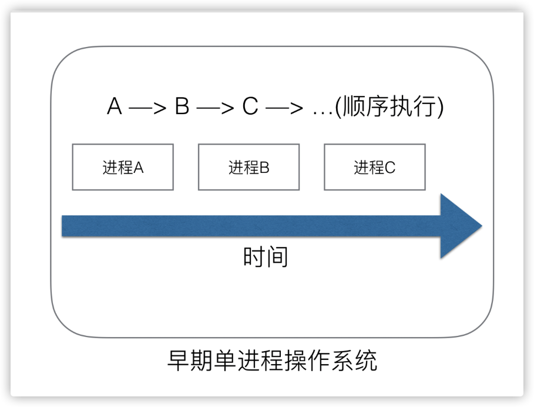
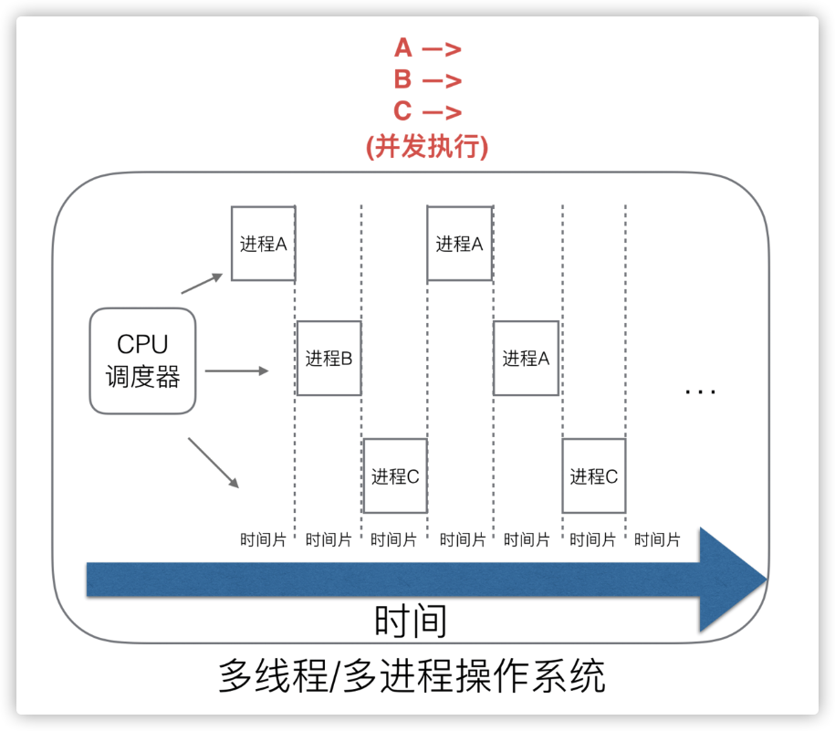
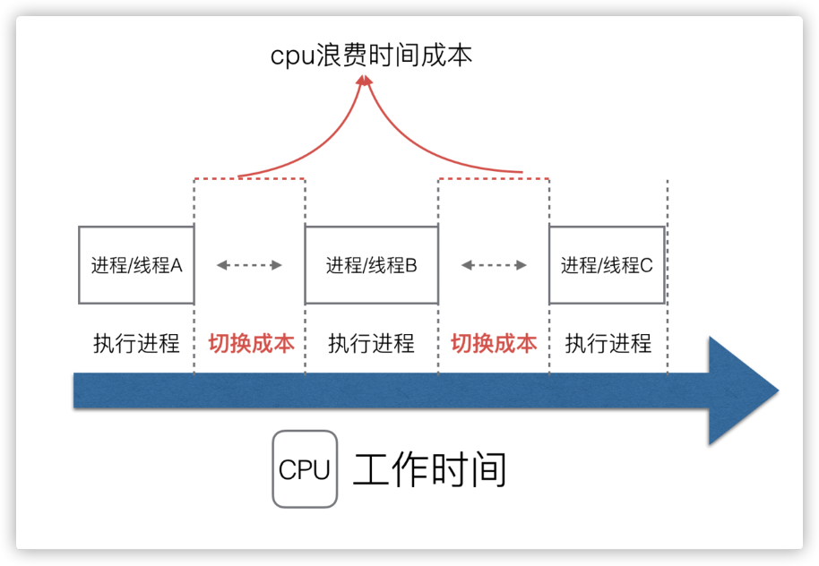
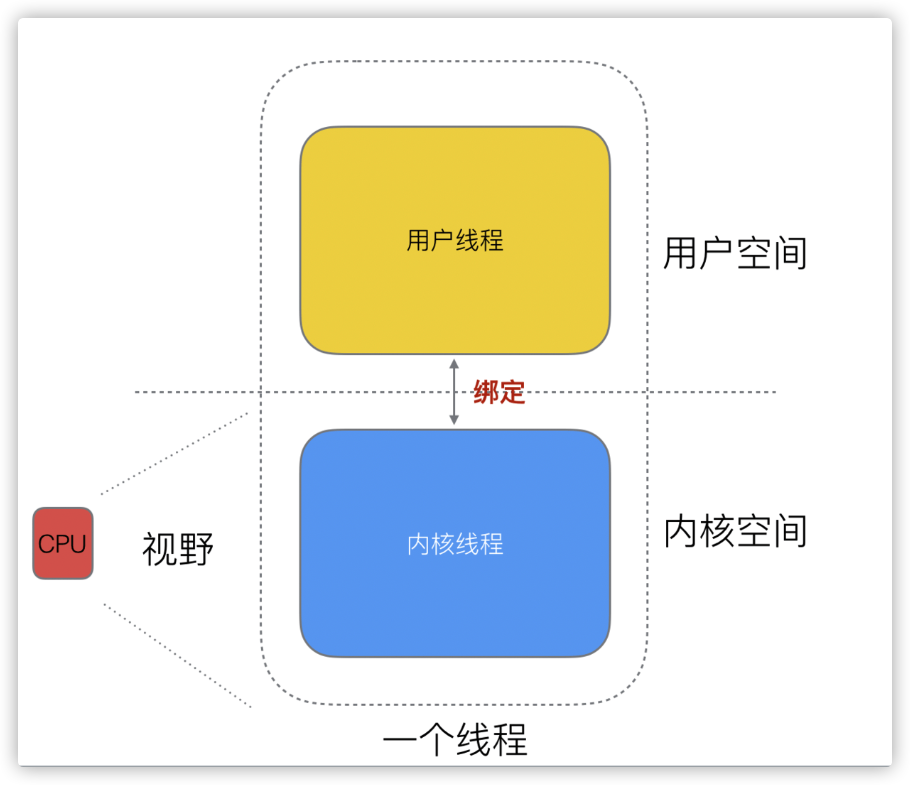
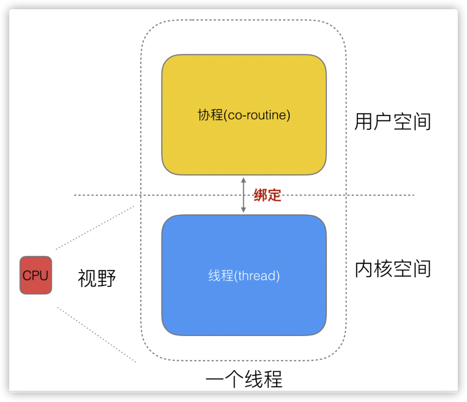
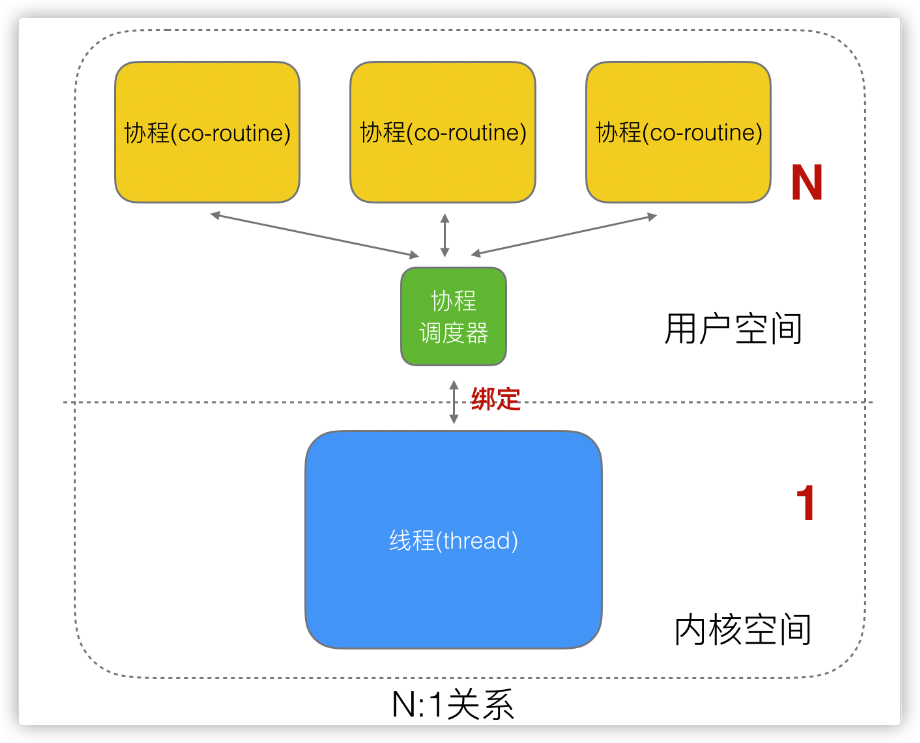
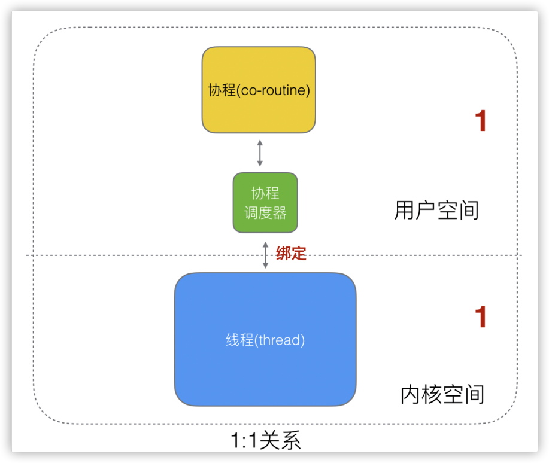
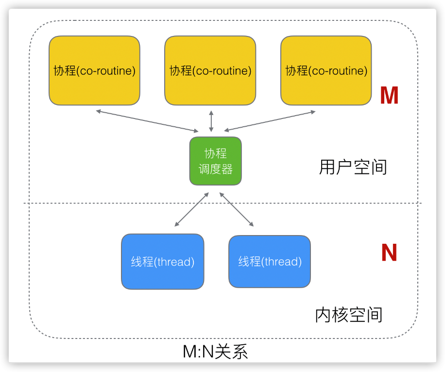

1. ## gmp 有什么优势

(1) 单进程时代不需要调度器
我们知道，一切的软件都是跑在操作系统上，真正用来干活 (计算) 的是 CPU。早期的操作系统每个程序就是一个进程，直到一个程序运行完，才能进行下一个进程，就是 “单进程时代”

一切的程序只能串行发生。

早期的单进程操作系统，面临 2 个问题：

1. 单一的执行流程，计算机只能一个任务一个任务处理。

2. 进程阻塞所带来的 CPU 时间浪费。

那么能不能有多个进程来宏观一起来执行多个任务呢？

后来操作系统就具有了最早的并发能力：多进程并发，当一个进程阻塞的时候，切换到另外等待执行的进程，这样就能尽量把 CPU 利用起来，CPU 就不浪费了。

(2) 多进程 / 线程时代有了调度器需求

在多进程 / 多线程的操作系统中，就解决了阻塞的问题，因为一个进程阻塞 cpu 可以立刻切换到其他进程中去执行，而且调度 cpu 的算法可以保证在运行的进程都可以被分配到 cpu 的运行时间片。这样从宏观来看，似乎多个进程是在同时被运行。

但新的问题就又出现了，进程拥有太多的资源，进程的创建、切换、销毁，都会占用很长的时间，CPU 虽然利用起来了，但如果进程过多，CPU 有很大的一部分都被用来进行进程调度了。

怎么才能提高 CPU 的利用率呢？

但是对于 Linux 操作系统来讲，cpu 对进程的态度和线程的态度是一样的。

很明显，CPU 调度切换的是进程和线程。尽管线程看起来很美好，但实际上多线程开发设计会变得更加复杂，要考虑很多同步竞争等问题，如锁、竞争冲突等。

(3) 协程来提高 CPU 利用率
多进程、多线程已经提高了系统的并发能力，但是在当今互联网高并发场景下，为每个任务都创建一个线程是不现实的，因为会消耗大量的内存 (进程虚拟内存会占用 4GB [32 位操作系统], 而线程也要大约 4MB)。

大量的进程 / 线程出现了新的问题

高内存占用
调度的高消耗 CPU
好了，然后工程师们就发现，其实一个线程分为 “内核态 “线程和” 用户态 “线程。

一个 “用户态线程” 必须要绑定一个 “内核态线程”，但是 CPU 并不知道有 “用户态线程” 的存在，它只知道它运行的是一个 “内核态线程”(Linux 的 PCB 进程控制块)。

这样，我们再去细化去分类一下，内核线程依然叫 “线程 (thread)”，用户线程叫 “协程 (co-routine)”.

 看到这里，我们就要开脑洞了，既然一个协程 (co-routine) 可以绑定一个线程 (thread)，那么能不能多个协程 (co-routine) 绑定一个或者多个线程 (thread) 上呢。

 之后，我们就看到了有 3 种协程和线程的映射关系：

N:1 关系
N 个协程绑定 1 个线程，优点就是协程在用户态线程即完成切换，不会陷入到内核态，这种切换非常的轻量快速。但也有很大的缺点，1 个进程的所有协程都绑定在 1 个线程上

缺点：

某个程序用不了硬件的多核加速能力
一旦某协程阻塞，造成线程阻塞，本进程的其他协程都无法执行了，根本就没有并发的能力了。

1:1 关系
1 个协程绑定 1 个线程，这种最容易实现。协程的调度都由 CPU 完成了，不存在 N:1 缺点，

缺点：

协程的创建、删除和切换的代价都由 CPU 完成，有点略显昂贵了。

M:N 关系
M 个协程绑定 1 个线程，是 N:1 和 1:1 类型的结合，克服了以上 2 种模型的缺点，但实现起来最为复杂。

 协程跟线程是有区别的，线程由 CPU 调度是抢占式的，协程由用户态调度是协作式的，一个协程让出 CPU 后，才执行下一个协程。

## 缺点

goroutine的调度时机，goroutine是协程，如果可以执行，会一直执行，直到阻塞才会放弃CPU。比如执行遇到锁了，或者读channel，或者读io请求等等。goroutine被切换出去之后，如果条件满足了，会被丢到ready队列里面去排队，等待被再次运行。然而，**具体什么时候会被执行，是不确定的**，跟排队的任务队列长度，排在它前面的任务要执行的时间，以及当时的负载情况等等很多因素有关。

这里的问题不是GC，而是调度。最终的延迟问题是跟Go的调度设计相关的，主要是协程的公平调度策略：

`不可以抢占`

`没有优先级的概念`

由于不可以抢占，假设网络消息好了，但这个时刻所有的CPU上面都正好有goroutine在跑着，并不能将谁踢掉，于是读网络的那个goroutine并没机会被唤醒。

由于没有优先级的概念，假设终于有goroutine阻塞并让出CPU了，这时让谁执行完全是看调度器的心情，读网络的那个goroutine运气不好，又没被唤醒。

只要goroutine不走到函数调用，是没有机会触发调度，不会让出CPU的。

Go声称可以开千千万万个goroutine，其实是有开销的：越多的goroutine被“公平”调度，越可能影响其中重要goroutine的唤醒，进而影响整体延迟。

回头再想之前同事那个测试，空跑worker会影响延时，也就能解释通了：由于被调度概率均等，越多无关的goroutine，则干活的那个goroutine被调度的概率越低，于是导致延迟增加。

Go的垃圾回收虽然不stop the world，仍然可能影响延迟：GC是可以打断goroutine，要求让出CPU的，而什么时候goroutine被再次调回来又看脸。

有太多太多的因素来影响调度，使整个runtime内的延迟变得不可控。平时压力小时调度上可能看不出什么来，然而尤其在压力大的时候，就表现得越差。

## 调度时机

- 会阻塞的系统调用，比如文件io，网络io；
- time系列定时操作；
- go func的时候, func执行完的时候；
- 管道读写阻塞的情况；
- 垃圾回收之后。
- 主动调用runtime.Gosched()

https://studygolang.com/articles/34362