# map 原理


## 面试题：

map怎么实现，底层是什么（数组），哈希表是什么，k-v是怎么实现的，哈希函数的作用，映射到数组上，哈希冲突怎么实现，链表法里面是什么


今天要分享的是主要内容是`Go语言Map底层实现`，目的让大家快速了解`Go语言Map`底层大致的实现原理。读完本篇文章你可以获得收益、以及我所期望你能获取的收益如下：

| 收益序号 | 收益描述                              | 掌握程度 |
| -------- | ------------------------------------- | -------- |
| 收益1    | **大致**对Go语言Map底层实现有一个了解 | 必须掌握 |
| 收益2    | **大致知道**Go语言Map是如何读取数据的 | 必须掌握 |
| 收益3    | **熟悉**Go语言Map底层核心结构体`hmap` | 可选     |
| 收益4    | **熟悉**Go语言Map底层核心结构体`bmap` | 可选     |
| 收益5    | **熟悉**Go语言Map底层里的溢出桶       | 可选     |
| 收益6    | **熟悉**Go语言Map是如何读取数据的     | 可选     |

收益1和收益2是看了本篇文章希望大家**必须掌握**的知识点，其他的为可选项，如果你对此感兴趣或者已经掌握了收益1、2可以继续阅读此处的内容。

对于本篇文章的结构主要按如下顺序开展：

- 简单看看一般Map的实现思路
- Go语言里Map的实现思路(入门程度：包含收益1、2)
- Go语言里Map的实现思路(熟悉程度：包含收益3、4、5、6)

其次，本篇文章主要以**Map的读**来展开分析，因为读弄明白了，其他的写、更新、删除等基本操作基本都可以猜出来了，不是么😏。

## **简单看看一般Map的实现思路**

直入主题，一般的Map会包含两个主要结构：

- 数组：数组里的值指向一个链表
- 链表：目的解决hash冲突的问题，并存放键值

大致结构如下：

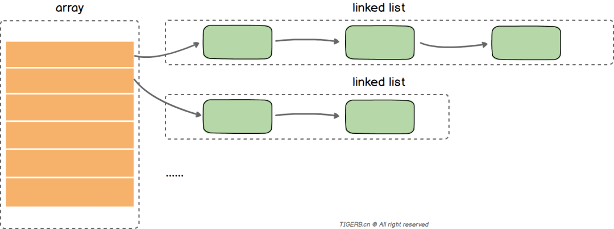

读取一个key值的过程大致如下：

```
                  key
                   |
                   v                 
+------------------------------------+
|      key通过hash函数得到key的hash    |
+------------------+-----------------+
                   |
                   v
+------------------------------------+
|       key的hash通过取模或者位操作     |
|          得到key在数组上的索引        |
+------------------------------------+
                   |
                   v
+------------------------------------+
|         通过索引找到对应的链表         |
+------------------+-----------------+
                   |
                   v
+------------------------------------+
|       遍历链表对比key和目标key        |
+------------------+-----------------+
                   |
                   v
+------------------------------------+
|              相等则返回value         |
+------------------+-----------------+
                   |
                   v                
                 value
```

接着我们来简单看看Go语言里Map的实现思路。

## **Go语言里Map的实现思路(入门程度)**

> 包含收益1、2

Go语言解决hash冲突不是链表，实际**主要**用的数组(内存上的连续空间)，如下图所示：

```
备注：后面我们会解释上面为啥用的“主要”两个字。
```

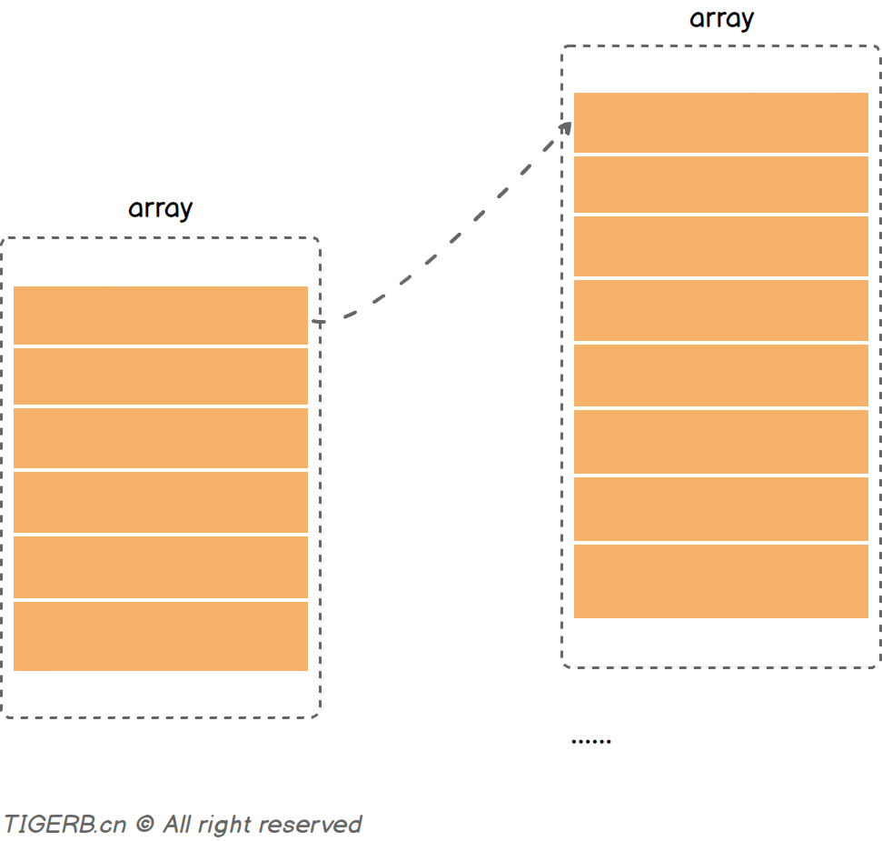

但是并不是只使用一个数组(连续内存空间)存放键和值，而是使用了两个数组分别存储键和值，图示如下：

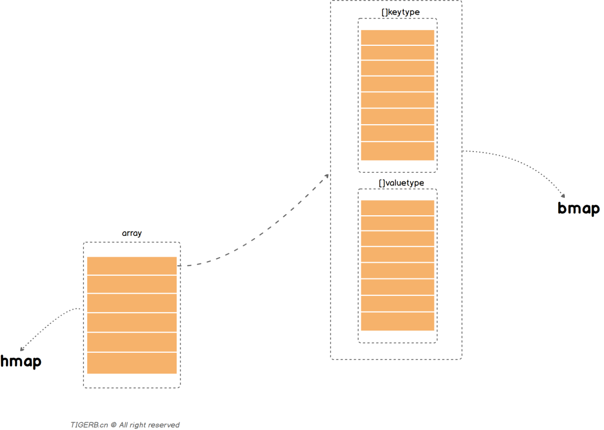

上图中：

- 分别对应的是两个核心的结构体`hmap`和`bmap`
- `bmap`里有两个数组分别存放key和value

把上面简化的关系转换一下，其实就是这样的一个大致关系，如下图所示：

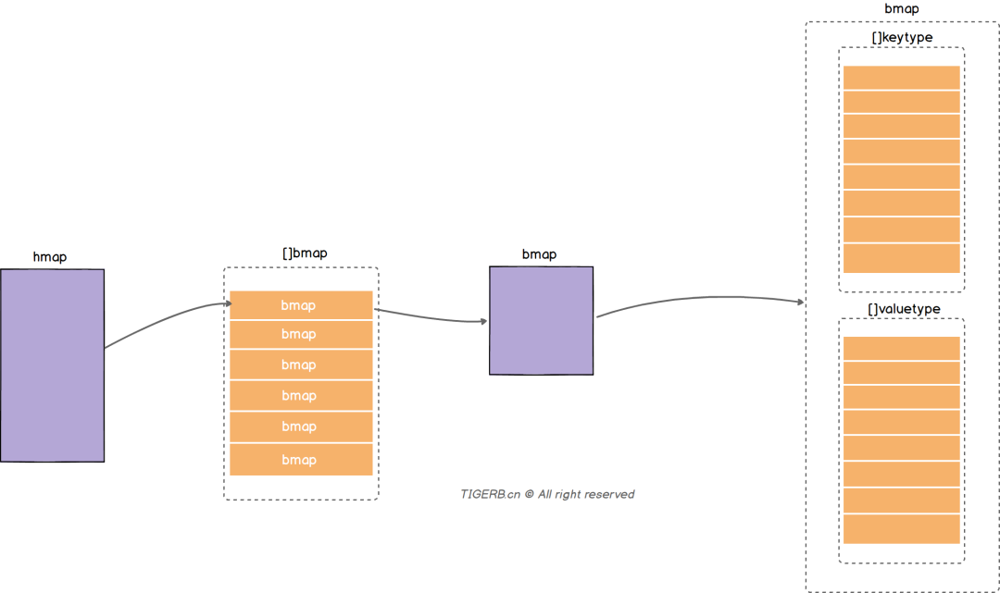

我们通过一次`读操作`为例，看看读取某个key的值的一个**大致过程**：

| 步骤编号 | 描述                                                         |
| :------- | :----------------------------------------------------------- |
| ①        | 通过hash函数获取目标key的**哈希**，哈希和数组的长度通过位操作获取数组位置的**索引**(备注：获取索引值的方式一般有取模或位操作，位操作的性能好些) |
| ②        | 遍历bmap里的键，和目标key对比获取**key的索引**(找不到则返回空值) |
| ③        | 根据**key的索引**通过计算偏移量，获取到对应**value**         |

读过程图示如下：

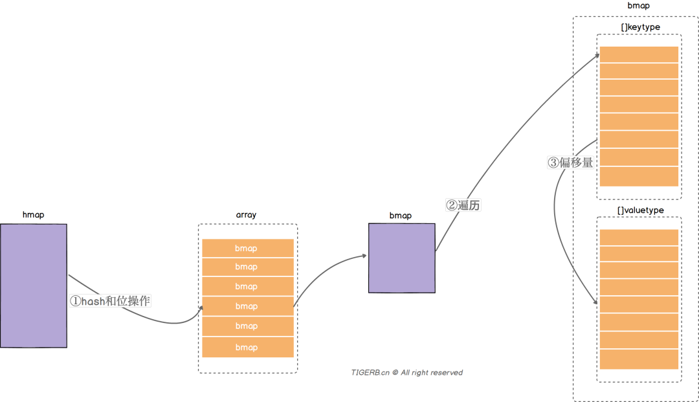

这么看起来是不是“很简单”、很清晰，所以读到这里，你是不是已经入门了`Go语言Map底层实现`并且：

- **大致**对Go语言Map底层实现有一个了解(收益1)
- **大致知道**Go语言Map是如何读取数据的(收益2)

然而实际情况不止如此，我们再稍微深入的探索下，有兴趣的可以继续往下看，没兴趣可以不用继续往下看了(开玩笑=^_^=)，反正已经达到目的了，哈哈😏。

## **Go语言里Map的实现思路(熟悉程度)**

> 包含收益3、4、5、6

想要深入学习，首先得了解下上面提到了实现Map的两个核心结构体`hmap`和`bmap`。

### **核心结构体`hmap`**

```
收益3: 熟悉Go语言Map底层核心结构体`hmap`
```

`hmap`的结构其实刚开始看起来其实还是比较复杂的，有不少的字段，具体字段如下图所示：

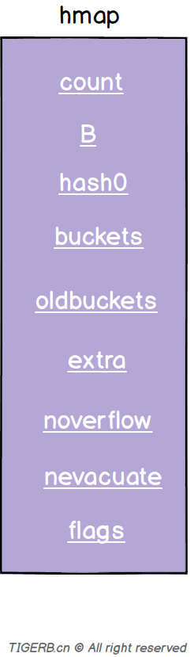

字段释义如下：

| 字段       | 解释                                                         |
| :--------- | :----------------------------------------------------------- |
| count      | 键值对的数量                                                 |
| B          | 2^B=len(buckets)                                             |
| hash0      | hash因子                                                     |
| buckets    | 指向一个数组(连续内存空间)，数组的类型为[]bmap，bmap类型就是存在键值对的结构下面会详细介绍，这个字段我们可以称之为正常桶。**如下图所示** |
| oldbuckets | 扩容时，存放之前的buckets(Map扩容相关字段)                   |
| extra      | 溢出桶结构，正常桶里面某个bmap存满了，会使用这里面的内存空间存放键值对 |
| noverflow  | 溢出桶里bmap大致的数量                                       |
| nevacuate  | 分流次数，成倍扩容分流操作计数的字段(Map扩容相关字段)        |
| flags      | 状态标识，比如正在被写、buckets和oldbuckets在被遍历、等量扩容(Map扩容相关字段) |

```
备注：本次内容不涉及Map的扩容逻辑。
```

重点看一些字段的含义和用处。

#### 字段`buckets`

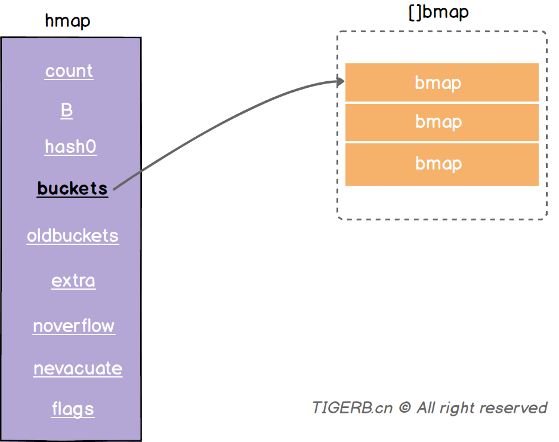

`buckets`指向了一个数组(连续的内存空间)，数组的元素是`bmap`类型，这个字段我们称之为正常桶。

hmap的源码和地址如下：

```go
//https://github.com/golang/go/blob/go1.13.8/src/runtime/map.go
type hmap struct {
	count     int 
	flags     uint8
	B         uint8 
	noverflow uint16 
	hash0     uint32
	buckets    unsafe.Pointer
	oldbuckets unsafe.Pointer
	nevacuate  uintptr 
	extra *mapextra
}
```

### **核心结构体`bmap`**

```
收益4: Go语言Map底层核心结构体`bmap`
```

正常桶`hmap.buckets`的元素是一个`bmap`结构。`bmap`的具体字段如下图所示：


字段释义如下：

| 字段     | 解释                                                         |
| :------- | :----------------------------------------------------------- |
| topbits  | 长度为8的数组，[]uint8，元素为：key获取的hash的高8位，遍历时对比使用，提高性能。**如下图所示** |
| keys     | 长度为8的数组，[]keytype，元素为：具体的key值。**如下图所示** |
| elems    | 长度为8的数组，[]elemtype，元素为：键值对的key对应的值。**如下图所示** |
| overflow | 指向的`hmap.extra.overflow`溢出桶里的`bmap`，上面的字段`topbits`、`keys`、`elems`长度为8，最多存8组键值对，存满了就往指向的这个`bmap`里存 |
| pad      | 对齐内存使用的，不是每个bmap都有会这个字段，需要满足一定条件 |

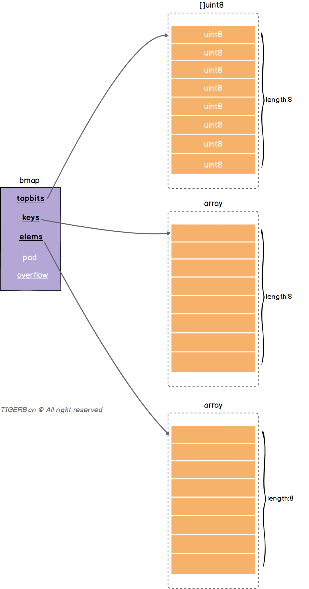

推断出`bmap`结构字段的代码和位置如下：

```go
//https://github.com/golang/go/blob/go1.13.8/src/cmd/compile/internal/gc/reflect.go
func bmap(t *types.Type) *types.Type {
  // 略...

  field := make([]*types.Field, 0, 5)

	field = append(field, makefield("topbits", arr))

  // 略...
  
	keys := makefield("keys", arr)
	field = append(field, keys)

  // 略...
  
	elems := makefield("elems", arr)
	field = append(field, elems)

  // 略...
  
	if int(elemtype.Align) > Widthptr || int(keytype.Align) > Widthptr {
		field = append(field, makefield("pad", types.Types[TUINTPTR]))
	}

  // 略...
  
	overflow := makefield("overflow", otyp)
	field = append(field, overflow)

  // 略...
}
```

> 结论：每个`bmap`结构最多存放8组键值对。

### **`hmap`和`bmap`的基本结构合起来**

分别了解了`hmap`和`bmap`的基本结构后，我们把上面的内容合并起来，就得到如下的Map结构图：

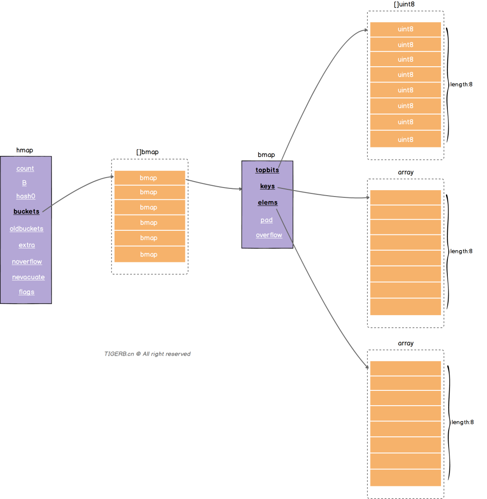

### **溢出桶**

```
收益5: 熟悉Go语言Map底层里的溢出桶
```

上面讲`bmap`的时候，我们不是得到了个结论么“每个`bmap`结构最多存放8组键值对。”，所以问题来了：

> 正常桶里的`bmap`存满了怎么办?

解决这个问题我们就要说到`hmap.extra`结构了，`hmap.extra`是个结构体，结构图示和字段释义如下：

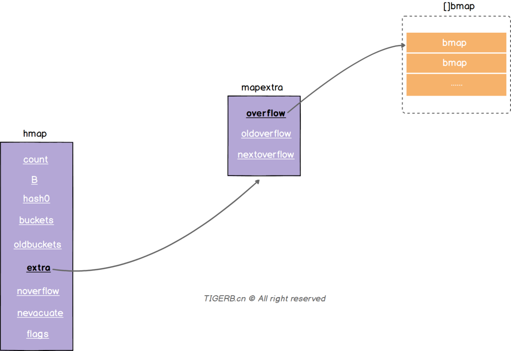

| 字段         | 解释                                                         |
| :----------- | :----------------------------------------------------------- |
| overflow     | 称之为**溢出桶**。和`hmap.buckets`的类型一样也是数组`[]bmap`，当正常桶`bmap`存满了的时候就使用`hmap.extra.overflow`的`bmap`。所以这里有个问题正常桶`hmap.buckets`里的`bmap`是怎么关联上溢出桶`hmap.extra.overflow`的`bmap`呢？我们下面说。 |
| oldoverflow  | 扩容时存放之前的overflow(Map扩容相关字段)                    |
| nextoverflow | 指向溢出桶里下一个可以使用的`bmap`                           |

源码和地址如下：

```go
//https://github.com/golang/go/blob/go1.13.8/src/runtime/map.go
type mapextra struct {
	overflow    *[]*bmap
	oldoverflow *[]*bmap
	nextOverflow *bmap
}
```

> 问题：正常桶`hmap.buckets`里的`bmap`是怎么关联上溢出桶`hmap.extra.overflow`的`bmap`呢？

答：就是我们介绍`bmap`结构时里的`bmap.overflow`字段(如下图所示)。`bmap.overflow`是个指针类型，存放了对应使用的溢出桶`hmap.extra.overflow`里的`bmap`的地址。

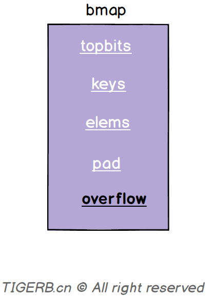

问题又来了：

> 问题：正常桶`hmap.buckets`里的`bmap`是什么时候关联上溢出桶`hmap.extra.overflow`的`bmap`呢？

答：Map写操作的时候。这里直接看关键代码：

```go
// https://github.com/golang/go/blob/go1.13.8/src/runtime/map.go
func mapassign(t *maptype, h *hmap, key unsafe.Pointer) unsafe.Pointer {
  // 略
again:
	// 略...
	var inserti *uint8
  // 略...
bucketloop:
	for {
		for i := uintptr(0); i < bucketCnt; i++ {
      // key的hash高8位不相等
			if b.tophash[i] != top {
        // 当前位置bmap.tophash的元素为空且还没有写入的记录(inserti已经写入的标记为)
				if isEmpty(b.tophash[i]) && inserti == nil {
          // inserti赋值为当前的hash高8位 标记写入成功
					inserti = &b.tophash[i]
					// 略...
				}
				// 略...
				continue
			}
			// 略...
			goto done
    }
    // 正常桶的bmap遍历完了 继续遍历溢出桶的bmap 如果有的话
		ovf := b.overflow(t)
		if ovf == nil {
			break
    }
		b = ovf
	}

  // 略...

  // 没写入成功(包含正常桶的bmap、溢出桶的bmap(如果有的话))
	if inserti == nil {
    // 分配新的bmap写
    newb := h.newoverflow(t, b)
    // 略...
	}

	// 略...
}

// 继续看h.newoverflow的代码
func (h *hmap) newoverflow(t *maptype, b *bmap) *bmap {
  var ovf *bmap
  // 如果hmap的存在溢出桶 且 溢出桶还没用完
	if h.extra != nil && h.extra.nextOverflow != nil {
    // 使用溢出桶的bmap
    ovf = h.extra.nextOverflow
    // 判断桶的bmap的overflow是不是空
    // 这里很巧妙。为啥？
    // 溢出桶初始化的时候会把最后一个bmap的overflow指向正常桶，值不为nil
    // 目的判断当前这个bmap是不是溢出桶里的最后一个
		if ovf.overflow(t) == nil {
      // 是nil
      // 说明不是最后一个
			h.extra.nextOverflow = (*bmap)(add(unsafe.Pointer(ovf), uintptr(t.bucketsize)))
		} else {
      // 不是nil
      // 则重置当前bmap的overflow为空
      ovf.setoverflow(t, nil)
      // 且 标记nextOverflow为nil 说明当前溢出桶用完了
			h.extra.nextOverflow = nil
		}
	} else {
    // 没有溢出桶 或者 溢出桶用完了
    // 内存空间重新分配一个bmap
		ovf = (*bmap)(newobject(t.bucket))
  }
  // 生成溢出桶bmap的计数器计数
	h.incrnoverflow()
  // 略...
  // 这行代码就是上面问题我们要的答案:
  // 正常桶`hmap.buckets`里的`bmap`在这里关联上溢出桶`hmap.extra.overflow`的`bmap`
	b.setoverflow(t, ovf)
	return ovf
}

// setoverflow函数的源码
func (b *bmap) setoverflow(t *maptype, ovf *bmap) {
  // 这行代码的意思：通过偏移量计算找到了bmap.overflow，并把ovf这个bmap的地址赋值给了bmap.overflow
	*(**bmap)(add(unsafe.Pointer(b), uintptr(t.bucketsize)-sys.PtrSize)) = ovf
}
```

下面代码这段代码解释了，上面的源码中为何如此判断预分配溢出桶的`bmap`是最后一个的原因。

```go
// https://github.com/golang/go/blob/go1.13.8/src/runtime/map.go
// 创建hmap的正常桶
func makeBucketArray(t *maptype, b uint8, dirtyalloc unsafe.Pointer) (buckets unsafe.Pointer, nextOverflow *bmap) {
  // 略...
	if base != nbuckets {
    // 略...
    last := (*bmap)(add(buckets, (nbuckets-1)*uintptr(t.bucketsize)))
    // 把溢出桶里 最后一个 `bmap`的`overflow`指先正常桶的第一个`bmap`
    // 获取预分配的溢出桶里`bmap`时，可以通过判断overflow是不是为nil判断是不是最后一个
		last.setoverflow(t, (*bmap)(buckets))
  }
  // 略...
}
```

**当hmap存在溢出桶时**，且**当前溢出桶只被使用了一个bmap时**，我们可以得到如下的关系图：

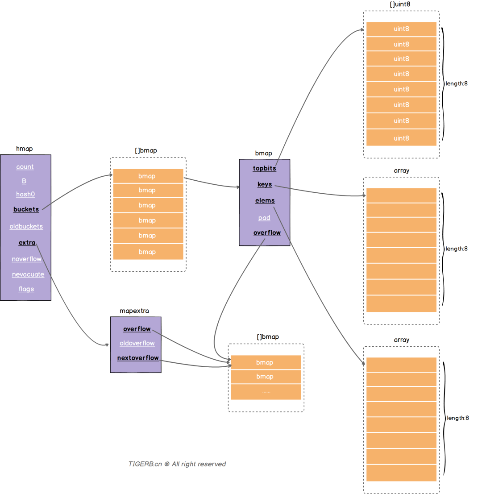

同时我们可以看出正常桶的`bmap`和溢出桶的`bmap`实际构成了链表关系，所以这也解释了开篇我们说到的“**Go里面Map的实现主要用到了数组**”，其次还用到了链表。

### **再次分析Map的读**

```
收益6: 熟悉Go语言Map是如何读取数据的
```

通过上面的学习，我们再次通过一次读操作为例，看看读取某个key的值的一个大致过程：

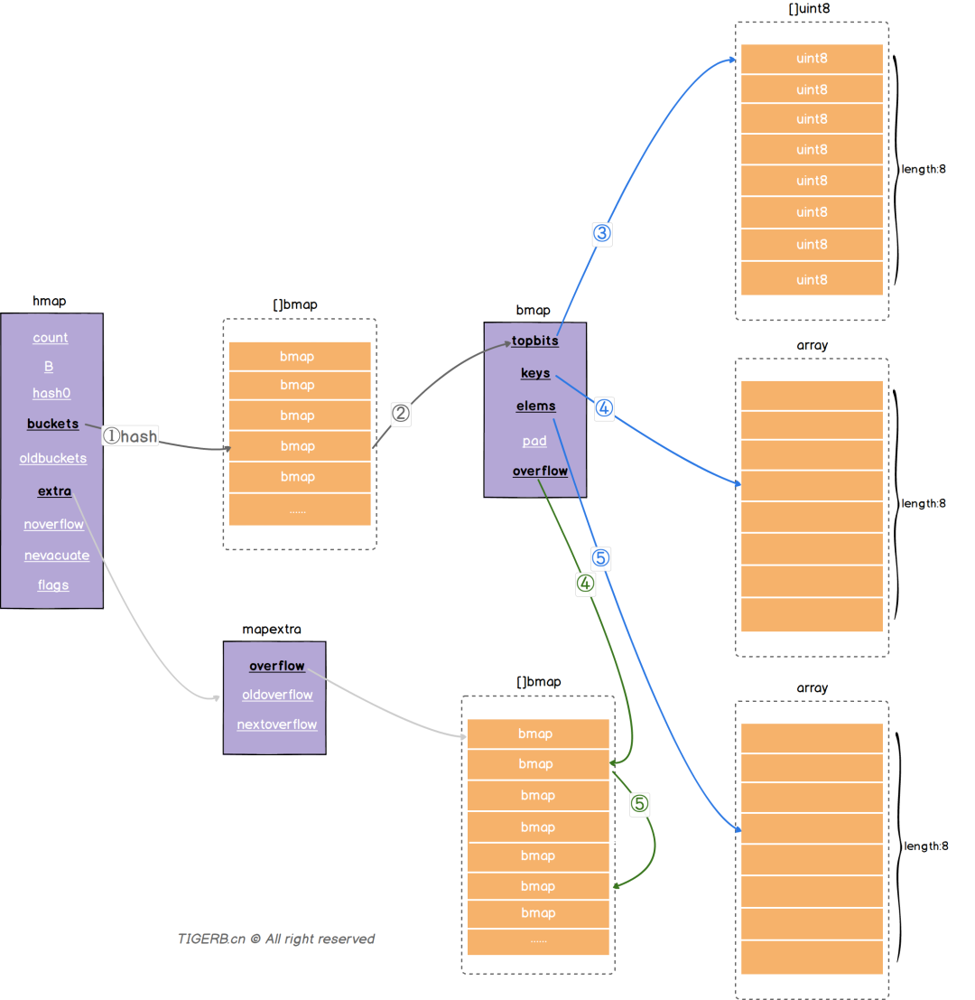

结合代码分析下整个大体的过程：

```go
func mapaccess1(t *maptype, h *hmap, key unsafe.Pointer) unsafe.Pointer {
    // ...略
    
    // ①通过hash函数获取当前key的哈希
	hash := alg.hash(key, uintptr(h.hash0))
    m := bucketMask(h.B)
    // ②通过当前key的哈希获取到对应的bmap结构的b
    // 这里的b 我们称之为“正常桶的bmap”
    // “正常桶的bmap”可能会对应到溢出桶的bmap结构，我们称之为“溢出桶的bmap”
    b := (*bmap)(add(h.buckets, (hash&m)*uintptr(t.bucketsize)))
    
    // ...略
    
    // 获取当前key的哈希的高8位
	top := tophash(hash)
bucketloop:
    // 下面的for循环是个简写，完整如下。
    // for b = b; b != nil; b = b.overflow(t) {
    // 可以知道b的初始值为上面的“正常桶的bmap”，则：
    // 第一次遍历：遍历的是“正常桶的bmap”
    // 如果正常桶没找到，则
    // 绿色线条④ 继续遍历：如果当前“正常桶的bmap”中的overflow值不为nil(说明“正常桶的bmap”关联了“溢出桶的bmap”)，则遍历当前指向的“溢出桶的bmap”继续 重复蓝色线条的③④⑤步骤
	for ; b != nil; b = b.overflow(t) {
        // 由于b的初始值为“正常桶的bmap”，第一次先遍历“正常桶的bmap”
		for i := uintptr(0); i < bucketCnt; i++ {
            // 蓝色线条③ 对比key哈希的高8位
            // 对比哈希的高8位目的是为了加速
			if b.tophash[i] != top {
                // emptyRest 标志位：表示当前位置已经是末尾了；删除操作会设置此标志位
				if b.tophash[i] == emptyRest {
					break bucketloop
				}
				continue
            }
            // 找到了相同的hash高8位，则：找到对应索引位置i的key
			k := add(unsafe.Pointer(b), dataOffset+i*uintptr(t.keysize))
			if t.indirectkey() {
				k = *((*unsafe.Pointer)(k))
            }
            // 蓝色线条④ 对比key是不是一致
			if alg.equal(key, k) {
                // 蓝色线条⑤ key是一致，则：获取对应索引位置的值
				e := add(unsafe.Pointer(b), dataOffset+bucketCnt*uintptr(t.keysize)+i*uintptr(t.elemsize))
				if t.indirectelem() {
					e = *((*unsafe.Pointer)(e))
                }
                // 返回找到的结果
				return e
			}
		}
    }
    // 正常桶、溢出桶都没找到则返回 “空值”
	return unsafe.Pointer(&zeroVal[0])
}
```


> 参考：
> 	1.《Go语言设计与实现》https://draveness.me/golang/docs/part2-foundation/ch03-datastructure/golang-hashmap/
>
> 2. Go源码版本1.13.8 https://github.com/golang/go/tree/go1.13.8/src

