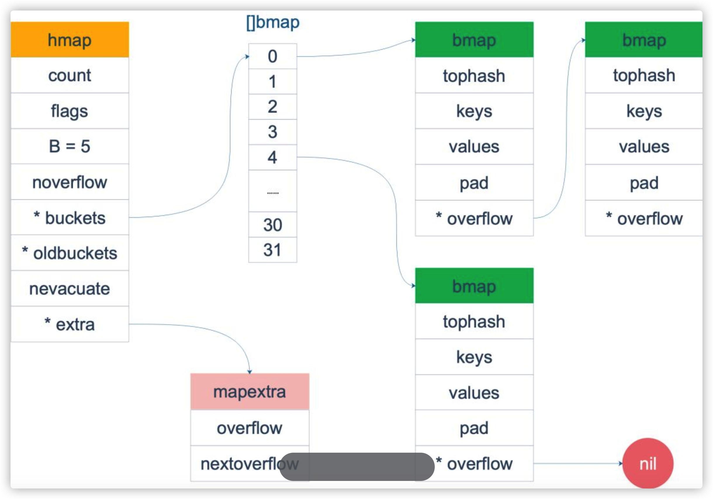
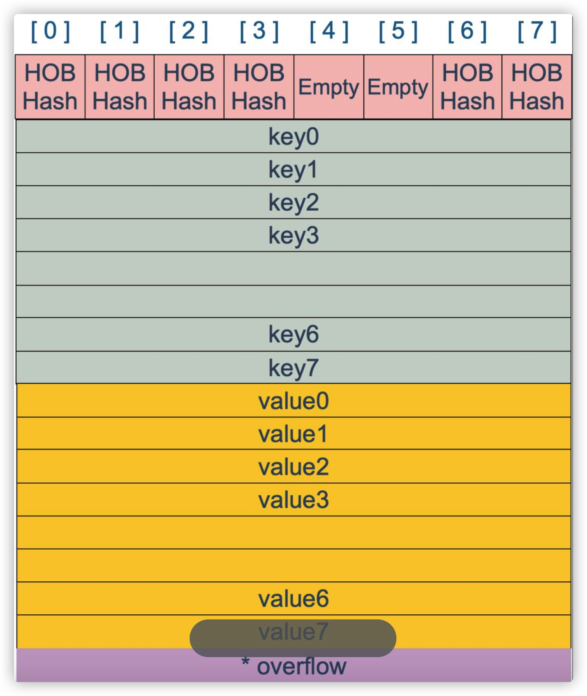
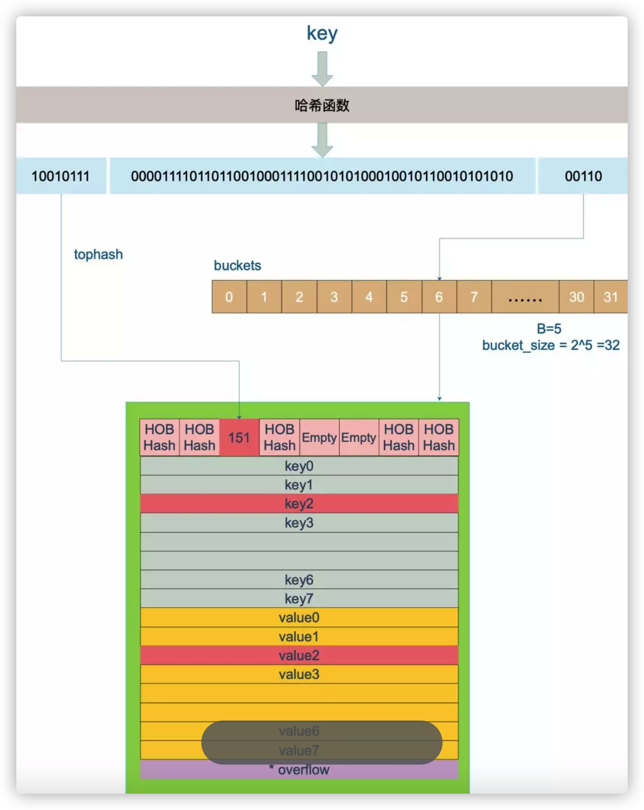

### GO 中map的底层是如何实现的

首先**Go 语言采用的是哈希查找表，并且使用链表解决哈希冲突。**

##### GO的内存模型

先看这一张map原理图



再来看看源码中map的定义

```go
//src/runtime/map.go  line 115

// A header for a Go map.
type hmap struct {
    // Note: the format of the hmap is also encoded in cmd/compile/internal/gc/reflect.go.
    // Make sure this stays in sync with the compiler's definition.
    //
    count     int  //len(map)时，返回的值
    flags     uint8   //表示是否有其他协程在操作map
    B         uint8    //上图中[]bmap的''长度'' 2^B
    noverflow uint16  //// 溢出的bucket个数
    hash0     uint32 // hash seed

    buckets    unsafe.Pointer    //buckets 数组指针
    oldbuckets unsafe.Pointer  // 扩容的时候用于赋值的buckets数组
    nevacuate  uintptr       // 搬迁进度

    extra *mapextra   // 用于扩容的指针

    type mapextra struct {
    overflow    *[]*bmap
    oldoverflow *[]*bmap
    nextOverflow *bmap
}

// A bucket for a Go map.
type bmap struct {
    tophash [bucketCnt]uint8        // len为8的数组
}
//底层定义的常量 
const (
    // Maximum number of key/value pairs a bucket can hold.
    bucketCntBits = 3
    bucketCnt     = 1 << bucketCntBits

} 
```


但这只是表面(src/runtime/hashmap.go)的结构，编译期间会给它加料，动态地创建一个新的结构：

```go
type bmap struct {
  topbits  [8]uint8
  keys     [8]keytype
  values   [8]valuetype
  pad      uintptr
  overflow uintptr
} 
```

bmap 就是我们常说的“桶”，桶里面会最多装 8 个 key，这些 key 之所以会落入同一个桶，是因为它们经过哈希计算后，哈希结果是“一类”的(低位的B位决定bucket)。在桶内，又会根据 key 计算出来的 hash 值的高 8 位来决定 key 到底落入桶内的哪个位置（一个桶内最多有8个位置）。如上图所示

bmap 是存放 k-v 的地方，我们把视角拉近，仔细看 bmap 的内部组成。



上图就是 bucket 的内存模型， HOBHash 指的就是 top hash。注意到 key 和 value 是各自放在一起的，并不是 key/value/key/value/… 这样的形式。源码里说明这样的好处是在某些情况下可以省略掉 padding 字段，节省内存空间。

每个 bucket 设计成最多只能放 8 个 key-value 对，如果有第 9 个 key-value 落入当前的 bucket，那就需要再构建一个 bucket ，通过 overflow 指针连接起来。


### 创建map

从语法上来说，创建一个map很简单（记得key的类型必须为可比较类型）

```go
maps := make(map[string]int)
    maps2 := map[string]int{
        "1":1,
        "2":2,
        "3":3,
    }
    var maps3 map[string]int 
```


通过汇编语言可以看到，实际上底层调用的是 makemap 函数，主要做的工作就是初始化 hmap 结构体的各种字段，例如计算 B 的大小，设置哈希种子 hash0 等等。

```
func makemap(t *maptype, hint int64, h *hmap, bucket unsafe.Pointer) *hmap 
```


注意，这个函数返回的结果：*hmap，它是一个指针

```
func makeslice(et *_type, len, cap int) slice 
```

##### hash函数

map 的一个关键点在于，哈希函数的选择。在程序启动时，会检测 cpu 是否支持 aes，如果支持，则使用 aes hash，否则使用 memhash。这是在函数 alginit() 中完成，位于路径：src/runtime/alg.go 下。

> hash 函数，有加密型和非加密型。加密型的一般用于加密数据、数字摘要等，典型代表就是 md5、sha1、sha256、aes256 这种；非加密型的一般就是查找。在 map 的应用场景中，用的是查找。选择 hash 函数主要考察的是两点：性能、碰撞概率。

##### key的定位过程

key 经过哈希计算后得到哈希值，共 64 个 bit 位（64位机，32位机就不讨论了，现在主流都是64位机），计算它到底要落在哪个桶时，只会用到最后 B 个 bit 位。还记得前面提到过的 B 吗？如果 B = 5，那么桶的数量，也就是 buckets 数组的长度是 2^5 = 32。
例如，现在有一个 key 经过哈希函数计算后，得到的哈希结果是：

```
10010111 | 000011110110110010001111001010100010010110010101010 │ 01010 
```


用最后的 5 个 bit 位，也就是 01010，值为 10，也就是 10 号桶。这个操作实际上就是取余操作，但是取余开销太大，所以代码实现上用的位操作代替。
再用哈希值的高 8 位，找到此 key 在 bucket 中的位置，这是在寻找已有的 key。最开始桶内还没有 key，新加入的 key 会找到第一个空位，放入。

buckets 编号就是桶编号，当两个不同的 key 落在同一个桶中，也就是发生了哈希冲突。冲突的解决手段是用链表法：在 bucket 中，从前往后找到第一个空位。这样，在查找某个 key 时，先找到对应的桶，再去遍历 bucket 中的 key。

这里参考曹大 github 博客里的一张图




参考：https://www.helloworld.net/p/3714029944