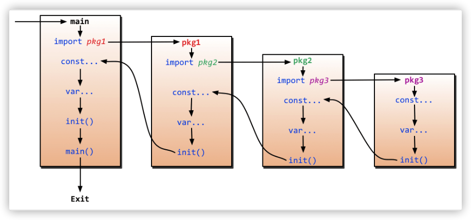

# 初始化顺序


import --> const --> var --> init()



如果一个包导入了其他包，则首先初始化导入的包。

然后初始化当前包的常量。

接下来初始化当前包的变量。

最后，调用当前包的 init() 函数。

一个包可以有多个 init 函数 (在单个文件中或分布在多个文件中)，并且按照它们呈现给编译器的顺序被调用。

一个包将只初始化一次，即使它是从多个包导入的。


# 1.init 函数简介

Golang init 函数是一种特殊的函数，主要用于完成程序的初始化工作，如初始化[数据库](https://cloud.tencent.com/solution/database?from=10680)的连接、载入本地配置文件、根据命令行参数初始化全局变量等。

```javascript
package main

import "flag"

var gopath string

func init() {
	println("init a")
}

func init() {
	println("init b")
}

func init() {
	println("init c")
	// gopath may be overridden by --gopath flag on command line.
	flag.StringVar(&gopath, "gopath", "/root/go", "override default GOPATH")
}

func main() {
	println("main")
	flag.Parse()
	println(gopath)
}
```

复制

运行输出：

```javascript
$ go run main.go --gopath="/home/alice/go"
init a
init b
init c
main
/home/alice/go
```

复制

之所以特殊，是因为 init 函数有如下特点：

- init 函数是可选的，可以没有；
- 与 main 函数一样，不能有入参与返回值；
- 与 main 函数一样，init 会自动执行，不能被其他函数调用；
- 一个包内可以有多个 init 函数，即可以在包的多个源文件中定义多个 init 函数。一般建议在与包同名源文件中写一个 init 函数，这样可读性好且便于维护；
- 一个源文件可以有多个 init 函数。

# 2.执行顺序

既然一个程序可以有多个 init 函数，那么对于位于不同包、不同源文件中的多个 init 函数，其执行顺序是怎样的呢？

下面从多个方面去考察。

## 2.1 单个源文件的 init 执行顺序

```javascript
package main

func init() {
	println("init a")
}

func init() {
	println("init b")
}

func init() {
	println("init c")
}

func main() {
	println("main")
}
```

复制

运行输出：

```javascript
$ go run main.go
init a
init b
init c
main
```

复制

**结论：** 同一个源文件的 init 函数执行顺序与其定义顺序一致，从上到下。

## 2.2 单个包的 init 执行顺序

假设 main 包有三个源文件 a.go，b.go 和 c.go。

```javascript
// a.go
package main

func init() {
	println("init a")
}

// b.go
package main

func init() {
	println("init b")
}

// c.go
package main

func init() {
	println("init c")
}

// main.go
package main

func init() {
	println("init main")
}

func main() {
	println("main")
}
```

复制

编译运行输出：

```javascript
$ go build && ./main
init a
init b
init c
init main
main
```

复制

**结论：** 同一个包中不同源文件 init 函数的执行顺序，是根据文件名的字典序来确定。

## 2.3 main 包导入多个包时 init 执行顺序

### 2.3.1 不存在依赖

对于不同的包，如果不相互依赖的话，在 main 包中被 import，那么这种情况下，各个包的 init 执行顺序是怎样的呢？

假设有包 a，b 和 c，在 main.go 中被 import。

```javascript
// a 包
// a.go
package a

func init() {
	println("init a")
}

// b 包
// b.go
package b

func init() {
	println("init b")
}

// c 包
// c.go
package c

func init() {
	println("init c")
}

// main 包
// main.go
package main

import (
	_ "main/a"
	_ "main/b"
	_ "main/c"
)

func init() {
	println("init main")
}

func main() {
	println("main")
}
```

复制

编译运行输出：

```javascript
$ go build && ./main
init a
init b
init c
init main
main
```

复制

**结论：** 对于不同的包，如果不相互依赖的话，按照 main 包中导入顺序调用包的 init 函数，最后再调用 main 包的 init 函数。

### 2.3.2 存在依赖

对于不同的包，如果存在依赖关系的话，在 main 包中被 import，那么这种情况下，各个包的 init 执行顺序是怎样的呢？

假设有包 a，b 和 c，main 包 import a 包，a import b，b import c，即依赖关系为 main > a > b > c。

```javascript
// a 包
// a.go
package a

import _ "main/b"

func init() {
	println("init a")
}

// b 包
// b.go
package b

import _ "main/c"

func init() {
	println("init b")
}

// c 包
// c.go
package c

func init() {
	println("init c")
}

// main 包
// main.go
package main

import (
	_ "main/a"
)

func init() {
	println("init main")
}

func main() {
	println("main")
}
```

复制

编译运行输出：

```javascript
$ go build && ./main
init c
init b
init a
init main
main
```

复制

**结论:** 如果 package 存在依赖，不同包的 init 函数按照包导入的依赖关系决定执行顺序。 调用顺序为最后被依赖的最先被初始化，如导入顺序 main > a > b > c，则初始化顺序为 c > b > a > main，依次执行对应的 init 方法。

## 2.4 包级变量初始化与 init 函数执行顺序

如果包中存在包级变量，那么其初始化与 init 函数执行先后顺序如何呢？

还是假设有包 a，b 和 c，main 包 import a 包，a import b，b import c，即依赖关系为 main > a > b > c。且每个包都有一个包级变量，并通过函数完成其初始化。

```javascript
// a 包
// a.go
package a

import _ "main/b"

var A = func() string {
	println("init var A")
	return "A"
}()

func init() {
	println("init a")
}

// b 包
// b.go
package b

import _ "main/c"

var B = func() string {
	println("init var B")
	return "B"
}()

func init() {
	println("init b")
}

// c 包
// c.go
package c

var C = func() string {
	println("init var C")
	return "C"
}()

func init() {
	println("init c")
}

// main 包
// main.go
package main

import (
	_ "main/a"
)

var m = func() string {
	println("init var m")
	return "m"
}()

func init() {
	println("init main")
}

func main() {
	println("main")
}
```

复制

编译运行输出：

```javascript
$ go build && ./main
init var C
init c
init var B
init b
init var A
init a
init var m
init main
main
```

复制

**结论:** 可见每个包的包级变量初始化是在 init 函数执行之前完成的。不同包的 init 函数与包级变量的初始化顺序如下图所示。


# 3.小结

Golang 中的 init 是一种特殊的函数，主要用于完成程序的初始化工作。其特点有：

- init 函数是可选的，可以没有；
- 与 main 函数一样，不能有入参与返回值；
- 与 main 函数一样，init 会自动执行，不能被其他函数调用；
- 一个包内可以有多个 init 函数，即可以在包的多个源文件中定义多个 init 函数。一般建议在与包同名源文件中写一个 init 函数，这样可读性好且便于维护；
- 一个源文件可以有多个 init 函数。

程序中如果在不同包的不同源文件有多个 init 函数时，其执行顺序可概述为：

- 同一个源文件的 init 函数执行顺序与其定义顺序一致，从上到下；
- 同一个包中不同文件的 init 函数的执行顺序按照文件名的字典序；
- 对于不同的包，如果不相互依赖的话，按照 main 包中 import 的顺序调用其包中的 init 函数；
- 如果包存在依赖，不同包的 init 函数按照包导入的依赖关系决定执行顺序。 调用顺序为最后被依赖的最先被初始化，如导入顺序 main > a > b > c，则初始化顺序为 c > b > a > main，依次执行对应的 init 方法；
- 如果包存在包级变量，则先于包的 init 函数完成初始化。

程序的初始化和执行都起始于 main 包。如果 main 包还导入了其它的包，那么就会在编译时将它们依次导入。有时一个包会被多个包同时导入，那么它只会被导入一次（例如很多包可能都会用到 fmt 包，但它只会被导入一次，因为没有必要导入多次）。

当一个包被导入时，如果该包还导入了其它的包，那么会先将其它包导入进来，然后再对这些包中的包级常量和变量进行初始化，接着执行 init 函数，依次类推。

**请务必铭记于心，虽然 init() 顺序是明确的，但代码可以更改，init() 函数之间的关系可能会使代码变得脆弱和容易出错，因此在编码时避免依赖 init() 函数的执行顺序。**