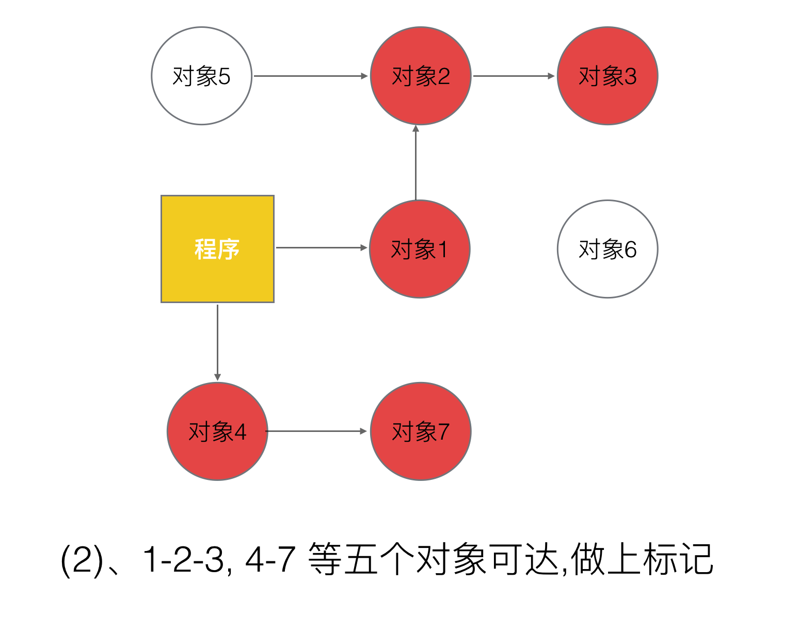
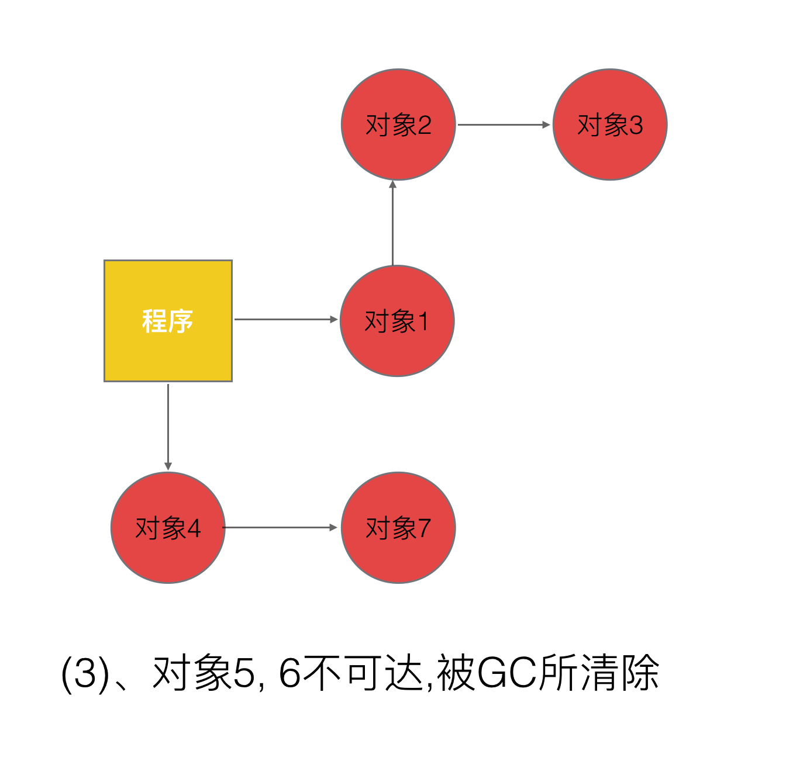
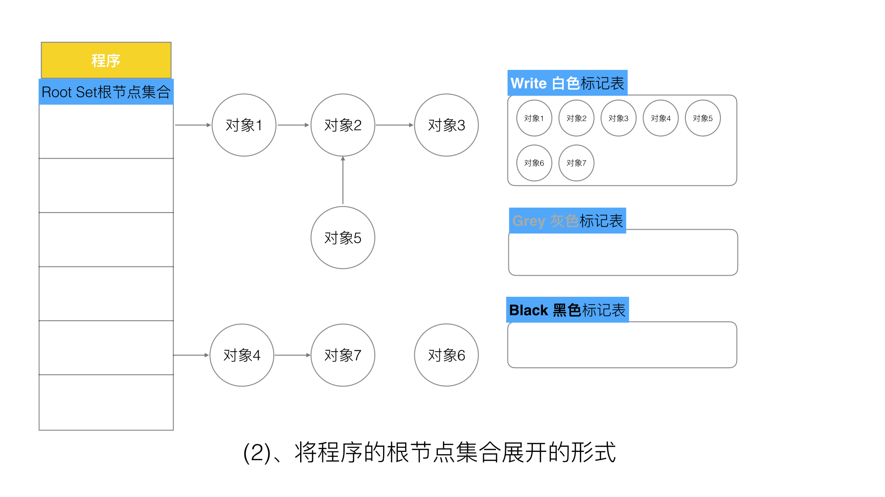

# 垃圾回收


垃圾回收(Garbage Collection，简称GC)是编程语言中提供的自动的内存管理机制，自动释放不需要的内存对象，让出存储器资源。GC过程中无需程序员手动执行。GC机制在现代很多编程语言都支持，GC能力的性能与优劣也是不同语言之间对比度指标之一。

Golang在GC的演进过程中也经历了很多次变革，Go V1.3之前的标记-清除(mark and sweep)算法，Go V1.3之前的标记-清扫(mark and sweep)的缺点

- Go V1.5的三色并发标记法
- Go V1.5的三色标记为什么需要STW
- Go V1.5的三色标记为什么需要屏障机制(“强-弱” 三色不变式、插入屏障、删除屏障 )
- Go V1.8混合写屏障机制
- Go V1.8混合写屏障机制的全场景分析

### 一、Go V1.3之前的标记-清除(mark and sweep)算法

接下来我们来看一下在Golang1.3之前的时候主要用的普通的标记-清除算法，此算法主要有两个主要的步骤：

- 标记(Mark phase)
- 清除(Sweep phase)

#### 1 标记清除算法的具体步骤

**第一步**，暂停程序业务逻辑, 分类出可达和不可达的对象，然后做上标记。


图中表示是程序与对象的可达关系，目前程序的可达对象有对象1-2-3，对象4-7等五个对象。

**第二步**, 开始标记，程序找出它所有可达的对象，并做上标记。如下图所示：

所以对象1-2-3、对象4-7等五个对象被做上标记。

**第三步**, 标记完了之后，然后开始清除未标记的对象. 结果如下。


操作非常简单，但是有一点需要额外注意：mark and sweep算法在执行的时候，需要程序暂停！即 `STW(stop the world)`，STW的过程中，CPU不执行用户代码，全部用于垃圾回收，这个过程的影响很大，所以STW也是一些回收机制最大的难题和希望优化的点。所以在执行第三步的这段时间，程序会暂定停止任何工作，卡在那等待回收执行完毕。

**第四步**, 停止暂停，让程序继续跑。然后循环重复这个过程，直到process程序生命周期结束。

以上便是标记-清除（mark and sweep）回收的算法。

#### 2 标记-清除(mark and sweep)的缺点

标记清除算法明了，过程鲜明干脆，但是也有非常严重的问题。

- STW，stop the world；让程序暂停，程序出现卡顿 **(重要问题)**；
- 标记需要扫描整个heap；
- 清除数据会产生heap碎片。

Go V1.3版本之前就是以上来实施的, 在执行GC的基本流程就是首先启动STW暂停，然后执行标记，再执行数据回收，最后停止STW，如图所示。


从上图来看，全部的GC时间都是包裹在STW范围之内的，这样貌似程序暂停的时间过长，影响程序的运行性能。所以Go V1.3 做了简单的优化,将STW的步骤提前, 减少STW暂停的时间范围.如下所示


上图主要是将STW的步骤提前了异步，因为在Sweep清除的时候，可以不需要STW停止，因为这些对象已经是不可达对象了，不会出现回收写冲突等问题。

但是无论怎么优化，Go V1.3都面临这个一个重要问题，就是**mark-and-sweep 算法会暂停整个程序** 。

Go是如何面对并这个问题的呢？接下来G V1.5版本 就用**三色并发标记法**来优化这个问题.

### 三、Go V1.5的三色并发标记法

Golang中的垃圾回收主要应用三色标记法，GC过程和其他用户goroutine可并发运行，但需要一定时间的**STW(stop the world)**，所谓**三色标记法**实际上就是通过三个阶段的标记来确定清楚的对象都有哪些？我们来看一下具体的过程。

**第一步** , 每次新创建的对象，默认的颜色都是标记为“白色”，如图所示。


上图所示，我们的程序可抵达的内存对象关系如左图所示，右边的标记表，是用来记录目前每个对象的标记颜色分类。这里面需要注意的是，所谓“程序”，则是一些对象的跟节点集合。所以我们如果将“程序”展开，会得到类似如下的表现形式，如图所示。


**第二步**, 每次GC回收开始, 会从根节点开始遍历所有对象，把遍历到的对象从白色集合放入“灰色”集合如图所示。


这里 要注意的是，本次遍历是一次遍历，非递归形式，是从程序抽次可抵达的对象遍历一层，如上图所示，当前可抵达的对象是对象1和对象4，那么自然本轮遍历结束，对象1和对象4就会被标记为灰色，灰色标记表就会多出这两个对象。

**第三步**, 遍历灰色集合，将灰色对象引用的对象从白色集合放入灰色集合，之后将此灰色对象放入黑色集合，如图所示。


这一次遍历是只扫描灰色对象，将灰色对象的第一层遍历可抵达的对象由白色变为灰色，如：对象2、对象7. 而之前的灰色对象1和对象4则会被标记为黑色，同时由灰色标记表移动到黑色标记表中。

**第四步**, 重复**第三步**, 直到灰色中无任何对象，如图所示。


当我们全部的可达对象都遍历完后，灰色标记表将不再存在灰色对象，目前全部内存的数据只有两种颜色，黑色和白色。那么黑色对象就是我们程序逻辑可达（需要的）对象，这些数据是目前支撑程序正常业务运行的，是合法的有用数据，不可删除，白色的对象是全部不可达对象，目前程序逻辑并不依赖他们，那么白色对象就是内存中目前的垃圾数据，需要被清除。

**第五步**: 回收所有的白色标记表的对象. 也就是回收垃圾，如图所示。

以上我们将全部的白色对象进行删除回收，剩下的就是全部依赖的黑色对象。

以上便是`三色并发标记法`，不难看出，我们上面已经清楚的体现`三色`的特性。但是这里面可能会有很多并发流程均会被扫描，执行并发流程的内存可能相互依赖，为了在GC过程中保证数据的安全，我们在开始三色标记之前就会加上STW，在扫描确定黑白对象之后再放开STW。但是很明显这样的GC扫描的性能实在是太低了。

那么Go是如何解决标记-清除(mark and sweep)算法中的卡顿(stw，stop the world)问题的呢？

### 四、没有STW的三色标记法

先抛砖引玉，我们加入如果没有STW，那么也就不会再存在性能上的问题，那么接下来我们假设如果三色标记法不加入STW会发生什么事情？
我们还是基于上述的三色并发标记法来说, 他是一定要依赖STW的. 因为如果不暂停程序, 程序的逻辑改变对象引用关系, 这种动作如果在标记阶段做了修改，会影响标记结果的正确性，我们来看看一个场景，如果三色标记法, 标记过程不使用STW将会发生什么事情?

我们把初始状态设置为已经经历了第一轮扫描，目前黑色的有对象1和对象4， 灰色的有对象2和对象7，其他的为白色对象，且对象2是通过指针p指向对象3的，如图所示。


现在如何三色标记过程不启动STW，那么在GC扫描过程中，任意的对象均可能发生读写操作，如图所示，在还没有扫描到对象2的时候，已经标记为黑色的对象4，此时创建指针q，并且指向白色的对象3。


与此同时灰色的对象2将指针p移除，那么白色的对象3实则就是被挂在了已经扫描完成的黑色的对象4下，如图所示。

然后我们正常指向三色标记的算法逻辑，将所有灰色的对象标记为黑色，那么对象2和对象7就被标记成了黑色，如图所示。

那么就执行了三色标记的最后一步，将所有白色对象当做垃圾进行回收，如图所示。

但是最后我们才发现，本来是对象4合法引用的对象3，却被GC给“误杀”回收掉了。

可以看出，有两种情况，在三色标记法中，是不希望被发生的。

- 条件1: 一个白色对象被黑色对象引用**(白色被挂在黑色下)**
- 条件2: 灰色对象与它之间的可达关系的白色对象遭到破坏**(灰色同时丢了该白色)**
  如果当以上两个条件同时满足时，就会出现对象丢失现象!

并且，如图所示的场景中，如果示例中的白色对象3还有很多下游对象的话, 也会一并都清理掉。

为了防止这种现象的发生，最简单的方式就是STW，直接禁止掉其他用户程序对对象引用关系的干扰，但是**STW的过程有明显的资源浪费，对所有的用户程序都有很大影响**。那么是否可以在保证对象不丢失的情况下合理的尽可能的提高GC效率，减少STW时间呢？答案是可以的，我们只要使用一种机制，尝试去破坏上面的两个必要条件就可以了。

### 五、屏障机制

我们让GC回收器，满足下面两种情况之一时，即可保对象不丢失。 这两种方式就是“强三色不变式”和“ 式”。

#### (1) “强-弱” 三色不变式

- 强三色不变式

不存在黑色对象引用到白色对象的指针。


弱三色不变色实际上是强制性的不允许黑色对象引用白色对象，这样就不会出现有白色对象被误删的情况。

- 弱三色不变式

所有被黑色对象引用的白色对象都处于灰色保护状态。


弱三色不变式强调，黑色对象可以引用白色对象，但是这个白色对象必须存在其他灰色对象对它的引用，或者可达它的链路上游存在灰色对象。 这样实则是黑色对象引用白色对象，白色对象处于一个危险被删除的状态，但是上游灰色对象的引用，可以保护该白色对象，使其安全。

为了遵循上述的两个方式，GC算法演进到两种屏障方式，他们“插入屏障”, “删除屏障”。

#### (2) 插入屏障

`具体操作`: 在A对象引用B对象的时候，B对象被标记为灰色。(将B挂在A下游，B必须被标记为灰色)

`满足`: **强三色不变式**. (不存在黑色对象引用白色对象的情况了， 因为白色会强制变成灰色)

伪码如下:

```
添加下游对象(当前下游对象slot, 新下游对象ptr) {   
  //1
  标记灰色(新下游对象ptr)   
  
  //2
  当前下游对象slot = 新下游对象ptr  				  
}
```

场景：

```
A.添加下游对象(nil, B)   //A 之前没有下游， 新添加一个下游对象B， B被标记为灰色
A.添加下游对象(C, B)     //A 将下游对象C 更换为B，  B被标记为灰色
```

 这段伪码逻辑就是写屏障,. 我们知道,黑色对象的内存槽有两种位置, `栈`和`堆`. 栈空间的特点是容量小,但是要求相应速度快,因为函数调用弹出频繁使用, 所以“插入屏障”机制,在**栈空间的对象操作中不使用**. 而仅仅使用在堆空间对象的操作中.

 接下来，我们用几张图，来模拟整个一个详细的过程， 希望您能够更可观的看清晰整体流程。

------


------


------


------


------


------


 但是如果栈不添加,当全部三色标记扫描之后,栈上有可能依然存在白色对象被引用的情况(如上图的对象9). 所以要对栈重新进行三色标记扫描, 但这次为了对象不丢失, 要对本次标记扫描启动STW暂停. 直到栈空间的三色标记结束.

------


------


------


------

 最后将栈和堆空间 扫描剩余的全部 白色节点清除. 这次STW大约的时间在10~100ms间.


------

#### (3) 删除屏障

`具体操作`: 被删除的对象，如果自身为灰色或者白色，那么被标记为灰色。

`满足`: **弱三色不变式**. (保护灰色对象到白色对象的路径不会断)

伪代码：

```
添加下游对象(当前下游对象slot， 新下游对象ptr) {
  //1
  if (当前下游对象slot是灰色 || 当前下游对象slot是白色) {
  		标记灰色(当前下游对象slot)     //slot为被删除对象， 标记为灰色
  }
  
  //2
  当前下游对象slot = 新下游对象ptr
}
```

场景：

```
A.添加下游对象(B, nil)   //A对象，删除B对象的引用。  B被A删除，被标记为灰(如果B之前为白)
A.添加下游对象(B, C)		 //A对象，更换下游B变成C。   B被A删除，被标记为灰(如果B之前为白)
```

接下来，我们用几张图，来模拟整个一个详细的过程， 希望您能够更可观的看清晰整体流程。


这种方式的回收精度低，一个对象即使被删除了最后一个指向它的指针也依旧可以活过这一轮，在下一轮GC中被清理掉。

### 六、Go V1.8的混合写屏障(hybrid write barrier)机制

插入写屏障和删除写屏障的短板：

- 插入写屏障：结束时需要STW来重新扫描栈，标记栈上引用的白色对象的存活；
- 删除写屏障：回收精度低，GC开始时STW扫描堆栈来记录初始快照，这个过程会保护开始时刻的所有存活对象。

Go V1.8版本引入了混合写屏障机制（hybrid write barrier），避免了对栈re-scan的过程，极大的减少了STW的时间。结合了两者的优点。

------

#### (1) 混合写屏障规则

`具体操作`:

1、GC开始将栈上的对象全部扫描并标记为黑色(之后不再进行第二次重复扫描，无需STW)，

2、GC期间，任何在栈上创建的新对象，均为黑色。

3、被删除的对象标记为灰色。

4、被添加的对象标记为灰色。

>
>
>栈上：
>
>1、GC开始将栈上的对象全部扫描并标记为黑色(之后不再进行第二次重复扫描，无需STW)，
>
>2、GC期间，任何在栈上创建的新对象，均为黑色。
>
>不需要stw ， 也不要对栈做 rescan
>
>
>
>堆上：
>
>启动混合屏障
>
>3、被删除的对象标记为灰色。
>
>4、被添加的对象标记为灰色。


`满足`: 变形的**弱三色不变式**.

伪代码：

```
添加下游对象(当前下游对象slot, 新下游对象ptr) {
  	//1 
		标记灰色(当前下游对象slot)    //只要当前下游对象被移走，就标记灰色
  	
  	//2 
  	标记灰色(新下游对象ptr)
  		
  	//3
  	当前下游对象slot = 新下游对象ptr
}
```

> 这里我们注意， 屏障技术是不在栈上应用的，因为要保证栈的运行效率。

#### (2) 混合写屏障的具体场景分析

接下来，我们用几张图，来模拟整个一个详细的过程， 希望您能够更可观的看清晰整体流程。

> 注意混合写屏障是Gc的一种屏障机制，所以只是当程序执行GC的时候，才会触发这种机制。

##### GC开始：扫描栈区，将可达对象全部标记为黑


------

##### 场景一： 对象被一个堆对象删除引用，成为栈对象的下游

> 伪代码

```
//前提：堆对象4->对象7 = 对象7；  //对象7 被 对象4引用
栈对象1->对象7 = 堆对象7；  //将堆对象7 挂在 栈对象1 下游
堆对象4->对象7 = null；    //对象4 删除引用 对象7
```


##### 场景二： 对象被一个栈对象删除引用，成为另一个栈对象的下游

> 伪代码

```
new 栈对象9；
对象8->对象3 = 对象3；      //将栈对象3 挂在 栈对象9 下游
对象2->对象3 = null；      //对象2 删除引用 对象3
```


##### 场景三：对象被一个堆对象删除引用，成为另一个堆对象的下游

> 伪代码

```
堆对象10->对象7 = 堆对象7；       //将堆对象7 挂在 堆对象10 下游
堆对象4->对象7 = null；         //对象4 删除引用 对象7
```


##### 场景四：对象从一个栈对象删除引用，成为另一个堆对象的下游

> 伪代码

```
堆对象10->对象7 = 堆对象7；       //将堆对象7 挂在 堆对象10 下游
堆对象4->对象7 = null；         //对象4 删除引用 对象7
```


 Golang中的混合写屏障满足`弱三色不变式`，结合了删除写屏障和插入写屏障的优点，只需要在开始时并发扫描各个goroutine的栈，使其变黑并一直保持，这个过程不需要STW，而标记结束后，因为栈在扫描后始终是黑色的，也无需再进行re-scan操作了，减少了STW的时间。

#### 七、总结

 以上便是Golang的GC全部的标记-清除逻辑及场景演示全过程。

GoV1.3- 普通标记清除法，整体过程需要启动STW，效率极低。

GoV1.5- 三色标记法， 堆空间启动写屏障，栈空间不启动，全部扫描之后，需要重新扫描一次栈(需要STW)，效率普通

GoV1.8-三色标记法，混合写屏障机制， 栈空间不启动，堆空间启动。整个过程几乎不需要STW，效率较高。