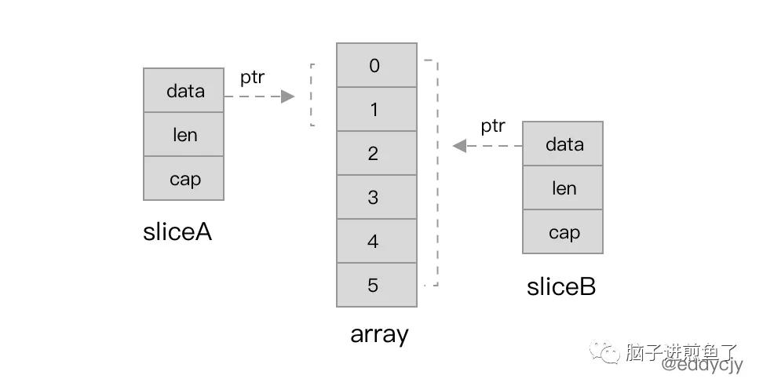

# 普通面试题


## 1. 什么是协程（Goroutine）

协程是**用户态轻量级线程**，它是**线程调度的基本单位**。通常在函数前加上go关键字就能实现并发。一个Goroutine会以一个很小的栈启动2KB或4KB，当遇到栈空间不足时，栈会**自动伸缩**， 因此可以轻易实现成千上万个goroutine同时启动。

线程的切换由操作系统负责调度，协程由用户自己进行调度，因此减少了上下文切换，提高了效率。

由于在同一个线程上，因此可以避免竞争关系而使用锁。


协程和线程的比较

| 比较项   |                             线程                             |                             协程                             |
| -------- | :----------------------------------------------------------: | :----------------------------------------------------------: |
| 占用资源 |                   初始单位为1MB,固定不可变                   |                初始一般为 2KB，可随需要而增大                |
| 调度所属 |                       由 OS 的内核完成                       |                          由用户完成                          |
| 切换开销 | 涉及模式切换(从用户态切换到内核态)、16个寄存器、PC、SP...等寄存器的刷新等 |            只有三个寄存器的值修改 - PC / SP / DX.            |
| 性能问题 |        资源占用太高，频繁创建销毁会带来严重的性能问题        |              资源占用小,不会带来严重的性能问题               |
| 数据同步 |            需要用锁等机制确保数据的一直性和可见性            | 不需要多线程的锁机制，因为只有一个线程，也不存在同时写变量冲突，在协程中控制共享资源不加锁，只需要判断状态就好了，所以执行效率比多线程高很多。 |


## 2. 2 个 interface 可以比较吗 ？

Go 语言中，interface 的内部实现包含了 2 个字段，`类型 T 和 值 V`，interface 可以使用 == 或 != 比较。2 个 interface 相等有以下 2 种情况

- 两个 interface 均等于 nil（此时 V 和 T 都处于 unset 状态）

- 类型 T 相同，且对应的值 V 相等。 (但是 T 类型必须是可比较的，如果是不可比较的类型，例如 slice map ，就不能比较)

看下面的例子：

```go
type Stu struct {

Name string

}


type StuInt interface{}


func main() {

	var stu1, stu2 StuInt = &Stu{"Tom"}, &Stu{"Tom"}

	var stu3, stu4 StuInt = Stu{"Tom"}, Stu{"Tom"}

	fmt.Println(stu1 == stu2) // false

	fmt.Println(stu3 == stu4) // true

}
```

stu1 和 stu2 对应的类型是 *Stu，值是 Stu 结构体的地址，两个地址不同，因此结果为 false。

stu3 和 stu4 对应的类型是 Stu，值是 Stu 结构体，且各字段相等，因此结果为 true。


## 3. goroutine 里面 panic 了会怎么样

在Go语言中，我们通常会用到panic和recover来抛出错误和捕获错误，这一对操作在单协程环境下我们正常用就好了，并不会踩到什么坑。但是在多协程并发环境下，我们常常会碰到以下两个问题。假设我们现在有2个协程，我们叫它们协程A和B好了：

- 如果协程A发生了panic，协程B是否会因为协程A的panic而挂掉？
- 如果协程A发生了panic，协程B是否能用recover捕获到协程A的panic？

答案分别是：会、不能。

==总结==  在一个 gorouting 里 panic ，就要在其 gorouting recover ， 否则整个进程都崩了


## 4. go里面goroutine创建数量有限制吗？


## 5. 值类型和引用类型的区别？

1. 值类型在内存中存储的是值本身，而引用类型在内存中存储的是值的内存地址。
2. 值类型内存通常在栈中分配，引用类型内存通常在堆中分配。


## 6. go 调度时机

在四种情形下，goroutine 可能会发生调度，但也并不一定会发生，只是说 Go scheduler 有机会进行调度。

| 情形            | 说明                                                         |
| :-------------- | :----------------------------------------------------------- |
| 使用关键字 `go` | go 创建一个新的 goroutine，Go scheduler 会考虑调度           |
| GC              | 由于进行 GC 的 goroutine 也需要在 M 上运行，因此肯定会发生调度。当然，Go scheduler 还会做很多其他的调度，例如调度不涉及堆访问的 goroutine 来运行。GC 不管栈上的内存，只会回收堆上的内存 |
| 系统调用        | 当 goroutine 进行系统调用时，会阻塞 M，所以它会被调度走，同时一个新的 goroutine 会被调度上来 |
| 内存同步访问    | atomic，mutex，channel 操作等会使 goroutine 阻塞，因此会被调度走。等条件满足后（例如其他 goroutine 解锁了）还会被调度上来继续运行 |


## 7 Go 中哪些动作会触发 runtime 调度？

**第一种：系统调用 SysCall**

**当你在 goroutine 进行一些 sleep 休眠、读取磁盘或者发送网络请求时，其实都会发生系统调用，进入操作系统内核。**

而一旦发生系统调用，就会直接触发 runtime 的调度，当前的 P 就会去找其他的 M 进行绑定，并取出 G 开始运行。

**第二种：等待锁、通道 （阻塞）**

此外，在你的代码中，**若因为锁或者通道导致代码阻塞了，也会触发调度**。

**第三种：人工触发**

在代码中直接调用 **runtime.Gosched** 方法，也可以手动触发。

**第四种：队列轮询**

不考虑G进入系统调用或IO操作的情况下，P周期性的将G调度到M中执行，执行一小段时间，将上下文保存下来，然后将G放到队列尾部，然后从队列中重新取出一个G进行调度。


明哥的说法：

#### Go 中哪些动作会触发 runtime 调度？

**第一种：系统调用 SysCall**

当你在 goroutine 进行一些 sleep 休眠、读取磁盘或者发送网络请求时，其实都会发生系统调用，进入操作系统内核。

而一旦发生系统调用，就会直接触发 runtime 的调度，当前的 P 就会去找其他的 M 进行绑定，并取出 G 开始运行。

**第二种：等待锁、通道**

此外，在你的代码中，若因为锁或者通道导致代码阻塞了，也会触发调度。

**第三种：人工触发**

在代码中直接调用 runtime.Gosched 方法，也可以手动触发。


## 8 golang GC 回收介绍 (标记清除, 三色标记法, 混合写屏障)


## 9 什么时候会触发 golang GC 呢

触发条件从大方面来说，分为 `手动触发` 和 `系统触发` 两种方式。手动触发一般很少用，主要通过开发者调用 `runtime.GC()` 函数来实现，而对于系统自动触发是 `运行时` 根据一些条件自行维护的

`kind` 的值有三种，分别为 `gcTriggerHeap`、 `gcTriggerTime` 和 `gcTriggerCycle`。

- `gcTriggerHeap` 当前分配的内存达到一定阈值时触发，这个阈值在每次GC过后都会根据堆内存的增长情况和CPU占用率来调整；主要是 [`mallocgc()` ](https://github.com/golang/go/blob/go1.16/src/runtime/malloc.go#L902-L1171)函数,其中分配内存对象大小又分多种情况，建议看下源码实现。
- `gcTriggerTime` 自从上次GC后间隔时间达到了`runtime.forcegcperiod` 时间（默认为2分钟），将启动GC；主要是 `sysmon` 监控线程
- `gcTriggerCycle` 如果当前没有开启垃圾收集，则启动GC；主要是调用函数 `runtime.GC()`

运行时会通过 `gcTrigger.test()` 函数判断是否需要触发GC，只要满足上面其中一个即可。


总结：

1. **主动触发**，通过调用 runtime.GC 来触发 GC，此调用阻塞式地等待当前 GC 运行完毕。
2. **被动触发**，分为两种方式：
   - 使用系统监控，当超过`两分钟`没有产生任何 GC 时，强制触发 GC。
   - 使用步调（Pacing）算法，其核心思想是控制内存增长的比例。其核心思想是控制内存增长的比例，每次内存分配时检测当前内存分配量是否到达了阀值：默认是100%，即当内存扩大一倍时启动GC.


## 10 golang 如何做超时控制 ? (time.After 和 context.WithTimeOut)


## 11 golang 如何 比较两个 map 使用相等

在 Golang 中比较两个 map 是否相等，需要遵循以下规则：

1. 两个 map 的类型必须完全相同。
2. 两个 map 必须具有相同的长度。
3. 对于每个 key，两个 map 中的值必须相等。


```shell
1、都为 nil
2、非空、长度相等，指向同一个 map 实体对象
3、相应的 key 指向的 value “深度”相等
```

直接将使用 map1 == map2 是错误的。这种写法只能比较 map 是否为 nil。

```go
 package main

import "fmt"

func main() {
	var m map[string]int
	var n map[string]int

	fmt.Println(m == nil)
	fmt.Println(n == nil)

	// 不能通过编译
	//fmt.Println(m == n)
}
```

输出结果：

true true

因此只能是遍历map 的每个元素，比较元素是否都是深度相等。

```go
func equal(a, b map[string]int) bool {
    if len(a) != len(b) {
        return false
    }
    for k, av := range a {
        if bv, ok := b[k]; !ok || av != bv {
            return false
        }
    }
    return true
}
```


或者使用 reflect.DeepEqual()


## 12 协程切换的时机？ (网易面试题)

`切换时机`

- 会阻塞的系统调用，比如文件io，网络io；
- time系列定时操作；
- go func的时候, func执行完的时候；
- 管道读写阻塞的情况；
- 垃圾回收之后。
- 主动调用runtime.Gosched()


## 13 channel的底层结构？接收、发送消息的过程？(网易面试题)


## 14 sync. WaitGroup的底层是怎么样实现的 


## 15 golang context 使用场景


## 16 两个结构体可以比较吗


>哪些数据类型是可比较的，哪些是不可比较的：
>
>- 可比较：*Integer*，*Floating-point*，*String*，*Boolean*，*Complex(复数型)*，*Pointer*，*Channel*，*Interface*，*Array*
>- 不可比较：*Slice*，*Map*，*Function*


结构体有时候并不能直接比较，当其基本类型包含：`slice、map、function` 时，是不能比较的。若强行比较，就会导致出现直接报错的情况。

而指针引用，其虽然都是 `new(string)`，从表象来看是一个东西，但其具体返回的地址是不一样的。

如果我们被迫无奈，被要求一定要用结构体比较怎么办？

这时候可以使用反射方法 `reflect.DeepEqual`，如下：

```go
func main() {
    v1 := Value{Name: "煎鱼", GoodAt: []string{"炸", "煎", "蒸"}}
    v2 := Value{Name: "煎鱼", GoodAt: []string{"炸", "煎", "蒸"}}
    if reflect.DeepEqual(v1, v2) {
        fmt.Println("脑子进煎鱼了")
        return
    }

    fmt.Println("脑子没进煎鱼")
}
```

这样子就能够正确的比较，输出结果为 “脑子进煎鱼了”。

例子中所用到的反射比较方法 `reflect.DeepEqual` 常用于判定两个值是否深度一致，其规则如下：

- 不同类型的值永远不会深度相等

  当两个数组的元素对应深度相等时，两个数组深度相等

  当两个相同结构体的所有字段对应深度相等的时候，两个结构体深度相等

  当两个函数都为nil时，两个函数深度相等，其他情况不相等（相同函数也不相等）

  当两个interface的真实值深度相等时，两个interface深度相等

  map的比较需要同时满足以下几个

  - 两个map都为nil或者都不为nil，并且长度要相等
  - 相同的map对象或者所有key要对应相同
  - map对应的value也要深度相等

  指针，满足以下其一即是深度相等

  - 两个指针满足go的==操作符
  - 两个指针指向的值是深度相等的

  切片，需要同时满足以下几点才是深度相等

  - 两个切片都为nil或者都不为nil，并且长度要相等
  - 两个切片底层数据指向的第一个位置要相同或者底层的元素要深度相等
  - 注意：空的切片跟nil切片是不深度相等的

  其他类型的值（numbers, bools, strings, channels）如果满足go的==操作符，则是深度相等的。要注意不是所有的值都深度相等于自己，例如函数，以及嵌套包含这些值的结构体，数组等


### 16.1 struct 可以作为 map 的key 吗

**struct必须是可比较的，才能作为key**，否则编译时报错

> key一定要是**可比较**的类型（可以理解为支持==的操作）：

```go
type T1 struct {
    Name  string
    Age   int
    Arr   [2]bool
    ptr   *int
    slice []int
    map1  map[string]string
}

type T2 struct {
    Name string
    Age  int
    Arr  [2]bool
    ptr  *int
}

func main() {
    // n := make(map[T2]string, 0) // 无报错
    // fmt.Print(n)                // map[]

    m := make(map[T1]string, 0)
    fmt.Println(m) // invalid map key type T1
}
```


### 16.2 两个不同的结构体实例可不可以比较

**「结论」**：可以比较，也不可以比较

可通过强制转换来比较：

```go
type T2 struct {
    Name  string
    Age   int
    Arr   [2]bool
    ptr   *int
}

type T3 struct {
    Name  string
    Age   int
    Arr   [2]bool
    ptr   *int
}

func main() {
    var ss1 T2
    var ss2 T3
    // Cannot use 'ss2' (type T3) as type T2 in assignment
    //ss1 = ss2     // 不同结构体之间是不可以赋值的
    ss3 := T2(ss2)
    fmt.Println(ss3==ss1) // true
}
```

如果成员变量中含有不可比较成员变量，即使可以强制转换，也不可以比较

```go
type T2 struct {
    Name  string
    Age   int
    Arr   [2]bool
    ptr   *int
    map1  map[string]string
}

type T3 struct {
    Name  string
    Age   int
    Arr   [2]bool
    ptr   *int
    map1  map[string]string
}

func main() {
    var ss1 T2
    var ss2 T3
    
    ss3 := T2(ss2)
    fmt.Println(ss3==ss1)   // 含有不可比较成员变量
}

# command-line-arguments
./test.go:28:18: invalid operation: ss3 == ss1 (struct containing map[string]string cannot be compared)
```

 

### 16.3 同一个struct的两个实例能不能比较

*什么可以比较？*

回到上面的划重点部分，在总结中我们可以知道，golang中 *Slice*，*Map*，*Function* 这三种数据类型是不可以直接比较的。

同一个struct的两个实例可比较也不可比较，当结构不包含不可直接比较成员变量时可直接比较，否则不可直接比较


### 16.4 当我们需要对含有不可直接比较的数据类型的结构体实例进行比较时

我们可以借助 *reflect.DeepEqual 函数* 来对两个变量进行比较。

```go
type S struct {
    Name    string
    Age     int
    Address *int
   Data    []int
}

func main() {
    a := S{
        Name:    "aa",
        Age:     1,
        Address: new(int),
      Data:    []int{1, 2, 3},
    }
    b := S{
        Name:    "aa",
        Age:     1,
        Address: new(int),
      Data:    []int{1, 2, 3},
    }

   fmt.Println(reflect.DeepEqual(a, b))
}

true
```


## 17 gmp 为什么要有 p

加了 P 之后会带来什么改变呢？我们再更显式的讲一下。

- **每个 P 有自己的本地队列**，大幅度的减轻了对**全局队列**的直接依赖，**所带来的效果就是锁竞争的减少**。而 GM 模型的性能开销大头就是锁竞争。

- **每个 P 相对的平衡上**，在 GMP 模型中也实现了 **Work Stealing 算法**，如果 P 的本地队列为空，则会从全局队列或其他 P 的本地队列中窃取可运行的 G 来运行，**减少空转，提高了资源利用率**。

- ### 为什么要有 P

  这时候就有小伙伴会疑惑了，如果是想实现本地队列、Work Stealing 算法，那为什么不直接在 M 上加呢，M 也照样可以实现类似的组件。为什么又再加多一个 P 组件？

  结合 M（系统线程） 的定位来看，若这么做，有以下问题：

  - 一般来讲，M 的数量都会多于 P。**像在 Go 中，M 的数量默认是 10000，P 的默认数量的 CPU 核数**。另外由于 M 的属性，也就是如果存在系统阻塞调用，阻塞了 M，又不够用的情况下，M 会不断增加。
  - M 不断增加的话，如果本地队列挂载在 M 上，那就意味着本地队列也会随之增加。这显然是不合理的，**因为本地队列的管理会变得复杂**，且 Work Stealing 性能会大幅度下降。
  - M 被系统调用阻塞后，我们是期望把他既有未执行的任务分配给其他继续运行的，而不是一阻塞就导致全部停止。

  因此使用 M 是不合理的，那么引入新的组件 P，把本地队列关联到 P 上，就能很好的解决这个问题。


## 18 new 和 make 区别

本质上在于 `make` 函数在初始化时，会初始化 `slice`、`chan`、`map` 类型的内部数据结构，`new` 函数并不会。

例如：在 `map` 类型中，合理的长度（len）和容量（cap）可以提高效率和减少开销。

更进一步的区别：

- ```
  make
  ```

  - 能够创建类型所需的内存空间，返回引用类型的本身, 而不是它们的指针类型。
  - 具有使用范围的局限性，仅支持 `channel`、`map`、`slice` 三种类型。
  - 具有独特的优势，`make` 函数会对三种类型的内部数据结构（长度、容量等）赋值。

- ```
  new
  ```

  - 能够创建并分配类型所需的内存空间，返回指针引用（指向内存的指针）。
  - 可被替代，能够通过字面值快速初始化。
  - 它会申请一个该类型大小的内存空间，并会初始化为对应的零值，返回指向该内存空间的一个指针。


总结下区别，回答时可以说：

- make 只能用来分配及初始化类型为 slice、map、chan 的数据。new 可以分配任意类型的数据；
- new 分配返回的是`指针`，即类型 *Type。make 返回`引用`，即 Type；
- new 分配的空间被清零。make 分配空间后，会进行初始化；


## 19 两个 interface 可以比较吗？

空接口在保存不同的值后，可以和其他变量值一样使用`==`进行比较操作。空接口的比较有以下几种特性。

interface 的内部实现包含了 2 个字段，类型 `T` 和 值 `V`

#### 1) 类型不同的空接口间的比较结果不相同

保存有类型不同的值的空接口进行比较时，Go语言会优先比较值的类型。因此类型不同，比较结果也是不相同的，代码如下：

```go
// a保存整型
var a interface{} = 100

// b保存字符串
var b interface{} = "hi"

// 两个空接口不相等
fmt.Println(a == b)
```

代码输出如下：

false

#### 2) 不能比较空接口中的动态值

当接口中保存有动态类型的值时，运行时将触发错误，代码如下：

```go
// c保存包含10的整型切片
var c interface{} = []int{10}

// d保存包含20的整型切片
var d interface{} = []int{20}

// 这里会发生崩溃
fmt.Println(c == d)
```

代码运行到第8行时发生崩溃：

panic: runtime error: comparing uncomparable type []int

这是一个运行时错误，提示 []int 是不可比较的类型。下表中列举出了类型及比较的几种情况。

| 类  型          | 说  明                                                       |
| --------------- | ------------------------------------------------------------ |
| map             | 宕机错误，不可比较                                           |
| 切片（[]T）     | 宕机错误，不可比较                                           |
| 通道（channel） | 可比较，必须由同一个 make 生成，也就是同一个通道才会是 true，否则为 false |
| 数组（[容量]T） | 可比较，编译期知道两个数组是否一致                           |
| 结构体          | 可比较，可以逐个比较结构体的值                               |
| 函数            | 可比较                                                       |


## 20 Go 的默认栈大小是多少？最大值多少？

 2KB

**为啥会有栈空间扩容**

由于当前的 **Go 的栈结构使用的是连续栈**，并且初始值才 2k 比较小，因此随着函数的调用层级加深，Go 的初始栈空间就可能不够用，不够用的话，就会触发栈空间的扩容。

**栈空间扩容啥时会触发 ** （由 runtime 管理） 

编译器会为函数调用插入运行时检查`runtime.morestack`，它会在几乎所有的函数调用之前检查当前`goroutine` 的栈内存是否充足，如果当前栈需要扩容，会调用`runtime.newstack` 创建新的栈。

而新的栈空间，是旧栈空间大小（通过保存在`goroutine`中的`stack`信息里记录的栈区内存边界计算出来的）的两倍，但最大栈空间大小不能超过 `maxstacksize` ，也就是 **1G。**

**不管是扩容还是缩容，都是使用 `runtime.copystack` 函数来开辟新的栈空间，然后将旧栈的数据全部拷贝至新的栈空间，并调整原来指针的指向。**


## 21 数组和silice 区别

### 数组

- Go语言中的Array即为数据的一种集合，需要在声明时指定容量和初值，且一旦声明就**长度固定**了，访问时按照索引进行访问。通过内置函数`len`可以获取数组中的元素个数。
- `数组在初始化时必须指定大小和初值`，不过Go语言为我们提供了一些更为灵活的方式进行初始化。例如：使用`...`来自动获取长度；未指定值时，用0赋予初值；指定指定元素的初值等。
- Go语言数组作为函数参数时，`必须指定参数数组的大小`，且传入的数组大小必须与指定的大小一致，`数组为**按值传递**的，函数内对数组的值的改变不影响初始数组`

- `golang`中的数组是**`值类型`**,也就是说，如果你将一个数组赋值给另外一个数组，那么，实际上就是整个数组拷贝了一份
- 如果`golang`中的数组作为函数的参数，那么实际传递的参数是一份`数组的拷贝`，而不是数组的指针
- `array`的长度也是`Type`的一部分，这样就说明`[10]int`和`[20]int`是不一样的。

### slice

切片是Go语言中极为重要的一种数据类型，可以理解为**动态长度**的数组（虽然实际上Slice结构内包含了一个数组），访问时可以按照数组的方式访问，也可以通过`切片`操作访问。`Slice有三个属性：指针、长度和容量`。指针即Slice名，指向的为数组中第一个可以由Slice访问的元素；长度指当前slice中的元素个数，不能超过slice的容量；容量为slice能包含的最大元素数量，但实际上当容量不足时，会自动扩充为原来的两倍。通过内置函数`len`和`cap`可以获取slice的长度和容量。

- Go语言Slice作为函数参数传递时为**按引用传递**的 (传递的是指针)，函数内对slice内元素的修改将导致函数外的值也发生改变，不过由于传入函数的是一个指针的副本，所以对该指针的修改不会导致原来的指针的变化（例如append函数不会改变原来的slice的值）


## 22 for range 的时候地址会发生变化吗？

在 for a,b := range c 遍历中， a 和 b 在内存中只会存在一份，即之后每次循环时遍历到的数据都是以值覆盖的方式赋给 a 和  b，a，b 的内存地址始终不变。由于有这个特性，「for 循环里面如果开协程，不要直接把 a 或者 b  的地址传给协程」。解决办法：在每次循环时，创建一个临时变量。


## 23 for range 的一些坑

`k,v`地址保持不变，  **range每次都会把当前值赋值到循环变量上，而不是直接使用原变量**

```go
type student struct {
	name string
	age  int
}
func main() {
	m := make(map[string]*student)
	stus := []student{
		{name: "小王子", age: 18},
		{name: "娜扎", age: 23},
		{name: "大王八", age: 9000},
	}
	for _, stu := range stus {
	//每次取的地址都是循环变量的地址（唯一）
		m[stu.name]=&stu
	}
	for k, v := range m {
		fmt.Println(k, "=>", v.name)
	}
}

小王子--》大王八
娜扎--》大王八
大王八--》大王八

迭代变量是被重用的
```


## 24 对 map 遍历时删除元素能遍历到吗？


## 25 对 map 遍历时新增元素能遍历到吗？


## 26 defer 在什么时候会修改返回值？


## 27 golang 中解析 tag 


## 28 反射原理？


## 29 slice 遇到过哪些坑

### 把 slice 传入参数

因为golang总是传值, slice在传入helper函数后, helper函数中的s变量是一个新的变量, append操作修改的是此局部变量的Len值. 而main函数中的s变量, 其Len值始终没有改变.

**切片传值操作**，append未触发扩容，会同时修改底层数组的值，`但不会影响原切片的长度和容量`；当触发扩容，那么会产生副本，后面的修改则会和原底层数组剥离开，互不影响。

如果期望在修改切片后，对原切片也发生修改，则可以使用**传址操作**，始终基于同一个切片变量进行操作。

（详细的可以在 slice 中看）


## 30 go 闭包

参看闭包的文章


## 31 context 使用场景

### 值传递

值传递只是context的一个辅助功能，并不是核心功能。一般我们只用context来传递不影响业务主逻辑的可选数据，比如日志信息、调试信息以及元信息等等。

```go
package main

import (
	"context"
	"fmt"
)

func readContext(ctx context.Context) {
	traceId, ok := ctx.Value("key").(string)
	if ok {
		fmt.Println("readContext key=", traceId)
	} else {
		fmt.Println("readContext no key")
	}
}

func main() {
	ctx := context.Background()
	readContext(ctx)
	ctx = context.WithValue(ctx, "key", "beautiful")
	readContext(ctx)
}

复制代码
```

在使用WithValue对ctx包装时，可以设置一个key-value键值对，在goroutine之间传递。


### 超时控制

**http请求设置超时时间**

```go
package main

import (
	"context"
	"fmt"
	"time"
)

func httpRequest(ctx context.Context) {
	for {
		// 处理http请求
		select {
		case <- ctx.Done():
			fmt.Println("Request timed out")
			return
		case <- time.After(time.Second):
			fmt.Println("Loading...")
		}
	}
}

func main() {
	fmt.Println("start TestTimeoutContext")
	ctx, cancel := context.WithTimeout(context.Background(), time.Second * 3)
	defer cancel()
	httpRequest(ctx)
	time.Sleep(time.Second * 5)
}

//start TestTimeoutContext
//Loading...
//Loading...
//Request timed out
```

**文件io或者网络io等耗时操作，可以查看剩余的时间是否充足，决定是否进行下一步操作**

```go
package main

import (
	"context"
	"fmt"
	"time"
)

func copyFile(ctx context.Context)  {
	deadline, ok := ctx.Deadline()
	if ok == false {
		return
	}
	// deadline.Sub(time.Now()) 截止时间与当前时间的差值
	isEnough := deadline.Sub(time.Now()) > time.Second * 5
	if isEnough {
		fmt.Println("copy file")
	} else {
		fmt.Println("isEnough is false return")
		return
	}
}

func main() {
	ctx, cancel := context.WithDeadline(context.Background(), time.Now().Add(time.Second * 4))
	defer cancel()
	copyFile(ctx)
	time.Sleep(time.Second * 5)
}


//isEnough is false return

复制代码
```


### 取消控制

**goroutine发送取消信号，保证自己这个逻辑中发散出去的goroutine全部成功取消**

```go
package main

import (
	"context"
	"fmt"
	"time"
)

func gen(ctx context.Context) <-chan int {
	ch := make(chan int)
	go func() {
		var n int
		for {
			select {
			case ch <- n:
				n++
				time.Sleep(time.Second)
			case <-ctx.Done():
				return
			}
		}
	}()
	return ch
}

func main() {
	// 创建一个Cancel context
	ctx, cancel := context.WithCancel(context.Background())
	defer cancel()
	for n := range gen(ctx) {
		fmt.Println(n)
		if n == 5 {
			// 达到要求之后触发cancel
			cancel()
			break
		}
	}
}
//0
//1
//2
//3
//4
//5
```


## 32 进程、线程、协程区别

进程

- 进程是程序一次动态执行的过程，是程序运行的基本单位。
- 每个进程都有自己的`独立地址空间`，不同进程通过进程间通信来通信。
- 进程占据独立的内存，所以上下文进程间的切换开销（栈、寄存器、页表、文件句柄等）比较大，但相对比较稳定安全。


线程

- 线程又叫做轻量级进程，是CPU调度的最小单位。
- 线程从属于进程，是程序的实际执行者。一个进程至少包含一个主线程，也可以有更多的子线程。
- 多个线程共享所属进程的资源，同时线程也拥有自己的专属资源。
- 程间通信主要通过`共享内存`，上下文切换很快，资源开销较少，但相比进程不够稳定容易丢失数据。


协程

- **协程是一种`用户态的轻量级线程`，`协程的调度完全由用户控制`**。
- 一个线程可以拥有多个协程，协程不是被操作系统内核所管理，而完全是由程序所控制。
- 与其让操作系统调度，不如我自己来，这就是协程


### 进程和线程的区别

线程是指进程内的一个执行单元,也是进程内的可调度实体。线程与进程的区别:

1、根本区别： 进程是操作系统`资源分配`和独立运行的最小单位；线程是`任务调度`和系统执行的最小单位。

2、地址空间区别： 每个进程都有独立的地址空间，一个进程崩溃不影响其它进程；一个进程中的多个线程共享该 进程的地址空间，一个线程的非法操作会使整个进程崩溃。

3、上下文切换开销区别： 每个进程有独立的代码和数据空间，进程之间上下文切换开销较大；线程组共享代码和数据空间，线程之间切换的开销较小。

线程进程的区别体现在6个方面：

- 根本区别：进程是操作系统资源分配的基本单位，而线程是处理器任务调度和执行的基本单位。
- 资源开销：每个进程都有独立的代码和数据空间，程序之间的切换会有较大的开销；线程可以看做轻量级的进程，同一进程的线程共享代码和数据空间，每个线程都有自己独立的运行栈和程序计数器，线程之间切换的开销小。
- 包含关系：如果一个进程内有多个线程，则执行过程不是一条线的，而是多条线（线程）共同完成的。
- 内存分配：同一进程的线程共享本进程的地址空间和资源，而进程之间的地址空间和资源是相互独立的。
- 影响关系：一个进程崩溃后，在保护模式下不会对其他进程产生影响，但是一个线程崩溃整个进程都死掉。所以多进程要比多线程健壮。
- 执行过程：每个独立的进程有程序运行的入口、顺序执行序列和程序出口。但是线程不能独立执行，必须依存在应用程序中，由应用程序提供多个线程执行控制。两者均可并发执行。


### 协程和线程的区别

1) 一个线程可以多个协程，一个进程也可以单独拥有多个协程。
2) 线程进程都是同步机制，而协程则是异步。
3) 协程能保留上一次调用时的状态，每次过程重入时，就相当于进入上一次调用的状态。
4) `线程是抢占式，而协程是非抢占式的`，所以需要用户自己释放使用权来切换到其他协程，因此同一时间其实只有一个协程拥有运行权，相当于单线程的能力。
5) 协程并不是取代线程, 而且抽象于线程之上, 线程是被分割的CPU资源, 协程是组织好的代码流程, 协程需要线程来承载运行, 线程是协程的资源, 但协程不会直接使用线程, 协程直接利用的是执行器(Interceptor), 执行器可以关联任意线程或线程池, 可以使当前线程, UI线程, 或新建新程.。


## 33 golang 内存模型为什么小对象会造成gc 压力


## 34 golang 中除了加 mutex ，还有什么方式可以安全读写共享变量

Golang中Goroutine 可以通过` Channel `进行安全读写共享变量,还可以通过`原子性`操作进行.


## 35 go 对 nil slice 和 空 slice 的处理是一致的吗？

在 Golang 中，当声明一个变量但没有赋值时，它的值将被设置为**该类型的零值**。

**Slice** 的零值是 `nil`，所以在我们上面的例子中，当我们声明 `var foo []string` 时，foo 的值实际上是 `nil` **而不是空切片** `string[]{}`。

**Empty Slice** (空切片) 可以通过使用[短变量声明](https://go.dev/tour/basics/10) (`:=`) 来生成，例如：`foo := []string{}` 或使用 make 函数。


**两者都能正常追加和遍历**

其实，绝大多数时候，我们并不那么需要刻意区分。

无论是 Empty Slice 还是 Nil Slice（初始值是 **nil**），两者都能正常进行**追加**和**遍历**操作。


**json encoding**

通过 Golang 的 encoding/json 库对两种 Slice 进行 encode 操作

Nil Slice 将得到 `null`，这也许不是我们 API 设计期望得到的结果（假如我们希望将定义一个非 null 的字段）。

而 Empty Slice 进行 encode 得到的值才是 `[]`。


## 36 golang 中的内存泄漏

内存泄漏是指程序运行过程中，内存因为某些原因无法释放或没有释放。简单来讲就是，有代码占着茅坑不拉屎，让内存资源造成了浪费。如果泄漏的内存越堆越多，就会占用程序正常运行的内存。比较轻的影响是程序开始运行越来越缓慢；严重的话，可能导致大量泄漏的内存堆积，最终导致程序没有内存可以运行，最终导致 OOM （Out Of Memory，即内存溢出）。但通常来讲，内存泄漏都是极其不易发现的，所以为了保证程序的健康运行，我们需要重视如何避免写出内存泄漏的代码。

- `slice`、`string` 误用造成内存泄漏
- `time.Ticker` 误用造成内存泄漏
- channel 误用造成内存泄漏

## `slice`、`string` 误用造成内存泄漏

一般来说我们经常会使用 `a[1:3]` 这种形式对一个 `slice` 进行切片，但你可能不知道，如果不注意，这个操作还会导致内存泄漏。毕竟这是个[“连 golang 官方都会踩的坑”](https://link.juejin.cn?target=https%3A%2F%2Fgithub.com%2Fgolang%2Fgo%2Fpull%2F32138)呢。

### 内存泄漏分析

**`slice` 的结构**

这里使用一张《Go 入门指南》的图：


正如上图 `x` 的结构所示，`slice` 的结构实际上只记录了如下三个部分：

- 数组指针。指向了真正的数组地址。
- `slice` 的长度
- `slice` 的容量

当我们对 `slice` 切片时，实际上新创建的 `slice` 的数组指针也是指向的旧 `slice` 指向的底层数组，只是可能指向的位置不同。也就是说，使用切片时，新产生的 `slice` 与旧 `slice` 共用一个底层数组。

正常情况下，如果没有 `y` 这个切片，当 `x` 不再使用了，由于 `x` 和其指向的数组都不存在任何引用，它们会被垃圾回收机制回收。如果 `x` 存在切片，比如上图的 `y`，当 `x` 不再使用时，`x` 可以被回收，但由于 `y` 仍在引用底层数组，垃圾回收机制不会把底层数组回收。这就造成底层数组索引为 0 的位置的内存发生了泄漏（谁也访问不到了）。

**验证一下**

让我们使用代码验证一下：

```go
func TestSlice(t *testing.T) {
	var a []int
	for i := 0; i < 100; i++ {
		a = append(a, i)
	}

	var b = a[:10]
	println(&a, &b)
	println(&a[0], &b[0])
}
复制代码
```

运行后，输出如下：

```
0xc000038748 0xc000038730
0xc000148400 0xc000148400
复制代码
```

我们可以发现，`a[0]` 与 `b[0]` 地址是完全一样的，可以印证 `a` 与 `b` 底层用的是同一个数组。当 `a` 不再使用时，`b` 就会只引用 `a` 指向的底层数组的一部分。假设 `a` 是一个大数组，而 `b` 只引用了一小部分，这就造成了底层数组其他未被引用的部分内存泄漏。即便 `a` 是一个小数组，如果内存中有很多类似 `b` 引用 `a` 这样代码，积少成多，也会导致大量内存泄漏。

> 需要注意的是：由于 string 切片时也会共用底层数组，所以使用不当也会造成内存泄漏。

**其他语言中类似的情况**

Python 和 Java 都有类似 `slice` 的概念，它们底层都大差不差，因此也会因为类似的原因导致内存泄漏。

比如 Python，也有切片这个概念，看下面这个代码：

```python
>>> a=[1,2,4,5]
>>> b=tab[:3]
>>> id(a[0])
140700163291672
>>> id(b[0])
140700163291672
复制代码
```

可以发现 `a[0]` 和 `b[0]` 的地址是相同的。

又比如 Java，Java 中这个结构被称为 `SubList`。`SubList` 和原 `List` 底层也是共用的一个数组，所以如果使用不当，也会造成内存泄漏。

### 解决方案

解决问题的核心是：如果我们需要使用切片时，尽量保证切片只作为局部变量使用，不会被传到方法外，这样在局部变量使用完后，该切片就会被回收。比如上文 `TestSlice` 中的代码，执行完后，切片就会被回收，即便对切片进行切片也不会造成内存泄漏（上述代码只是用于演示会造成内存泄漏）。但如果切片被传递到其他方法中，很可能被其他方法切片，导致原有的切片出现内存泄漏。

如果我们不能保证将切片作为局部变量使用且不传递，则应该对需要的切片数据进行拷贝，防止内存泄漏。如下所示的两种方式均可：

```go
func TestSliceSolution(t *testing.T) {
	var a, b []int
	for i := 0; i < 100; i++ {
		a = append(a, i)
	}

	b = append(b, a[:10]...)
	println(&a[0], &b[0])
}

//0xc000014800 0xc000020230
复制代码
func TestSliceSolution2(t *testing.T) {
	var a, b []int
	for i := 0; i < 100; i++ {
		a = append(a, i)
	}

	b = make([]int, 10)
	copy(b, a[:10])
	println(&a[0], &b[0])
}

//0xc000014800 0xc00003e6d0
复制代码
```

## `time.Ticker` 误用造成内存泄漏

> 注意：`Ticker` 和 `Timer` 是不同的。`Timer` 只会定时一次，而 `Ticker` 如果不 `Stop`，就会一直发送定时。

可能有些人对 `Ticker` 并不熟悉，这里给出一个使用示例：

```go
func TestTickerNormal(t *testing.T) {
	ticker := time.NewTicker(time.Second)
	defer ticker.Stop()
	go func() {
		for {
			fmt.Println(<-ticker.C)
		}
	}()

	time.Sleep(time.Second * 3)
	fmt.Println("finish")
}

//2022-03-17 12:01:06.279504 +0800 CST m=+1.000922333
//2022-03-17 12:01:07.281379 +0800 CST m=+2.002815014
//finish
//2022-03-17 12:01:08.280861 +0800 CST m=+3.002314240
```

作者：柳双六
链接：https://juejin.cn/post/7129299782828785695

## channel 误用造成内存泄漏

都说 golang 10 次内存泄漏，9 次是 go routine 泄漏。可见 go channel 内存泄漏的常见性。go channel 内存泄漏主要分两种情况，我在[《老手也常误用！详解 Go channel 内存泄漏问题》](https://link.juejin.cn?target=https%3A%2F%2Fmp.weixin.qq.com%2Fs%2FpmdAcYWcIw82K4Vu7m4WHw)这篇文章有详细讲述。这里简单说一下造成内存泄漏的代码、原因。

### 情景一： `select-case` 造成的内存泄漏

```go
func TestLeakOfMemory(t *testing.T) {
   fmt.Println("NumGoroutine:", runtime.NumGoroutine())
   chanLeakOfMemory()
   time.Sleep(time.Second * 3) // 等待 goroutine 执行，防止过早输出结果
   fmt.Println("NumGoroutine:", runtime.NumGoroutine())
}

func chanLeakOfMemory() {
   errCh := make(chan error) 
   go func() { 
      time.Sleep(2 * time.Second)
      errCh <- errors.New("chan error") // (1)
      fmt.Println("finish sending")
   }()

   var err error
   select {
   case <-time.After(time.Second): // (2) 大家也经常在这里使用 <-ctx.Done()
      fmt.Println("超时")
   case err = <-errCh: 
      if err != nil {
         fmt.Println(err)
      } else {
         fmt.Println(nil)
      }
   }
}
复制代码
```

由于 go channel 在没有缓冲队列的时候，读取 channel 默认是阻塞的，所以 (1) 处代码会阻塞，(2) 处超时后，由于没有 go routine 读取 channel ，(1) 会一直阻塞。因此输出：

```makefile
NumGoroutine: 2
超时
NumGoroutine: 3
复制代码
```

### 情景二： `for-range` 造成的内存泄漏

```go
func TestLeakOfMemory2(t *testing.T) {
   fmt.Println("NumGoroutine:", runtime.NumGoroutine())
   chanLeakOfMemory2()
   time.Sleep(time.Second * 3) // 等待 goroutine 执行，防止过早输出结果
   fmt.Println("NumGoroutine:", runtime.NumGoroutine())
}

func chanLeakOfMemory2() {
   ich := make(chan int, 100)
   // sender
   go func() {
      defer close(ich)
      for i := 0; i < 10000; i++ {
         ich <- i // (2)
         time.Sleep(time.Millisecond) // 控制一下，别发太快
      }
   }()
   // receiver
   go func() {
      ctx, cancel := context.WithTimeout(context.Background(), time.Second)
      defer cancel()
      for i := range ich { 
         if ctx.Err() != nil { // (1)
            fmt.Println(ctx.Err())
            return
         }
         fmt.Println(i)
      }
   }()
}

// Output:
// NumGoroutine: 2
// 0
// 1
// ...(省略)...
// 789
// context deadline exceeded
// NumGoroutine: 3
复制代码
```

注意 (1) 处代码，如果检测到 `ctx.Err() != nil`，程序会立刻退出，但此时 `ich` 仍在发送，这就导致代码可能阻塞在 (2) 处，造成了内存泄漏。

### 解决方案

如果接收者需要在 channel 关闭之前提前退出，为防止内存泄漏，在发送者与接收者发送次数是一对一时，应设置 channel 缓冲队列为 1；在发送者与接收者的发送次数是多对多时，应使用专门的 stop channel 通知发送者关闭相应 channel。

作者：柳双六
链接：https://juejin.cn/post/7129299782828785695

## 37 golang 中的内存分配


## 38 协程泄漏

Goroutine 作为一种逻辑上理解的轻量级线程，需要维护执行用户代码的上下文信息。在运行过程中也需要消耗一定的内存来保存这类信息，而这些内存在目前版本的 Go 中是不会被释放的。

因此，如果一个程序持续不断地产生新的 goroutine、且不结束已经创建的 goroutine 并复用这部分内存，就会造成内存泄漏的现象.

可以通过Go自带的工具pprof或者使用Gops去检测诊断当前在系统上运行的Go进程的占用的资源.


## 39 gorouting 存在的意义

线程其实分两种：

- 一种是传统意义的`操作系统线程`
- 一种是编程语言实现的`用户态线程`，也称为协程，在 Go 中就是 goroutine

因此，goroutine 的存在必然是为了换个方式解决操作系统线程的一些弊端 — **太重** 。

太重表现在如下几个方面：

**第一：创建和切换太重**

`操作系统线程的创建和切换都需要进入内核`，而进入内核所消耗的性能代价比较高，开销较大；

**第二：内存使用太重**

一方面，为了尽量避免极端情况下操作系统线程栈的溢出，内核在创建操作系统线程时默认会为其分配一个较大的栈内存（虚拟地址空间，内核并不会一开始就分配这么多的物理内存），然而在绝大多数情况下，系统线程远远用不了这么多内存，这导致了浪费；

另一方面，`栈内存空间一旦创建和初始化完成之后其大小就不能再有变化，这决定了在某些特殊场景下系统线程栈还是有溢出的风险。`

相对的，用户态的goroutine则轻量得多：

- goroutine是`用户态线程`，其创建和切换都在用户代码中完成而无需进入操作系统内核，所以其开销要远远小于系统线程的创建和切换；
- goroutine启动时`默认栈大小只有2k`，这在多数情况下已经够用了，即使不够用，goroutine的栈也会自动扩大，同时，如果栈太大了过于浪费它还能自动收缩，这样既没有栈溢出的风险，也不会造成栈内存空间的大量浪费。


## 40 gmp 为什么要有 p

在 Go v1.1 之前，实际上 GMP确实是没有 P 的，所有的 M 线程都要从 全局队列中获取 G 来执行任务，为了避免冲突，从全局队列中获取 G 的时候，要先获取一把大锁。

当一个程序的并发量比较小的时候，影响还不大，而当程序的并发量非常大的时候，这个全局队列会成为性能的瓶颈。

除此之外 ，若直接把 G 从全局队列分配给 M，那么当 G 中当生系统调用或者其他阻塞性的操作时，M 会有一段时间处于挂起的状态，此时又没有新创建线程的线程来代替该线程继续从队列中取出其他 G 来运行，从效率上其实会打折扣。

加了 P 之后会带来什么改变呢？

- 每个 P 有自己的本地队列，大幅度的减轻了对全局队列的直接依赖，所带来的效果就是锁竞争的减少。而 GM 模型的性能开销大头就是锁竞争。
- 当一个 M 中 运行的 G 发生阻塞性操作时，P 会重新选择一个 M，若没有 M 就新创建一个 M 来继续从 P 本地队列中取 G 来执行，提高运行效率。
- 每个 P 相对的平衡上，在 GMP 模型中也实现了 `Work Stealing` 算法，如果 P 的本地队列为空，则会从全局队列或其他 P 的本地队列中窃取可运行的 G 来运行，减少空转，提高了资源利用率。


## 41 连续栈空间

其核心原理就是每当程序的栈空间不足时，初始化一片比旧栈大两倍的新栈并将原栈中的所有值都迁移到新的栈中，新的局部变量或者函数调用就有了充足的内存空间。使用连续栈机制时，栈空间不足导致的扩容会经历以下几个步骤：

1. 调用用`runtime.newstack`在内存空间中分配更大的栈内存空间；
2. 使用`runtime.copystack`将旧栈中的所有内容复制到新的栈中；
3. 将指向旧栈对应变量的指针重新指向新栈；
4. 调用`runtime.stackfree`销毁并回收旧栈的内存空间；

`copystack`会把旧栈里的所有内容拷贝到新栈里然后调整所有指向旧栈的变量的指针指向到新栈


## 42 默认栈空间大小是多少

最小 2k 最大 1g


## 43 抢占式调度

 v1.14 的这种抢占式调用是基于信号的，不管你的协程有没有意愿主动让出 cpu 运行权，只要你这个协程超过某个时间，就会发送信号强行夺取 cpu 运行权。

那么这个时间具体是多少呢？ `20ms`


## 44 defer 的变量快照什么情况会失效？

在下面这段代码中，会先打印出来  `18`，即使后面 age 已经被改变了，可 defer 中的 age还是 修改之前的 `0`，这种现象称之为变量快照。

```go
func func1() {
    age := 0
    defer fmt.Println(age) // output: 0

    age = 18
    fmt.Println(age)      // output: 18
}


func main() {
    func1()
}
```

Go

对于这个输出结果，相信还是挺容易理解的。

接下来，我请大家再看下面这个例子，可以猜猜看会输出什么？

```go
func func1() {
    age := 0
    defer func() {
        fmt.Println(age)
    }()
    age = 18
    return
}

func main() {
    func1()
}
```

正确的答案是：`18`， 而不是 `0`

你肯定会纳闷：不对啊，defer 不是会对变量的值做一个快照吗？答案应该是 0 啊，为什么会是 18？

实际上，仔细观察，可以发现上面的两个例子的区别就在于，一个 defer 后接的是单个表达式，另一个 defer 后接的是一个函数，并且不是普通函数，而是一个匿名的闭包函数。

<iframe id="aswift_3" name="aswift_3" style="left: 0px; top: 0px; border: 0px none; width: 802px; height: 0px;" sandbox="allow-forms allow-popups allow-popups-to-escape-sandbox allow-same-origin allow-scripts allow-top-navigation-by-user-activation" marginwidth="0" marginheight="0" vspace="0" hspace="0" allowtransparency="true" scrolling="no" src="https://googleads.g.doubleclick.net/pagead/ads?client=ca-pub-5848050476707354&amp;output=html&amp;h=280&amp;adk=2453816436&amp;adf=21368618&amp;pi=t.aa~a.3955246158~i.23~rp.4&amp;w=802&amp;fwrn=4&amp;fwrnh=100&amp;lmt=1681481084&amp;num_ads=1&amp;rafmt=1&amp;armr=3&amp;sem=mc&amp;pwprc=2846993921&amp;ad_type=text_image&amp;format=802x280&amp;url=https%3A%2F%2Fiswbm.com%2F535.html&amp;fwr=0&amp;pra=3&amp;rh=200&amp;rw=802&amp;rpe=1&amp;resp_fmts=3&amp;wgl=1&amp;fa=27&amp;dt=1681481084375&amp;bpp=4&amp;bdt=1690&amp;idt=5&amp;shv=r20230412&amp;mjsv=m202304110101&amp;ptt=9&amp;saldr=aa&amp;abxe=1&amp;cookie=ID%3D00217627b65340c9-22f06d6cacde0029%3AT%3D1681479964%3ART%3D1681479964%3AS%3DALNI_MZ4-X_kPa4Y4EFonj37qkzcnOmgrg&amp;gpic=UID%3D00000bf4829f9bdf%3AT%3D1681479964%3ART%3D1681479964%3AS%3DALNI_Mb4fZmr2ukCJIXMio8tVt2P9EYvZg&amp;prev_fmts=0x0%2C1200x200%2C1440x722&amp;nras=3&amp;correlator=778490063702&amp;frm=20&amp;pv=1&amp;ga_vid=1674364742.1681481083&amp;ga_sid=1681481083&amp;ga_hid=1536566050&amp;ga_fc=0&amp;u_tz=480&amp;u_his=1&amp;u_h=900&amp;u_w=1440&amp;u_ah=807&amp;u_aw=1440&amp;u_cd=30&amp;u_sd=1&amp;adx=415&amp;ady=1379&amp;biw=1440&amp;bih=722&amp;scr_x=0&amp;scr_y=333&amp;eid=44759926%2C44759875%2C44759842%2C31073770%2C44786559&amp;oid=2&amp;psts=AHQMDFf_cBxdTW1o75xf4q1Pku4Jk51X_wAAU8zVjFDITpbvfYXiEcDgf70RfRXSbay_bTJ4wQmCNw8T7QBF-UFlHML5&amp;pvsid=1891426477092813&amp;tmod=2057376315&amp;nvt=1&amp;ref=https%3A%2F%2Fiswbm.com%2Fgolang-interview-qa&amp;fc=1408&amp;brdim=0%2C23%2C0%2C23%2C1440%2C23%2C1440%2C807%2C1440%2C722&amp;vis=1&amp;rsz=%7C%7Cs%7C&amp;abl=NS&amp;fu=128&amp;bc=31&amp;ifi=4&amp;uci=a!4&amp;btvi=2&amp;fsb=1&amp;xpc=KPEnIModXS&amp;p=https%3A//iswbm.com&amp;dtd=18" data-google-container-id="a!4" data-google-query-id="CKXq9JXFqf4CFadgDwIdukIJXg" data-load-complete="true" width="802" height="0" frameborder="0"></iframe>

根据闭包的特性，实际上在闭包函数存的是 age 这个变量的指针（原因可以查看上一篇文章：[Go 语言面试题 100 讲之 014篇：说说 Go 中闭包的底层原理？](https://iswbm.com/534.html)），因而，在 defer 后所修改的值会直接影响到 defer 中的 age 的值。

总结一下：

1. 若 defer 后接的是单行表达式，那defer 中的 age 只是拷贝了 `func1` 函数栈中 defer 之前的 age 的值；
2. 若 defer 后接的是闭包函数，那defer 中的 age 只是存储的是 `func1` 函数栈中  age 的指针。


## 44 go defer，多个 defer 的顺序，defer 在什么时机会修改返回值？


## 45 channel 操作结果

总结一下操作 channel 的结果：

| 操作     | nil channel | closed channel     | not nil, not closed channel                                  |
| -------- | ----------- | ------------------ | ------------------------------------------------------------ |
| close    | panic       | panic              | 正常关闭                                                     |
| 读 <- ch | 阻塞        | 读到对应类型的零值 | 阻塞或正常读取数据。缓冲型 channel 为空或非缓冲型 channel 没有等待发送者时会阻塞 |
| 写 ch <- | 阻塞        | panic              | 阻塞或正常写入数据。非缓冲型 channel 没有等待接收者或缓冲型 channel buf 满时会被阻塞 |

总结一下，发生 ==panic== 的情况有三种：

- 向一个关闭的 channel 进行写操作；

- 关闭一个 nil 的 channel；

- 重复关闭一个 channel。

读、写一个 nil channel 都会被阻塞。


## 46 golang 中实现单例的方式

#### 1. 懒汉模式（Lazy Loading）

懒汉模式是开源项目中使用最多的一种，最大的缺点是非线程安全的

2. ### sync.Once


基础相关：

1、golang 中 make 和 new 的区别？（基本必问）

2、数组和切片的区别 （基本必问）

3、for range 的时候它的地址会发生变化么？for 循环遍历 slice 有什么问题？

4、go defer，多个 defer 的顺序，defer 在什么时机会修改返回值？（for defer）
defer recover 的问题？(主要是能不能捕获)

5、 uint 类型溢出

6、介绍 rune 类型

7、 golang 中解析 tag 是怎么实现的？反射原理是什么？(问的很少，但是代码中用的多)

8、调用函数传入结构体时，应该传值还是指针？ （Golang 都是值传递）

9、silce 遇到过哪些坑？

10、go struct 能不能比较？

11、Go 闭包

Context 相关：

1、context 结构是什么样的？

2、context 使用场景和用途？（基本必问）

Channel 相关：

1、channel 是否线程安全？锁用在什么地方？

2、go channel 的底层实现原理 （数据结构）

3、nil、关闭的 channel、有数据的 channel，再进行读、写、关闭会怎么样？（各类变种题型）
例如：go channel close 后读的问题
向为 nil 的 channel 发送数据会怎么样？

4、向 channel 发送数据和从 channel 读数据的流程是什么样的？

Map 相关：

1、map 使用注意的点，并发安全？

2、map 循环是有序的还是无序的？

3、 map 中删除一个 key，它的内存会释放么？

4、怎么处理对 map 进行并发访问？有没有其他方案？ 区别是什么？

5、 nil map 和空 map 有何不同？

6、map 的数据结构是什么？是怎么实现扩容？

7、map 取一个 key，然后修改这个值，原 map 数据的值会不会变化

GMP 相关：

1、什么是 GMP？（必问）调度过程是什么样的？（对流程熟悉，要求更高，问的较少）

2、进程、线程、协程有什么区别？

3、抢占式调度是如何抢占的？

4、M 和 P 的数量问题？

5、协程怎么退出？

6、map 如何顺序读取？

锁相关：

1、除了 mutex 以外还有那些方式安全读写共享变量？

2、Go 如何实现原子操作？

3、Mutex 是悲观锁还是乐观锁？悲观锁、乐观锁是什么？

4、Mutex 有几种模式？

5、goroutine 的自旋占用资源如何解决

6、读写锁底层是怎么实现的？

同步原语相关：

1、知道哪些 sync 同步原语？各有什么作用？
sync.pool 问的相对多些

2、sync.WaitGroup

并发相关：

1、怎么控制并发数？

2、多个 goroutine 对同一个 map 写会 panic，异常是否可以用 defer 捕获？

3、如何优雅的实现一个 goroutine 池（百度、手写代码）

4、select 可以用于什么？

5、主协程如何等其余协程完再操作？

GC 相关：

1、go gc 是怎么实现的？（必问）

2、go 是 gc 算法是怎么实现的？ （得物，出现频率低）

3、GC 中 stw 时机，各个阶段是如何解决的？ （百度）

4、GC 的触发时机？

内存相关：

1、谈谈内存泄露，什么情况下内存会泄露？怎么定位排查内存泄漏问题？

2、知道 golang 的内存逃逸吗？什么情况下会发生内存逃逸？

3、请简述 Go 是如何分配内存的？Channel 分配在栈上还是堆上？哪些对象分配在堆上，哪些对象分配在栈上？

4、介绍一下大对象小对象，为什么小对象多了会造成 gc 压力？

5、堆和栈的区别？

6、当 go 服务部署到线上了，发现有内存泄露，该怎么处理？

微服务框架

1、go-micro 微服务架构怎么实现水平部署的，代码怎么实现？

2、怎么做服务发现的

其他：

1、go 实现单例的方式？

2、项目中使用 go 遇到的坑？

3、client 如何实现长连接？

编程题：

1、3 个函数分别打印 cat、dog、fish，要求每个函数都要起一个 goroutine，按照 cat、dog、fish 顺序打印在屏幕上 100 次。

2、如何优雅的实现一个 goroutine 池？


## 泄露的原因大多集中在：

- Goroutine 内正在进行 channel/mutex 等读写操作，但由于逻辑问题，某些情况下会被一直阻塞。
- Goroutine 内的业务逻辑进入死循环，资源一直无法释放。
- Goroutine 内的业务逻辑进入长时间等待，有不断新增的 Goroutine 进入等待。


## 47 map 遍历为什么是无序的

当我们在遍历 map 时，并不是固定地从 0 号 bucket 开始遍历，**每次都是从一个随机值序号的 bucket 开始遍历**，并且是从这个 bucket 的一个随机序号的 cell 开始遍历。这样，即使你是一个写死的 map，仅仅只是遍历它，也不太可能会返回一个固定序列的 key/value 对了。

>
>
>1. 生成一个随机数
>2. 遍历开始的 bmap(bucket) 是随机的
>3. bucket 中的起始位置也是随机的

咱们关注到源码中 `fastrand` 的部分，这个方法名，是不是迷之眼熟。没错，它是一个生成随机数的方法。再看看上下文：

```javascript
...
// decide where to start
r := uintptr(fastrand())
if h.B > 31-bucketCntBits {
	r += uintptr(fastrand()) << 31
}
it.startBucket = r & bucketMask(h.B)              // 起始的 bucket
it.offset = uint8(r >> h.B & (bucketCnt - 1))     // 起始的 bucket 中的 offset

// iterator state
it.bucket = it.startBucket
```

在这段代码中，它生成了随机数。用于决定从哪里开始循环迭代。更具体的话就是根据随机数，**选择一个桶位置作为起始点进行遍历迭代**

因此每次重新 `for range map`，你见到的结果都是不一样的。那是因为它的起始位置根本就不固定！


## 48 如何避免 golang 内存逃逸

出现内存逃逸的情况有：

1.发送指针或带有指针的值到channel，因为编译时候无法知道那个goroutine会在channel接受数据，编译器无法知道什么时候释放。

2.在一个切片上存储指针或带指针的值。比如[]*string，导致切片内容逃逸，其引用值一直在堆上。

3.切片的append导致超出容量，切片重新分配地址，切片背后的存储基于运行时的数据进行扩充，就会在堆上分配。

4.调用接口类型时，接口类型的方法调用是动态调度，实际使用的具体实现只能在运行时确定，如一个接口类型为io.Reader的变量r，对r.Read(b)的调用将导致r的值和字节片b的后续转义并因此分配到堆上。

5.在方法内把局部变量指针返回，被外部引用，其生命周期大于栈，导致内存溢出。


避免内存逃逸的方法有：

尽量减少外部指针引用，必要的时候可以使用值传递；

对于自己定义的数据大小，有一个基本的预判，尽量不要出现栈空间溢出的情况；

Golang中的接口类型的方法调用是动态调度，如果对于性能要求比较高且访问频次比较高的函数调用，应该尽量避免使用接口类型；

尽量不要写闭包函数，可读性差且发生逃逸。

设定slice长度，避免容量超出。


## 49 gc 触发的时机

**内存分配量达到阈值触发GC**

每次内存分配时都会检查当前内存分配量是否已达到阈值，如果达到阈值立即启动GC，

```
阈值 = 上次GC内存分配量 × 内存增长率
```

内存增长率由环境变量GOGC控制，默认为100，即`每当内存扩大一倍时启动GC`。

**定期触发GC**

默认情况下，最长2分钟触发一次GC，这个时间间隔由 `runtime.forcegcperiod`变量声明

**主动触发**：

程序代码中可以调用 `runtime.GC（）`来触发GC，主要用于GC的性能测试和统计。


## 50 slice 内存泄漏


```
var a []int 
 
func f(b []int) []int { 
 a = b[:2] 
 return a 
} 
```

在上述案例中，我们有一个包全局变量 a，共有 2 个切片 a 和 b，截取了 b 的一部分赋值给了 a，两者存在着关联。

从程序的直面来看，截取了 b 的一部分赋值给了 a，结构似乎是如下图：

[](https://s3.51cto.com/oss/202110/08/a15be7004371a04787c178eac1df00c7.jpg)

但我们进一步打开程序底层来看，他应该是如下图所示：

[](https://s6.51cto.com/oss/202110/08/13bab6cb50ba70ed7a11d4ef06527696.jpg)

切片 a 和 b 都共享着同一个底层数组(共享内存块)，sliceB 包含全部所引用的字符。sliceA 只包含了 [:2]，也就是 0 和 1 两个索引位的字符。

那他们泄露在哪里了?

### 泄露的点

泄露的点，就在于虽然切片 b 已经在函数内结束了他的使命了，不再使用了。但切片 a 还在使用，切片 a 和 切片 b 引用的是同一块底层数组(共享内存块)。

关键点：切片 a 引用了底层数组中的一段。

[](https://s3.51cto.com/oss/202110/08/593e080bbd28f246a173bf08082bc33b.jpg)

虽然切片 a 只有底层数组中 0 和 1 两个索引位正在被使用，其余未使用的底层数组空间毫无作用。但由于正在被引用，他们也不会被 GC，因此造成了泄露。


# 参考


[内存泄漏](https://juejin.cn/post/7129299782828785695#heading-7)

https://www.bookstack.cn/read/qcrao-Go-Questions/%E5%8F%8D%E5%B0%84-Go%20%E8%AF%AD%E8%A8%80%E5%A6%82%E4%BD%95%E5%AE%9E%E7%8E%B0%E5%8F%8D%E5%B0%84.md
