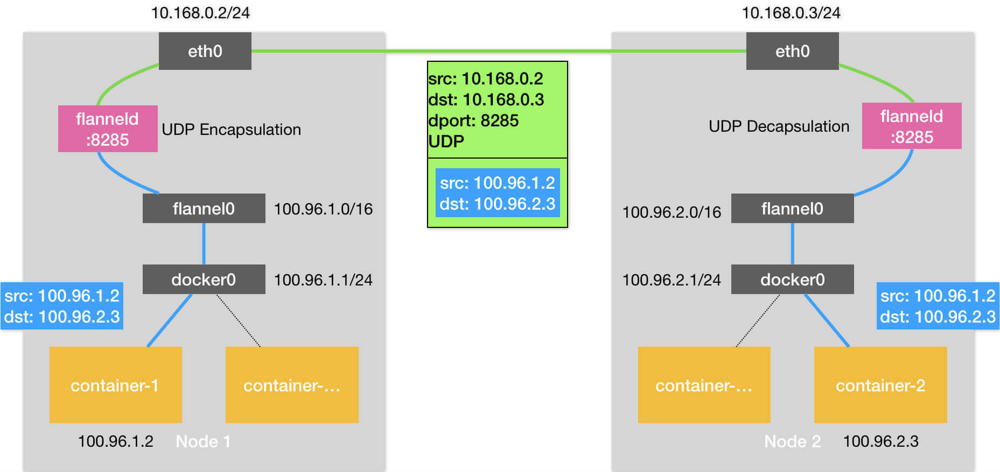
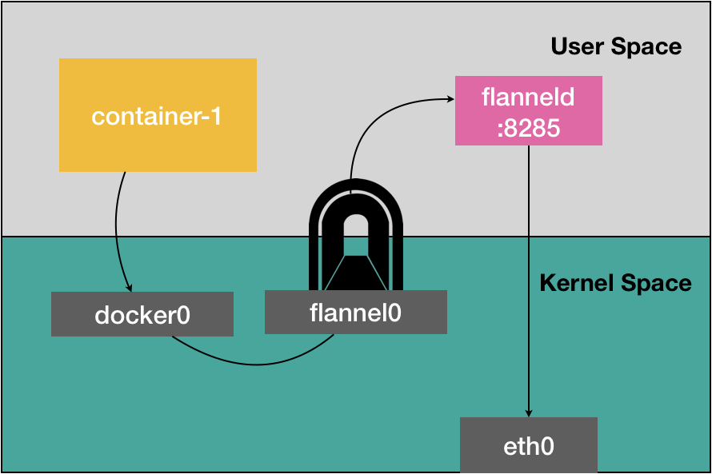
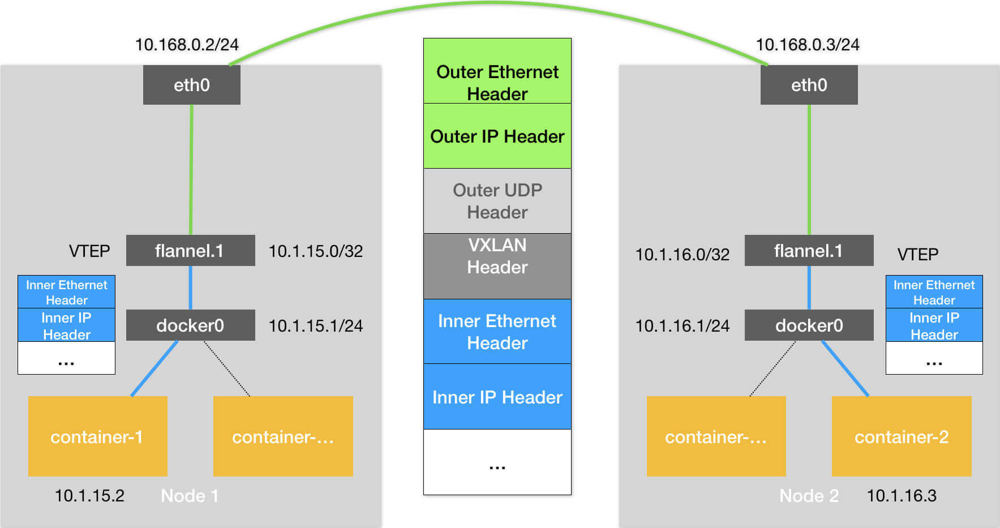
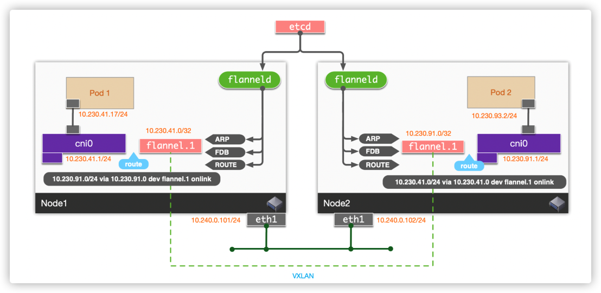

# flannel 源码


## 前沿

**先了解 k8s 网络的设计原则，然后才能更好的理解 flannel 网络的应用**


### Kubernetes 网络设计模型：


•在 Kubernetes 网络中存在两种 IP（Pod IP 和 Service Cluster IP），Pod IP 地址是实际存在于某个网卡(可以是虚拟设备)上的，Service Cluster IP 它是一个虚拟 IP，是由 kube-proxy 使用 Iptables 规则重新定向到其本地端口，再均衡到后端 Pod 的。

基本原则：
 • 每个 Pod 都拥有一个独立的 IP 地址（IPper Pod），而且假定所有的 pod 都在一个可以直接连通的、扁平的网络空间中。

设计原因：
 • 用户不需要额外考虑如何建立 Pod 之间的连接，也不需要考虑将容器端口映射到主机端口等问题。

网络要求：
 • 所有的容器都可以在不用 NAT 的方式下同别的容器通讯；所有节点都可在不用 NAT 的方式下同所有容器通讯；容器的地址和别人看到的地址是同一个地址。


### K8S 网络主要解决以下网络通信问题:

• **同一 pod 下容器与容器的通信；** (共享同一个网络命名空间，它们之间的访问可以用localhost 地址 + 容器端口就可以访问。)

• **同一节点下不同的 pod 之间的容器间通信；**  (二层互通)

• **不同节点下容器之间的通信；**

• **集群外部与内部组件的通信；**

• **pod 与 service 之间的通信；**


### 容器网络方案：

**隧道方案（ Overlay Networking ）**

隧道方案在 IaaS 层的网络中应用也比较多，大家共识是随着节点规模的增长复杂度会提升，而且出了网络问题跟踪起来比较麻烦，大规模集群情况下这是需要考虑的一个点。

• Weave：UDP 广播，本机建立新的 BR，通过 PCAP 互通

• Open vSwitch（OVS）：基于 VxLan 和 GRE 协议，但是性能方面损失比较严重

• **Flannel：UDP 广播，VxLan, hostgw**

• Racher：IPsec


# flannel

• Flannel 是 CoreOS 团队针对 Kubernetes 设计的一个网络规划服务，简单来说，它的功能是让集群中的不同节点主机创建的 Docker `容器都具有全集群唯一的虚拟 IP 地址`。

• 在默认的 Docker 配置中，每个节点上的 Docker 服务会分别负责所在节点容器的 IP 分配。这样导致的一个问题是，不同节点上容器可能获得相同的内外 IP 地址。并使这些容器之间能够之间通过 IP 地址相互找到，也就是相互 ping 通。

• Flannel 的设计目的就是为集群中的所有节点重新规划 IP 地址的使用规则，从而使得不同节点上的容器能够获得“同属一个内网”且”不重复的”IP 地址，并让属于不同节点上的容器能够直接通过内网 IP 通信。

• Flannel 实质上是一种“覆盖网络(overlaynetwork)”，也就是将 TCP 数据包装在另一种网络包里面进行路由转发和通信，**目前已经支持 udp、vxlan、host-gw、aws-vpc、gce 和 alloc 路由等数据转发方式，默认的节点间数据通信方式是 UDP 转发。**


## Host-gw


## udp




### flannel0

该方案使用时会在各个 Work 节点上运行一个Flannel 进程，同时创建一个 flannel0 设备 ，而这个 flannel0 它是一个 TUN 设备（Tunnel 设备）。

在 Linux 中，TUN 设备是一种工作在三层（Network Layer）的虚拟网络设备。TUN 设备的功能非常简单，即：**在操作系统内核和用户应用程序之间传递 IP 包**。

当操作系统将一个 IP 包发送给 flannel0 设备之后，flannel0 就会把这个 IP 包，交给创建这个设备的应用程序，也就是 Flannel 进程。

> 这是一个从内核态向用户态的流动方向。

反之，如果 Flannel 进程向 flannel0 设备发送了一个 IP 包，那么这个 IP 包就会出现在宿主机网络栈中，然后根据宿主机的路由表进行下一步处理。

> 这是一个从用户态向内核态的流动方向。

### subnet

子网（Subnet) 是 Flannel 项目里一个非常重要的概念。

事实上，在由 Flannel 管理的容器网络里，一台宿主机上的所有容器，都属于该宿主机被分配的一个“子网”。

> 在我们的例子中，Node 1 的子网是 100.96.1.0/24，container-1 的 IP 地址是 100.96.1.2。Node 2 的子网是 100.96.2.0/24，container-2 的 IP 地址是 100.96.2.3。

而这些子网与宿主机的对应关系，正是保存在 Etcd 当中，如下所示：

```
$ etcdctl ls /coreos.com/network/subnets /coreos.com/network/subnets/100.96.1.0-24 /coreos.com/network/subnets/100.96.2.0-24 /coreos.com/network/subnets/100.96.3.0-24 
```

所以，flanneld 进程在处理由 flannel0 传入的 IP 包时，就可以根据目的 IP 的地址（比如 100.96.2.3），匹配到对应的子网（比如 100.96.2.0/24），然后从 Etcd 中找到这个子网对应的宿主机的 IP 地址，如下所示：

```
$ etcdctl get /coreos.com/network/subnets/100.96.2.0-24 {"PublicIP":"10.168.0.3"} 
```

> 即根据容器 IP 确定子网，根据子网确定目标宿主机 IP。


### 具体步骤

**step 1：容器到宿主机**

container-1 容器里的进程发起的 IP 包，其源地址就是 100.96.1.2，目的地址就是 100.96.2.3。

由于目的地址 100.96.2.3 并不在 Node 1 的 docker0 网桥的网段里，所以这个 IP 包会被交给默认路由规则，通过容器的网关进入 docker0 网桥（如果是同一台宿主机上的容器间通信，走的是直连规则），从而出现在宿主机上。

```shell
root@escape128:~# route -nnnnn
Kernel IP routing table
Destination     Gateway         Genmask         Flags Metric Ref    Use Iface
0.0.0.0         10.244.5.1      0.0.0.0         UG    0      0        0 eth0
10.244.0.0      10.244.5.1      255.255.0.0     UG    0      0        0 eth0
10.244.5.0      0.0.0.0         255.255.255.0   U     0      0        0 eth0 (gateway 0.0.0.0 是直连路由)
```

**step 2：宿主机路由到 flannel0 设备**

这时候，这个 IP 包的下一个目的地，就取决于宿主机上的路由规则了。

> Flannel 已经在宿主机上创建出了一系列的路由规则。

以 Node 1 为例，如下所示：

```
# 在Node 1上 
$ ip route 
default via 10.168.0.1 dev eth0 
100.96.0.0/16 dev flannel0  proto kernel  scope link  src 100.96.1.0 
100.96.1.0/24 dev docker0  proto kernel  scope link  src 100.96.1.1 
10.168.0.0/24 dev eth0  proto kernel  scope link  src 10.168.0.2 
```

由于我们的 IP 包的目的地址是 100.96.2.3，只能匹配到第二条、也就是 100.96.0.0/16 对应的这条路由规则，从而进入到一个叫作 flannel0 的设备中。

**step 3：flanneld 进程转发给 Node2**

flannel0 设备收到 IP 包后转给 flanned 进程。然后，flanneld 根据这个 IP 包的目的地址，是 100.96.2.3，`去 etcd 中查询到对应的宿主机IP`，就是 Node2，因此会把它发送给了 Node 2 宿主机，不过发送之前会对该 IP 包进行封装。

> 因为当前这个包源地址是 container-1 的 IP 100.96.1.2，目的地址是 container-2 的 IP 100.96.2.3，这样直接发送出去肯定是到不了的。

**step 4：封装UDP包**

flanneld 进程会把这个 IP 包直接封装在一个 UDP 包里，然后发送给 Node 2。不难理解，这个 UDP 包的源地址，就是 flanneld 所在的 Node 1 的地址，而目的地址，则是 container-2 所在的宿主机 Node 2 的地址。

> 由于 flanneld 进程监听的是 8285 端口，所以会发送给 Node2 的 8285 端口。

**step 5：Node2 解析并处理UDP包**

Node2 上的 flanneld 进程收到这个 UDP 包之后就可以从里面解析出container-1 发来的原 IP 包。

解析后将其发送给 flannel0 设备，flannel0 则会将其转发给操作系统内核。

**step 6：内核处理IP包**

内核收到这个 IP 包之后，内核网络栈就会负责处理这个 IP 包。具体的处理方法，就是通过本机的`路由表`来寻找这个 IP 包的下一步流向。

> 该路由规则同样由 Flannel 维护。

而 Node 2 上的路由表，跟 Node 1 非常类似，如下所示：

```
# 在Node 2上
$ ip route
default via 10.168.0.1 dev eth0
100.96.0.0/16 dev flannel0  proto kernel  scope link  src 100.96.2.0
100.96.2.0/24 dev docker0  proto kernel  scope link  src 100.96.2.1
10.168.0.0/24 dev eth0  proto kernel  scope link  src 10.168.0.3
```

由于这个 IP 包的目的地址是 100.96.2.3，它跟第三条、也就是 100.96.2.0/24 网段对应的路由规则匹配更加精确。所以，Linux 内核就会按照这条路由规则，把这个 IP 包转发给 docker0 网桥。

**step 7：容器网络**

IP 包到 docker0 网桥后的流程就属于容器网络了，这里不在过多讲解，具体参考开篇提到的两篇文章。


### 分析

实际上，相比于两台宿主机之间的直接通信，基于 Flannel UDP 模式的容器通信多了一个额外的步骤，即 flanneld 的处理过程。

而这个过程，由于使用到了 flannel0 这个 TUN 设备，仅在发出 IP 包的过程中，就**需要经过三次用户态与内核态之间的数据拷贝**，如下所示：



- 1）第一次，用户态的容器进程发出的 IP 包经过 docker0 网桥进入内核态；
- 2）第二次，IP 包根据路由表进入 TUN（flannel0）设备，从而回到用户态的 flanneld 进程；
- 3）第三次，flanneld 进行 UDP 封包之后重新进入内核态，将 UDP 包通过宿主机的 eth0 发出去。

此外，我们还可以看到，Flannel 进行 UDP 封装（Encapsulation）和解封装（Decapsulation）的过程，也都是在用户态完成的。在 Linux 操作系统中，上述这些上下文切换和用户态操作的代价其实是比较高的，这也正是造成 Flannel UDP 模式性能不好的主要原因。

所以说，**我们在进行系统级编程的时候，有一个非常重要的优化原则，就是要减少用户态到内核态的切换次数，并且把核心的处理逻辑都放在内核态进行**。这也是为什么，Flannel 后来支持的VXLAN 模式，逐渐成为了主流的容器网络方案的原因。


## vxlan

VXLAN，即 Virtual Extensible LAN（虚拟可扩展局域网），是 Linux 内核本身就支持的一种网络虚似化技术。

所以说，VXLAN 可以完全在`内核态实现上述封装和解封装的工作`，从而通过与前面相似的“隧道”机制，构建出覆盖网络（Overlay Network）。

VXLAN 的覆盖网络的设计思想是：**在现有的三层网络之上，“覆盖”一层虚拟的、由内核 VXLAN 模块负责维护的二层网络，使得连接在这个 VXLAN 二层网络上的“主机”（虚拟机或者容器都可以）之间，可以像在同一个局域网（LAN）里那样自由通信**。

> 当然，实际上，这些“主机”可能分布在不同的宿主机上，甚至是分布在不同的物理机房里。
>
> 简单理解就是：把 二层数据包 封装之后通过 三层网络发送，然后对应设备收到后进行解包拿到里面的 二层数据包，这样只要 三层网络连通就可以实现了，相当于把 二层网络的范围扩大到了 三层网络。


### 1. VTEP

而为了能够在二层网络上打通“隧道”，VXLAN 会在宿主机上设置一个特殊的网络设备作为“隧道”的两端。**这个设备就叫作 VTEP，即：VXLAN Tunnel End Point（虚拟隧道端点）**。

而 VTEP 设备的作用，其实跟前面的 flanneld 进程非常相似。只不过，它进行封装和解封装的对象，是二层数据帧（Ethernet frame）；而且这个工作的执行流程，全部是在**内核**里完成的（因为 VXLAN 本身就是 Linux 内核中的一个模块）。

> 因此 VXLAN 模式的效率会比 UDP 模式高不少

具体流程如下：



可以看到，图中每台宿主机上名叫 flannel.1 的设备，就是 VXLAN 所需的 VTEP 设备，它既有 IP 地址，也有 MAC 地址。


### 2. 路由规则

每台宿主机上的 flanneld 进程会负责维护相关的路由规则。比如，当 Node 2 启动并加入 Flannel 网络之后，在 Node 1（以及所有其他节点）上，flanneld 就会添加一条如下所示的路由规则：

```shell
# node1 节点上
$ route -n
Kernel IP routing table
Destination     Gateway         Genmask         Flags Metric Ref    Use Iface
...
10.1.16.0       10.1.16.0       255.255.255.0   UG    0      0        0 flannel.1
```

这条规则的意思是：凡是发往 10.1.16.0/24 网段的 IP 包，都需要经过 flannel.1 设备发出，并且，它最后被发往的网关地址是：10.1.16.0。

> 10.1.16.0 正是 Node 2 上的 VTEP 设备（也就是 flannel.1 设备）的 IP 地址。

**即：Flannel1 设备会在当前宿主机增加指向 flannel 网络中其他节点的路由规则**。

> 类似于 UDP 模式中的 Subnet，前者是把对应节点 IP 存储在 etcd 中，后者则是直接通过路由规则指定。

### 3. ARP 记录

flanneld 进程启动时，会自动把当前节点上的 ARP 记录发送给当前 flannel 网络中的其他节点。

后续将 IP 包封装成 二层数据帧的时候，用到的目的 MAC 地址就是从这里查询的。

### 4. 网桥设备

flannel.1 设备实际还要扮演一个“网桥”的角色，在二层网络进行 UDP 包的转发。而在 Linux 内核里面，“网桥”设备进行转发的依据，来自于一个叫作 FDB（Forwarding Database）的转发数据库。

> flannel.1 设备的 FDB 则由 flanneld 进程维护。

### 5. 具体步骤

**step 1：容器到宿主机**

和 UDP 模式一样，当 container-1 发出请求之后，这个目的地址是 10.1.16.3 的 IP 包，根据容器内的路由规则，会先出现在 cni0 网桥。

```shell
# 容器网络
root@escape128:~# route -nnnnn
Kernel IP routing table
Destination     Gateway         Genmask         Flags Metric Ref    Use Iface
0.0.0.0         10.244.5.1      0.0.0.0         UG    0      0        0 eth0
10.244.0.0      10.244.5.1      255.255.0.0     UG    0      0        0 eth0  #  容器内的别的网段，出现在 cni0 网卡上
10.244.5.0      0.0.0.0         255.255.255.0   U     0      0        0 eth0  # （同一个node 上走直连路由）

# 容器内的邻居表
root@escape128:~# ip neigh
10.244.5.1 dev eth0 lladdr 2a:b3:1f:89:f3:35 STALE

# 宿主机上
# 10.244.5.1 就是 cni0 网卡的 ip
5: cni0: <BROADCAST,MULTICAST,UP,LOWER_UP> mtu 1450 qdisc noqueue state UP group default qlen 1000
    link/ether 2a:b3:1f:89:f3:35 brd ff:ff:ff:ff:ff:ff
    inet 10.244.5.1/24 brd 10.244.5.255 scope global cni0
       valid_lft forever preferred_lft forever
    inet6 fe80::28b3:1fff:fe89:f335/64 scope link
       valid_lft forever preferred_lft forever
```


**step 2：宿主机路由到 flannel1 设备**

查看宿主机上的路由表：

```shell
root@escape128:~# route -n
Kernel IP routing table
Destination     Gateway         Genmask         Flags Metric Ref    Use Iface
0.0.0.0         192.168.32.1    0.0.0.0         UG    0      0        0 ens33
10.244.0.0      10.244.0.0      255.255.255.0   UG    0      0        0 flannel.1
10.244.1.0      10.244.1.0      255.255.255.0   UG    0      0        0 flannel.1
10.244.2.0      10.244.2.0      255.255.255.0   UG    0      0        0 flannel.1
10.244.3.0      10.244.3.0      255.255.255.0   UG    0      0        0 flannel.1
10.244.4.0      10.244.4.0      255.255.255.0   UG    0      0        0 flannel.1
10.244.5.0      0.0.0.0         255.255.255.0   U     0      0        0 cni0   # 本机的走 cni0
10.244.6.0      10.244.6.0      255.255.255.0   UG    0      0        0 flannel.1
10.244.7.0      10.244.7.0      255.255.255.0   UG    0      0        0 flannel.1
10.244.8.0      10.244.8.0      255.255.255.0   UG    0      0        0 flannel.1
10.244.10.0     10.244.10.0     255.255.255.0   UG    0      0        0 flannel.1
172.17.0.0      0.0.0.0         255.255.0.0     U     0      0        0 docker0
192.168.32.0    0.0.0.0         255.255.255.0   U     0      0        0 ens33


root@escape128:~# ip neigh show dev flannel.1
10.244.1.0 lladdr 86:96:57:03:6d:ef PERMANENT  # 另外一台宿主机上的flannel.1 网卡 mac 地址
10.244.8.0 lladdr 36:3e:9d:fe:3f:3c PERMANENT
10.244.6.0 lladdr a6:4f:a5:5e:bd:86 PERMANENT
10.244.2.0 lladdr 52:ff:ad:4d:aa:88 PERMANENT
10.244.7.0 lladdr 72:dd:ee:52:e4:52 PERMANENT
10.244.3.0 lladdr f6:f1:67:9e:6a:4a PERMANENT
10.244.10.0 lladdr 32:90:14:a7:5f:4f PERMANENT
10.244.4.0 lladdr 72:b8:e2:36:49:e0 PERMANENT
10.244.0.0 lladdr 26:b4:20:7e:39:20 PERMANENT


# 另外一台宿主机上：
4: flannel.1: <BROADCAST,MULTICAST,UP,LOWER_UP> mtu 1450 qdisc noqueue state UNKNOWN group default
    link/ether 86:96:57:03:6d:ef brd ff:ff:ff:ff:ff:ff
    inet 10.244.1.0/32 scope global flannel.1
       valid_lft forever preferred_lft forever
    inet6 fe80::8496:57ff:fe03:6def/64 scope link
       valid_lft forever preferred_lft forever
```

然后被路由到本机 flannel.1 设备进行处理。也就是说，来到了“隧道”的**入口**。

为了能够将“原始 IP 包”封装并且发送到正确的宿主机，VXLAN 就需要找到这条“隧道”的**出口**，即：目的宿主机的 VTEP 设备。

根据前面提到的 路由规则，知道这个 IP 包要发给 10.1.16.0 ，即 Node 2 上的 VTEP 设备（也就是 flannel.1 设备）的 IP 地址。

**step 3：封装为 2 层数据帧**

> 为了方便叙述，后续把 Node 1 和 Node 2 上的 flannel.1 设备分别称为“源 VTEP 设备”和“目的 VTEP 设备”。

而这些 VTEP 设备之间，就需要想办法组成一个虚拟的二层网络，即：通过二层数据帧进行通信。

所以在我们的例子中，“源 VTEP 设备”收到“原始 IP 包”后，就要想办法把“原始 IP 包”加上一个**目的 MAC 地址**，封装成一个二层数据帧，然后发送给“目的 VTEP 设备”。

> 在正常网络里是由 内核网络栈进行封装的，比如某机器收到一个 三层数据包,对比目的 IP 地址，发现就是内部某局域网的，eth0 设备就会使用下一跳地址对应的 MAC 地址，作为该数据帧的目的 MAC 地址，将这个 三层数据包 封装成 二层数据帧。
>
> 但是这里的 二层网络 使我们虚拟出来的，因此为了让 VTEP 设备收到的是二层数据帧，我们需要自己来处理封包的逻辑。


前面路由记录中我们知道了“目的 VTEP 设备”的 IP 地址，这里就可以使用 IP 地址查询对应的 MAC 地址，这正是 ARP（Address Resolution Protocol ）表的功能。

> 这也就是为什么 flanneld 进程启动后要把本地 ARP 记录发送给其他节点。

```shell
# 在Node 1上
$ ip neigh show dev flannel.1
10.1.16.0 lladdr 5e:f8:4f:00:e3:37 PERMANENT
```

可以看到：IP 地址 10.1.16.0，对应的 MAC 地址是 5e:f8:4f:00:e3:37。

有了这个“目的 VTEP 设备”的 MAC 地址，**Linux 内核就可以开始二层封包工作了**。

**step 4：将二层数据帧封装为外部数据帧，通过 UDP 发送出去**

上面提到的这些 VTEP 设备的 MAC 地址，对于宿主机网络来说并没有什么实际意义。所以上面封装出来的这个数据帧，并不能在我们的宿主机二层网络里传输。为了方便叙述，我们把它称为**“内部数据帧”(Inner Ethernet Frame)**。

所以接下来，Linux 内核还需要再把“内部数据帧”进一步封装成为宿主机网络里的一个普通的数据帧，好让它“载着”“内部数据帧”，通过宿主机的 eth0 网卡进行传输。

我们把这次要封装出来的、宿主机对应的数据帧称为**“外部数据帧”(Outer Ethernet Frame)**。

为了实现这个“搭便车”的机制，Linux 内核会在“内部数据帧”前面，加上一个特殊的 VXLAN 头，用来表示这个“乘客”实际上是一个 VXLAN 要使用的数据帧。

而这个 VXLAN 头里有一个重要的标志叫作 VNI，它是 VTEP 设备识别某个数据帧是不是应该归自己处理的重要标识。而在 Flannel 中，VNI 的默认值是 1。

> 这也是为何，宿主机上的 VTEP 设备都叫作 flannel.1 的原因，这里的“1”，其实就是 VNI 的值

**然后，Linux 内核会把这个数据帧封装进一个 UDP 包里发出去**。

**step 5：flannel1 设备转发 UDP 包**

flannel.1 设备实际上要扮演一个“网桥”的角色，在二层网络进行 UDP 包的转发。而在 Linux 内核里面，“网桥”设备进行转发的依据，来自于一个叫作 `FDB（Forwarding Database）的转发数据库`。

- fdb 是二层转发表

通过 bridge fdb 命令查看 flannel.1 设备的FDB

```shell
[root@ksp ~]# bridge fdb show dev flannel.1
72:b8:e2:36:49:e0 dst 192.168.132.11 self permanent
72:dd:ee:52:e4:52 dst 192.168.32.127 self permanent
a6:4f:a5:5e:bd:86 dst 192.168.32.231 self permanent
aa:92:0c:84:46:2d dst 192.168.32.127 self permanent
26:b4:20:7e:39:20 dst 192.168.132.10 self permanent
fa:9d:f2:67:fa:cf dst 192.168.32.127 self permanent
36:3e:9d:fe:3f:3c dst 192.168.132.164 self permanent
52:ff:ad:4d:aa:88 dst 192.168.20.100 self permanent
62:c5:72:84:72:67 dst 192.168.32.127 self permanent
3a:ee:2e:71:fc:1d dst 192.168.132.12 self permanent
56:8f:14:15:cc:dc dst 192.168.32.128 self permanent
32:90:14:a7:5f:4f dst 192.168.32.126 self permanent
22:8d:d1:2d:9b:82 dst 192.168.32.127 self permanent
f6:f1:67:9e:6a:4a dst 192.168.132.12 self permanent
fa:d3:45:e9:e5:78 dst 192.168.32.126 self permanent
62:67:47:d3:75:25 dst 192.168.20.100 self permanent
5e:0e:ce:69:a8:81 dst 192.168.32.231 self permanent
86:a9:22:6a:d2:a1 dst 192.168.20.100 self permanent

# 在Node 1上，使用“目的VTEP设备”的MAC地址进行查询
$ bridge fdb show flannel.1 | grep 5e:f8:4f:00:e3:37
5e:f8:4f:00:e3:37 dev flannel.1 dst 10.168.0.3 self permanent
```

可以看到，在上面这条 FDB 记录里，指定了这样一条规则，即：

往我们前面提到的“目的 VTEP 设备”（MAC 地址是 5e:f8:4f:00:e3:37）的二层数据帧，应该通过 flannel.1 设备，发往 IP 地址为 10.168.0.3 的主机。显然，这台主机正是 Node 2，UDP 包要发往的目的地就找到了。

所以**接下来的流程，就是一个正常的、宿主机网络上的封包工作**。

**step 6: 宿主机封包并发送**

宿主机把我们准备好的 UDP 包，增加 IP 头组成一个IP包，IP 头中的IP则是前面通过 FDB 查询出来的`目的主机的 IP 地址`，即 Node 2 的 IP 地址 10.168.0.3。

然后增加二层数据帧头，并把 Node 2 的 MAC 地址填进去。这个 MAC 地址本身，是 Node 1 的 ARP 表要学习的内容，无需 Flannel 维护。


接下来，Node 1 上的 flannel.1 设备就可以把这个数据帧从 Node 1 的 eth0 网卡发出去。显然，这个帧会经过宿主机网络来到 Node 2 的 eth0 网卡。

**step 7：Node 2 解包**

Node 2 的内核网络栈会发现这个数据帧里有 VXLAN Header，并且 VNI=1。`所以 Linux 内核会对它进行拆包`，拿到里面的内部数据帧，然后根据 VNI 的值，把它交给 Node 2 上的 flannel.1 设备。

而 flannel.1 设备则会进一步拆包，取出“原始 IP 包”。接下来就回到了单机容器网络的处理流程。最终，IP 包就进入到了 container-2 容器的 Network Namespace 里。

### 6. 分析

与 UDP 实现相比，VXLAN 方式所有封包工作都在内核态完成，省去了 内核态用户态切换的消耗，拥有较高的效率。


## L2MISS and L3MISS

在 flannel 0.9.0 之后，做了一些改动:

```markdown
// Some design notes and history:
// VXLAN encapsulates L2 packets (though flannel is L3 only so don't expect to be able to send L2 packets across hosts)
// The first versions of vxlan for flannel registered the flannel daemon as a handler for both "L2" and "L3" misses
// - When a container sends a packet to a new IP address on the flannel network (but on a different host) this generates
//   an L2 miss (i.e. an ARP lookup)
// - The flannel daemon knows which flannel host the packet is destined for so it can supply the VTEP MAC to use.
//   This is stored in the ARP table (with a timeout) to avoid constantly looking it up.
// - The packet can then be encapsulated but the host needs to know where to send it. This creates another callout from
//   the kernal vxlan code to the flannel daemon to get the public IP that should be used for that VTEP (this gets called
//   an L3 miss). The L2/L3 miss hooks are registered when the vxlan device is created. At the same time a device route
//   is created to the whole flannel network so that non-local traffic is sent over the vxlan device.
//
// In this scheme the scaling of table entries (per host) is:
//  - 1 route (for the configured network out the vxlan device)
//  - One arp entry for each remote container that this host has recently contacted
//  - One FDB entry for each remote host
//
// 移除了 L3MISS
// The second version of flannel vxlan removed the need for the L3MISS callout. When a new remote host is found (either
// during startup or when it's created), flannel simply adds the required entries so that no further lookup/callout is required.
//
// 移除了 L2MISS
// The latest version of the vxlan backend  removes the need for the L2MISS too, which means that the flannel deamon is not
// listening for any netlink messages anymore. This improves reliability (no problems with timeouts if
// flannel crashes or restarts) and simplifies upgrades.
//
// How it works:
// Create the vxlan device but don't register for any L2MISS or L3MISS messages
// Then, as each remote host is discovered (either on startup or when they are added), do the following
// 1) create routing table entry for the remote subnet. It goes via the vxlan device but also specifies a next hop (of the remote flannel host).
// 2) Create a static ARP entry for the remote flannel host IP address (and the VTEP MAC)
// 3) Create an FDB entry with the VTEP MAC and the public IP of the remote flannel daemon.
//
// In this scheme the scaling of table entries is linear to the number of remote hosts - 1 route, 1 arp entry and 1 FDB entry per host
//
// In this newest scheme, there is also the option of skipping the use of vxlan for hosts that are on the same subnet,
// this is called "directRouting"
```


`v0.9.0`之前版本的实现主要依赖`vxlan`内核模块的`L2MISS`和`L3MISS`消息机制。`L2MISS`是指`vxlan`设备在`ARP`表中找不到内层`IP`对应的`MAC`地址时会给用户态程序发送`netlink`消息。`L3MISS`是指`vxlan`设备在`FDB`表中找不到`VXLAN`协议内层`MAC`地址所属的`VTEP`的`IP`地址时会给用户态程序发送`netlink`消息。之前的文章[<<动态维护FDB表项实现VXLAN通信>>](http://just4coding.com/2020/04/20/vxlan-fdb/)介绍过相关概念和操作。本文主要分析`v0.9.0`版本上的实现方式。


之前的方式实现是，`flanneld`作为`L2MISS`和`L3MISS`消息的处理器,当收到相应消息时从`etcd`或者`kubernetes API`获取到相应的`ARP`或者`FDB`信息来填充相应条目。如果`flanneld`异常退出，那么整个容器网络集群的网络就中断了。这是一个很大的隐患。`v0.9.0`实现不再需要处理`L2MISS`和`L3MISS`消息，而是由`flanneld`通过`watch` `etcd`或者`kubernetes API`的相关节点信息来动态地维护各节点通信所需的`ARP`、`FDB`以及路由条目。即使`flanneld`崩溃，整个集群网络数据转发依然可以运行。这个实现很优雅，每个节点只需要一条路由，一个`ARP`缓存条目和一个`FDB`条目。





`node1`上的`flannel`网络信息如下,分配的`subnet`为`10.230.41.1/24`:

```
[root@node1 ~]# cat /run/flannel/subnet.env
FLANNEL_NETWORK=10.230.0.0/16
FLANNEL_SUBNET=10.230.41.1/24
FLANNEL_MTU=1450
FLANNEL_IPMASQ=false
```

`node2`上的`flannel`网络信息如下, 分配的`subnet`为`10.230.93.1/24`:

```
[root@node2 ~]# cat /run/flannel/subnet.env
FLANNEL_NETWORK=10.230.0.0/16
FLANNEL_SUBNET=10.230.93.1/24
FLANNEL_MTU=1450
FLANNEL_IPMASQ=false
```

我们来看`10.230.41.17`向`10.230.93.2`发送数据包的过程。


`10.230.93.2`与`10.230.41.17`不在同一二层网络，因而需要查找路由来决定由哪个设备发送到哪里。`10.230.41.17`的路由如下:

```shell
[root@master1 ~]# kubectl exec -it busybox2-6f8fdb784d-r6ln2 -- ip route
default via 10.230.41.1 dev eth0
10.230.0.0/16 via 10.230.41.1 dev eth0  
10.230.41.0/24 dev eth0 scope link  src 10.230.41.17
```

匹配到默认路由，因而需要发送到网关`10.230.41.1`。`10.230.41.1`配置在网桥`cni0`上。内核通过`ARP`请求获得`10.230.41.1`的`MAC`地址, 将数据包转发到`cni0`上。

```shell
[root@node1 ~]# ip addr show dev cni0
5: cni0: <BROADCAST,MULTICAST,UP,LOWER_UP> mtu 1450 qdisc noqueue state UP group default qlen 1000
    link/ether 86:99:b6:37:95:b2 brd ff:ff:ff:ff:ff:ff
    inet 10.230.41.1/24 brd 10.230.41.255 scope global cni0
       valid_lft forever preferred_lft forever
    inet6 fe80::8499:b6ff:fe37:95b2/64 scope link
       valid_lft forever preferred_lft forever
```


`flanneld`在加入集群时会为每个其他节点生成一条`on-link`路由，`on-link`路由表示是直连路由，匹配该条路由的数据包将触发`ARP`请求获取目的IP的`MAC`地址。在`node1`上查看路由信息:

```
[root@node1 ~]# ip route show dev flannel.1
10.230.93.0/24 via 10.230.93.0 onlink
```

`cni0`设备根据这条路由将数据包转给`vxlan`设备`flannel.1`，并且接收端的`IP`地址为`10.230.93.0`, 需要通过`ARP`获取`MAC`地址。

`flannel.1`的信息如下, 可以看到没有开启`l2miss`和`l3miss`:

```shell
[root@node1 ~]# ip -d link show flannel.1
4: flannel.1: <BROADCAST,MULTICAST,UP,LOWER_UP> mtu 1450 qdisc noqueue state UNKNOWN mode DEFAULT group default
    link/ether a6:f7:8b:a4:60:b0 brd ff:ff:ff:ff:ff:ff promiscuity 0
    vxlan id 1 local 10.240.0.101 dev eth1 srcport 0 0 dstport 8472 nolearning ageing 300 noudpcsum noudp6zerocsumtx noudp6zerocsumrx addrgenmode eui64 numtxqueues 1 numrxqueues 1 gso_max_size 65536 gso_max_segs 65535
```

`vxlan`设备需要对接收到的数据包进行`VXLAN`协议封装。它需要知道对端`10.230.93.0`的`MAC`地址。而`flanneld`在启动时已经根据从`etcd`或`kubernetes API`获取到的信息写入到`ARP`表中: (0.9.0 之后不再走 l3 MISS)

```shell
[root@node1 ~]# ip neigh show dev flannel.1
10.230.93.0 lladdr 2a:02:24:58:e9:07 PERMANENT
```


查看下 flannel 源码：

```go
log.V(2).Infof("adding subnet: %s PublicIP: %s VtepMAC: %s", sn, attrs.PublicIP, net.HardwareAddr(vxlanAttrs.VtepMAC))
					if err := retry.Do(func() error {
            // 添加 arp
						return nw.dev.AddARP(neighbor{IP: sn.IP, MAC: net.HardwareAddr(vxlanAttrs.VtepMAC)})
					}); err != nil {
						log.Error("AddARP failed: ", err)
						continue
					}

					if err := retry.Do(func() error {
            // 添加 fdb
						return nw.dev.AddFDB(neighbor{IP: attrs.PublicIP, MAC: net.HardwareAddr(vxlanAttrs.VtepMAC)})
					}); err != nil {
						log.Error("AddFDB failed: ", err)

						// Try to clean up the ARP entry then continue
						if err := retry.Do(func() error {
							return nw.dev.DelARP(neighbor{IP: event.Lease.Subnet.IP, MAC: net.HardwareAddr(vxlanAttrs.VtepMAC)})
						}); err != nil {
							log.Error("DelARP failed: ", err)
						}

						continue
					}
```


这样获取到`10.230.93.0`的`MAC`地址后，就可以完成`内层数据`的封装。

内层数据包的 mac 地址是两端 VTEP (flannel.1网卡) 的 mac 地址

- 更新的 arp 表 只是用来更新内部数据包的

- fdb 表用来更新外部的数据包


到这里的大致流程就是：

1. 数据包到达flannel.1，通过查找路由表，知道数据包要通过flannel.1发往192.20.1.0
2. 通过arp cache表，知道了目的ip192.20.1.0的mac地址。


数据包封装完成后，它需要获得对应这个`MAC`地址的`VTEP`的 所在 node 的`IP`地址。`flanneld`已经在启动时写入`FDB`条目:

```shell
[root@node1 ~]# bridge fdb show dev flannel.1
2a:02:24:58:e9:07 dst 10.240.0.102 self permanent
```

可以看到`2a:02:24:58:e9:07`对应的`VTEP node IP`为`10.240.0.102`。这时`flannel.1`这个`vxlan`设备知道数据包要发送的目的 node`IP`，根据主机的路由策略从`eth0`设备发出。主机路由信息如下:

```shell
[root@node1 ~]# ip route
default via 10.0.2.2 dev eth0
10.0.2.0/24 dev eth0 proto kernel scope link src 10.0.2.15
10.230.41.0/24 dev cni0 proto kernel scope link src 10.230.41.1
10.230.93.0/24 via 10.230.93.0 dev flannel.1 onlink
10.240.0.0/24 dev eth1 proto kernel scope link src 10.240.0.101
169.254.0.0/16 dev eth0 scope link metric 1002
169.254.0.0/16 dev eth1 scope link metric 1003
```

数据包到达`node2`的`eth1`后，`eth1`将收到`VXLAN`数据包, 数据包中的`MAC`地址为:`2a:02:24:58:e9:07`, 正是`node2`节点上`flannel.1`的地址, 将它转给`flannel.1`设备:

```shell
[root@node2 ~]# ip addr show flannel.1
4: flannel.1: <BROADCAST,MULTICAST,UP,LOWER_UP> mtu 1450 qdisc noqueue state UNKNOWN group default
    link/ether 2a:02:24:58:e9:07 brd ff:ff:ff:ff:ff:ff
    inet 10.230.93.0/32 scope global flannel.1
       valid_lft forever preferred_lft forever
    inet6 fe80::2802:24ff:fe58:e907/64 scope link
       valid_lft forever preferred_lft forever
```

`flannel.1`解包之后，根据内层目的地址:`10.240.93.2`查找路由转发到`cni0`:

```shell
[root@node2 ~]# ip route
default via 10.0.2.2 dev eth0 proto dhcp metric 100
10.0.2.0/24 dev eth0 proto kernel scope link src 10.0.2.15 metric 100
10.230.41.0/24 via 10.230.41.0 dev flannel.1 onlink
10.230.93.0/24 dev cni0 proto kernel scope link src 10.230.93.1
10.240.0.0/24 dev eth1 proto kernel scope link src 10.240.0.102 metric 101
```

`cni0`再通过`ARP`请求获得`10.230.93.2`的`MAC`地址，从而将数据包转发到相应的POD中的`veth pair`设备，从而到达容器中。

回包的路径是一样的，不再详述。


## Onlink 和直连路由

## 路由表中的 on-link 是什么意思


在计算机网络中，`"on-link"是指某个网络接口可以直接发送数据包到该网络的所有目的地，而无需通过任何路由器进行转发`。

在路由表中，当一个路由器需要确定如何将数据包发送到目标IP地址时，它首先查找该地址是否与当前路由器直接相连的网络地址匹配。如果匹配成功，则该路由器认为该目标IP地址是“on-link”的，意味着它可以直接将数据包发送到该地址而无需通过任何其他的路由器。

例如，假设有一个路由器连接到了一个以192.168.0.0/24为地址前缀的局域网，并且有另外一个网络设备在该局域网上拥有IP地址192.168.0.2。在该路由器的路由表中，将会存在一个针对192.168.0.0/24网络的条目，该条目的“on-link”标志会被设置为真。这表示该路由器可以直接将数据包发送到192.168.0.2，而无需通过其他路由器进行转发。

总之，当路由表中的某个条目的“on-link”标志为真时，该路由器将会认为目标IP地址是与该路由器直接相连的网络上的地址，并且可以直接将数据包发送到该地址。


## 那和直连路由有什么区别呢


"on-link"和"直连路由"（也称为"直接连接路由"）是相似但不完全相同的概念。

"直连路由"通常是指一种特殊的路由表条目，用于将一个IP地址映射到一个物理接口。该条目指示路由器将所有传入或传出该接口的数据包都发送到该IP地址。

"on-link"则更多的是一种描述，指示某个IP地址是否与路由器直接相连。当某个IP地址被认为是"on-link"时，路由器可以直接将数据包发送到该地址，而无需通过任何其他路由器进行转发。这意味着该IP地址可能对应于一个直接连接到该路由器的物理接口，或者可能是通过另一个交换机或路由器与该路由器直接相连的。

因此，“直连路由”更加具体和明确，它描述了一种特殊的路由表条目类型。而"on-link"则更加抽象和一般化，它描述了一个IP地址与路由器是否直接相连的概念，可以用于描述任何类型的网络连接，而不仅仅是直接连接的物理接口。