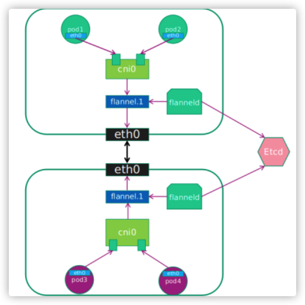

# flannel

## 简介

Flannel是CoreOS团队针对Kubernetes设计的一个网络规划服务，简单来说，它的功能是让集群中的不同节点主机创建的Docker容器都具有全集群唯一的虚拟IP地址。

Flannel的设计目的就是为集群中的所有节点重新规划IP地址的使用规则，从而使得不同节点上的容器能够获得“同属一个内网”且”不重复的”IP地址，并让属于不同节点上的容器能够直接通过内网IP通信。

Flannel实质上是一种“覆盖网络(overlaynetwork)”，也就是将TCP数据包装在另一种网络包里面进行路由转发和通信，目前已经支持udp、vxlan、host-gw、aws-vpc、gce和alloc路由等数据转发方式，默认的节点间数据通信方式是UDP转发。

 

## 特点

1. 使集群中的不同Node主机创建的Docker容器都具有全集群唯一的虚拟IP地址。

2. 建立一个覆盖网络（overlay network），通过这个覆盖网络，将数据包原封不动的传递到目标容器。覆盖网络是建立在另一个网络之上并由其基础设施支持的虚拟网络。覆盖网络通过将一个分组封装在另一个分组内来将网络服务与底层基础设施分离。在将封装的数据包转发到端点后，将其解封装。

3. 创建一个新的虚拟网卡flannel0接收docker网桥的数据，通过维护路由表，对接收到的数据进行封包和转发（vxlan）。

4. etcd保证了所有node上flanned所看到的配置是一致的。同时每个node上的flanned监听etcd上的数据变化，实时感知集群中node的变化。

5. flanneld将本主机获取的subnet以及用于主机间通信的Public IP通过etcd存储起来，需要时发送给相应模块。

6. flannel利用各种backend mechanism，例如udp，vxlan等等，跨主机转发容器间的网络流量，完成容器间的跨主机通信。

## 架构图

各个组件的解释：

**Cni0**:网桥设备，每创建一个pod都会创建一对 veth pair。其中一端是pod中的eth0，另一端是Cni0网桥中的端口（网卡）。Pod中从网卡eth0发出的流量都会发送到Cni0网桥设备的端口（网卡）上。

**Flannel.1**: overlay网络的设备，用来进行 vxlan 报文的处理（封包和解包）。不同node之间的pod数据流量都从overlay设备以隧道的形式发送到对端。

**Flanneld**：flannel在每个主机中运行flanneld作为agent，它会为所在主机从集群的网络地址空间中，获取一个小的网段subnet，本主机内所有容器的IP地址都将从中分配。同时Flanneld监听K8s集群数据库，为flannel.1设备提供封装数据时必要的mac，ip等网络数据信息。

## 通讯流程

**不同node上的pod的通信流程：**

1. pod中产生数据，根据pod的路由信息，将数据发送到Cni0
2. Cni0 根据节点的路由表，将数据发送到隧道设备flannel.1
3. Flannel.1查看数据包的目的ip，从flanneld获得对端隧道设备的必要信息，封装数据包。
4. Flannel.1将数据包发送到对端设备。对端节点的网卡接收到数据包，发现数据包为overlay数据包，解开外层封装，并发送内层封装到flannel.1设备。
5. Flannel.1设备查看数据包，根据路由表匹配，将数据发送给Cni0设备。
6. Cni0匹配路由表，发送数据给网桥上对应的端口。

### 1 pod 到 cni0

### 2 cni0 到 flannel1.1

# 补充

## ARP表和FDB表的区别

ARP表：IP和MAC的对应关系；

FDB表：MAC+VLAN和PORT的对应关系；