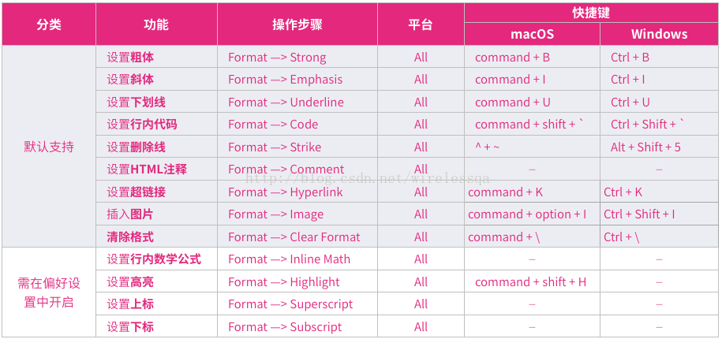

# Typora常用的语法与快捷键

## 表情

输出表情需要借助 `：`符号。

栗子：`:smile` 显示为 😄,记住是左右两边都要冒号。

使用者可以通过使用`ESC`键触发表情建议补全功能，也可在功能面板启用后自动触发此功能。同时，直接从菜单栏`Edit` -> `Emoji & Symbols`插入UTF8表情符号也是可以的。

或者使用下面的方法

访问网站 https://emojikeyboard.org/，找到需要的符号，鼠标左键单击，然后粘贴到需要的地方就行了！🆗

## 高亮

想要使用这个功能，需要在设置面板的`Markdown` 栏启动它，之后使用`==`来修饰高亮文本，栗如：

`==highlight==` 显示为 ==highlight== 。