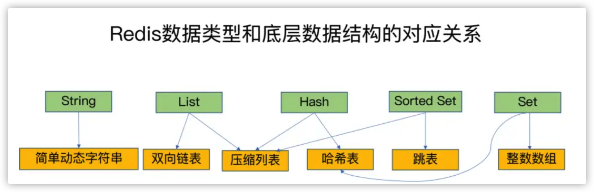
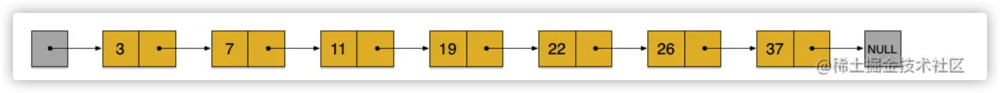
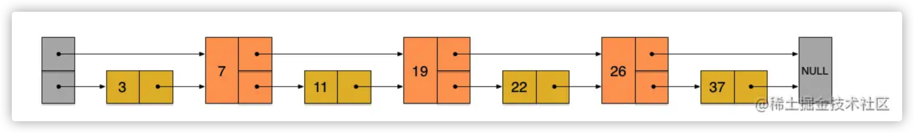
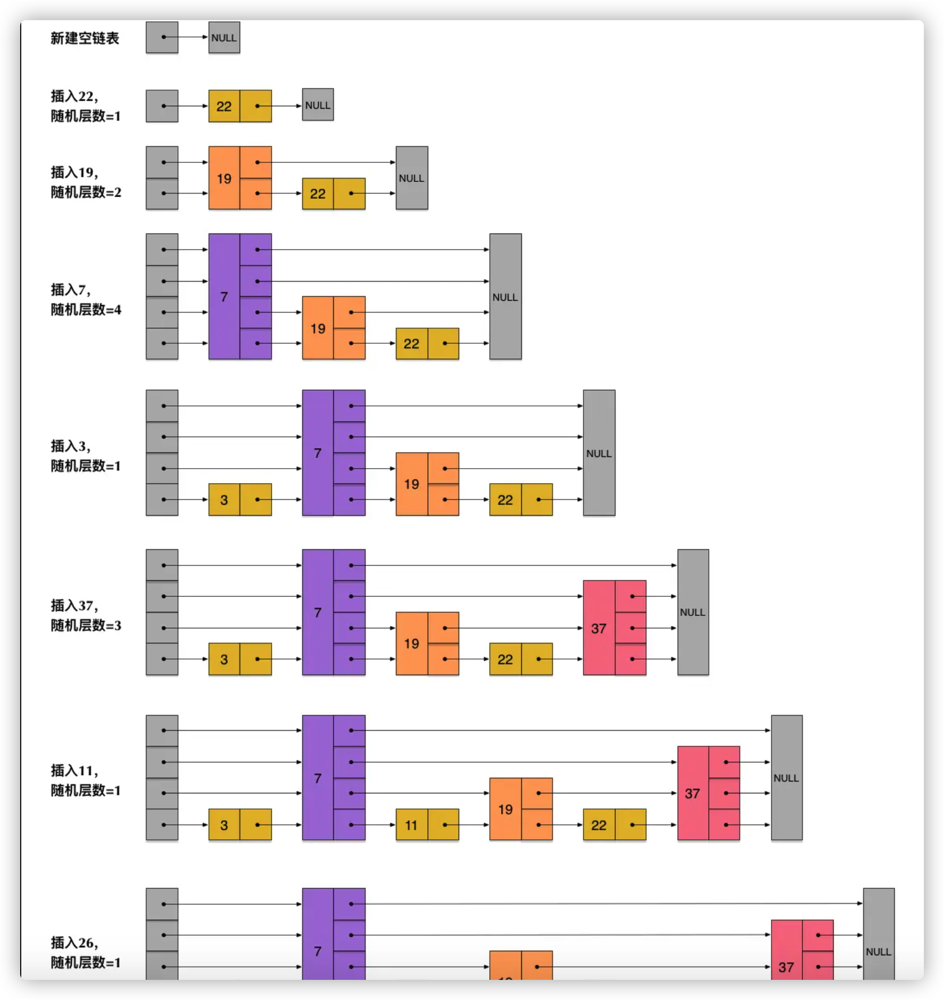
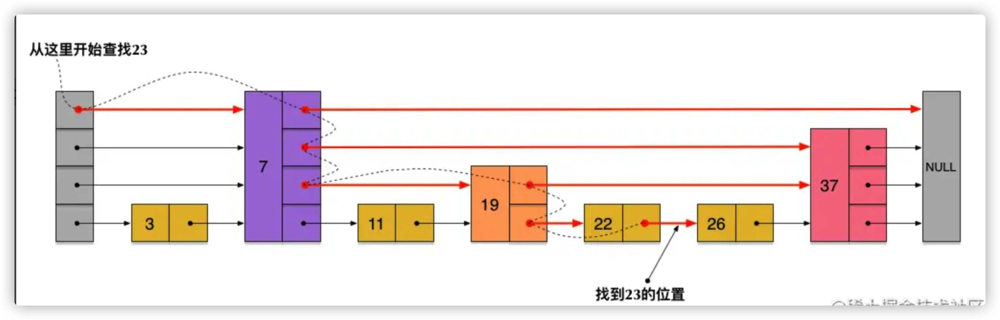
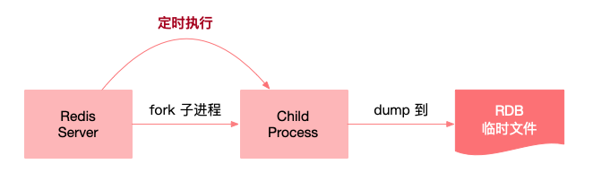
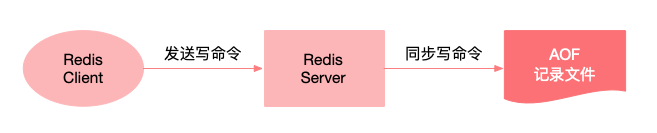

# redis 基础

## 1. 什么是 redis

Redis 是一个开源（BSD 许可）、基于`内存`、支持多种数据结构的存储系统，可以作为`数据库`、`缓存`和`消息中间件`。它支持的数据结构有字符串（strings）、哈希（hashes）、列表（lists）、集合（sets）、有序集合（sorted sets）等，除此之外还支持 bitmaps、hyperloglogs 和地理空间（ geospatial ）索引半径查询等功能。

它内置了复制（Replication）、LUA 脚本（Lua scripting）、LRU 驱动事件（LRU eviction）、事务（Transactions）和不同级别的磁盘持久化（persistence）功能，并通过 Redis 哨兵（哨兵）和集群（Cluster）保证缓存的高可用性（High availability）。


## 2. Redis 的数据类型有哪些？

Redis 支持的数据类型有：

| 类型                   | 简介                                                         | 特性                                                         | 场景                                                         |
| :--------------------- | :----------------------------------------------------------- | :----------------------------------------------------------- | :----------------------------------------------------------- |
| String（字符串）       | 二进制安全                                                   | 可以包含任何数据，比如 JPG 图片或者序列化的对象，一个键最大能存储 512M | 简短的字符场景                                               |
| Hash（哈希）           | 键值对集合，即编程语言中的 Map 类型                          | 适合存储对象，并且可以像数据库中 update 一个属性一样只修改某一项属性值（Memcached 中需要取出整个字符串反序列化成对象修改完再序列化存回去） | 存储、读取、修改用户属性                                     |
| List（列表)            | 链表（双向链表)                                              | 增删快，提供了操作某一段元素的 API                           | ①最新消息排行等功能（比如朋友圈的时间线）； ②消息队列        |
| Set（集合)             | 哈希表实现，元素不重复                                       | ①添加、删除，查找的复杂度都是 O(1) ②为集合提供了求交集、并集、差集等操作 | ①共同好友； ②利用唯一性，统计访问网站的所有独立 IP； ③好友推荐时，根据 tag 求交集，大于某个阈值就可以推荐 |
| Sorted Set（有序集合） | 将 Set 中的元素增加一个权重参数 score，元素按 score 有序排列 | 数据插入集合时，已经进行天然排序                             | ①排行榜； ②带权重的消息队列                                  |


## 3. 为什么Redis 是单线程的以及为什么这么快？

- • **redis完全基于内存**,绝大部分请求是纯粹的内存操作,非常快速.
- • 数据结构简单,对数据操作也简单,redis中的**数据结构是专门进行设计的**
- • 采用`单线程`模型, 避免了不必要的上下文切换和竞争条件, 也不存在多线程或者多线程切换而消耗CPU, 不用考虑各种锁的问题, `不存在加锁`, 释放锁的操作, 没有因为可能出现死锁而导致性能消耗
- • 使用了`多路IO复用`模型,非阻塞IO
- • 使用底层模型不同,它们之间底层实现方式及与客户端之间的 通信的应用协议不一样,Redis直接构建了自己的VM机制,因为一般的系统调用系统函数的话,会浪费一定的时间去移动和请求

## 4. Redis 一般有哪些使用场景？

可以结合自己的项目讲讲，比如

- • **热点数据的缓存**

缓存是Redis最常见的应用场景，之所有这么使用，主要是因为Redis读写性能优异。而且逐渐有取代memcached，成为首选服务端缓存的组件。而且，Redis内部是支持事务的，在使用时候能有效保证数据的一致性。

- • **限时业务的运用**

redis中可以使用expire命令设置一个键的生存时间，到时间后redis会删除它。利用这一特性可以运用在限时的优惠活动信息、手机验证码等业务场景。

- • **计数器相关问题**

redis由于incrby命令可以实现原子性的递增，所以可以运用于高并发的秒杀活动、分布式序列号的生成、具体业务还体现在比如限制一个手机号发多少条短信、一个接口一分钟限制多少请求、一个接口一天限制调用多少次等等。

- • **分布式锁**

这个主要利用redis的`setnx`命令进行，setnx："set if not exists"就是如果不存在则成功设置缓存同时返回1，否则返回0 ，这个特性在俞你奔远方的后台中有所运用，因为我们服务器是集群的，定时任务可能在两台机器上都会运行，所以在定时任务中首先 通过setnx设置一个lock，如果成功设置则执行，如果没有成功设置，则表明该定时任务已执行。 当然结合具体业务，我们可以给这个lock加一个过期时间，比如说30分钟执行一次的定时任务，那么这个过期时间设置为小于30分钟的一个时间就可以，这个与定时任务的周期以及定时任务执行消耗时间相关。

在分布式锁的场景中，主要用在比如秒杀系统等。


## 5. 使用 Redis 有哪些好处？

具有以下好处：

- 读取速度快，因为数据存在`内存`中，所以数据获取快；
- 支持多种数据结构，包括字符串、列表、集合、有序集合、哈希等；
- 支持`事务`，且操作遵守原子性，即对数据的操作要么都执行，要么都不支持；
- 还拥有其他丰富的功能，`队列、主从复制、集群、数据持久化`等功能。


## 6.Redis 相比 Memcached 有哪些优势？

Redis 相比 Memcache 有以下的优势：

- 数据结构：Memcache 只支持 key value 存储方式，Redis 支持更多的数据类型，比如 Key value、hash、list、set、zset；
- 多线程：Memcache 支持多线程，Redis 支持单线程；CPU 利用方面 Memcache 优于 Redis；
- 持久化：Memcache 不支持持久化，Redis 支持持久化；
- 内存利用率：Memcache 高，Redis 低（采用压缩的情况下比 Memcache 高）；
- 过期策略：Memcache 过期后，不删除缓存，会导致下次取数据数据的问题，Redis 有专门线程，清除缓存数据；
- 适用场景：Redis 适用于对读写效率要求都很高，数据处理业务复杂和对安全性要求较高的系统。Redis 只使用单核，而 Memcached 可以使用多核，所以平均每一个核上 Redis 在存储小数据时比 Memcached 性能更高。Memcached 适用于在动态系统中减少数据库负载，提升性能，做缓存，提高性能（适合读多写少，对于数据量比较大，可以采用 sharding）。


## 7. 为什么 Redis 需要把所有数据放到内存中？

Redis 将数据放在内存中有一个好处，那就是可以实现`最快的对数据读取`，如果数据存储在硬盘中，磁盘 I/O 会严重影响 Redis 的性能。而且 Redis 还提供了`数据持久化功能`，不用担心服务器重启对内存中数据的影响。其次现在硬件越来越便宜的情况下，Redis 的使用也被应用得越来越多，使得它拥有很大的优势。


## 8. Redis 的同步机制了解是什么？

Redis 支持主从同步、从从同步。如果是第一次进行主从同步，主节点需要使用 bgsave 命令，再将后续修改操作记录到内存的缓冲区，等 RDB 文件全部同步到复制节点，复制节点接受完成后将 RDB 镜像记载到内存中。等加载完成后，复制节点通知主节点将复制期间修改的操作记录同步到复制节点，即可完成同步过程。


## 9.Redis 最适合的场景？

Redis 是一个开源（BSD 许可），基于内存，支持多种数据结构的存储系统。可以作为数据库、缓存和消息中间件。它支持的数据结构有字符串（strings）、哈希（hashes）、列表（lists）、集合（sets）、有序集合（sorted sets）等，除此之外还支持 bitmaps、hyperloglogs 和地理空间（ geospatial ）索引半径查询等功能。根据它的特性，它适用的场景有：

**1. 会话缓存**

会话（Session）是存储在服务端的，但是可以设置存储的时候不以文件的方式存储，而是存到 Redis 中，而且 Redis 支持数据持久化，不用担心数据因为服务器重启导致 Session 数据丢失的问题。这样做的好处不只是提高获取会话的速度，也对网站的整体性能有很大的提升。

**2. 数据缓存**

Redis 支持多种数据结构，经常被用来做缓存中间件使用。缓存的数据不只是包括数据库中的数据，也可以缓存一些需要临时存储的数据，例如 token、会话数据等。

**3. 队列**

Redis 是支持列表（lists）功能的，可以简单实现一个队列的功能，对数据进行入队、出队操作。实现的队列可以应用到电商的秒杀场景中。

**4. 排行榜、计数器**

Redis 提供了有序集合，可以对数据进行排名，实现排行榜功能。 其次 Redis 中提供了 incr 对数字加 1 命令，也提供了 decr 对数字减 1 命令，所以可以实现一个简单的计数器功能。

**5. 发布、订阅功能**

Redis 中提供了发布订阅相关的命令，可以用来做一些跟发布订阅相关的场景应用等。例如简单的消息队列功能等。


## 10.什么是 Redis 事务？原理是什么？

Redis 中的事务是一组命令的集合，是 Redis 的最小执行单位。它可以保证一次执行多个命令，每个事务是一个单独的隔离操作，事务中的所有命令都会序列化、按顺序地执行。`服务端在执行事务的过程中，不会被其他客户端发送来的命令请求打断`。

它的原理是先将属于一个事务的命令发送给 Redis，然后依次执行这些命令。


## 11.Redis 事务的注意点有哪些？

需要注意的点有：

- Redis 事务是`不支持回滚`的，不像 MySQL 的事务一样，要么都执行要么都不执行；
- **Redis** 提供的不是严格的事务，**Redis** 只保证串行执行命令，并且能保证全部执行，但是执行`命令失败时并不会回滚`，而是会继续执行下去
- Redis 服务端在执行事务的过程中，`不会被其他客户端发送来的命令请求打断`。直到事务命令全部执行完毕才会执行其他客户端的命令。

### Redis事务三特性

- **单独的隔离操作** ： 事务中的所有命令都会序列化、按顺序地执行。事务在执行过程中，不会被其他客户端发过来的请求所打断。
- **没有隔离级别的概念** ：队列中的命令没有提交之前都不会实际被执行，因为事务提交前任何指令都不会被实际执行。
- **不保证原子性** ： 事务中如果有一条命令执行失败，其后的命令任然会被执行，没有回滚。


## 12.Redis 为什么不支持回滚？

Redis 的事务不支持回滚，但是执行的命令有语法错误，Redis 会执行失败，这些问题可以从程序层面捕获并解决。但是如果出现其他问题，则依然会继续执行余下的命令。`这样做的原因是因为回滚需要增加很多工作，而不支持回滚则可以保持简单、快速的特性`。


## 13.Redis 为什么设计成单线程的？

- 多线程处理会涉及到`锁`，并且多线程处理会涉及到线程切换而消耗 CPU。

- 采用单线程，避免了不必要的`上下文切换和竞争条件`。

- 其次 CPU 不是 Redis 的瓶颈，Redis 的瓶颈最有可能是机器`内存`或者`网络带宽`。

## 14.怎么测试 Redis 的连通性？

通过命令 ping 执行后，会得到回复结果 pong。如果没有得到 pong 的结果说明 Redis 没有正常连通。


## 15.怎么理解 Redis 事务？

在 MySQL 中，事务是指一组操作中，要么全部执行，要么全部不执行。而在 Redis 也存在事务的概念。Redis 的事务可以保证一次执行多个命令，每个事务是一个单独的隔离操作，事务中的所有命令都会序列化、按顺序地执行。服务端在执行事务的过程中，不会被其他客户端发送来的命令请求打断。


## 16.Redis 常用的业务场景有哪些？

主要常用的业务场景有：

- 对热点数据的缓存；因为 Redis 支持多种数据类型，数据存储在内存中，访问速度块，所以 Redis 很适合用来存储热点数据；
- 限时类业务的实现；可以使用 expire 命令设置 key 的生存时间，到时间后自动删除 key。例如使用在验证码验证、优惠活动等业务场景；
- 计数器的实现；因为 incrby 命令可以实现原子性的递增，所以可以运用于高并发的秒杀活动、分布式序列号的生成。例如限制一个手机号发多少条短信、一个接口一分钟限制多少请求、一个接口一天限制调用多少次等业务场景。
- 排行榜的实现；借助 Sorted Set 进行热点数据的排序。例如：下单量最多的用户排行榜，最热门的帖子（回复最多）等业务场景；
- 分布式锁实现；可以利用 Redis 的 setnx 命令进行。
- 队列机制实现；Redis 提供了 `list push` 和 `list pop` 这样的命令，所以能够很方便的执行队列操作。


# 数据结构




## 1. Redis 的一个字符串类型的值能存储最大容量是多少？

字符串类型是最基本的数据类型，是二进制安全的字符串，最大 512M。


## 2. Redis 常用的哈希命令有哪些？

哈希类型操作命令和方法为：

| 命令    | 说明           | Cli 命令写法                              | PHP 写法                                                     |
| :------ | :------------- | :---------------------------------------- | :----------------------------------------------------------- |
| hset    | 赋值           | `hset key field value`                    | `$redis->hSet(key,field,value);`                             |
| hmset   | 赋值多个字段   | `hmset key field1 value1 [field2 values]` | `$redis->hMset(key,array('field1'=>'value1','field2'=>'value2'));` |
| hget    | 取值           | `hget key field`                          | `$redis->hGet(key,field);`                                   |
| hmget   | 取多个字段的值 | `hmget key field1[field2]`                | `$redis->hmGet(key,array('field1','field2'));`               |
| hgetall | 取所有字段的值 | `hgetall key`                             | `$redis->hGet(key,array('field1','field2'));`                |
| hlen    | 获取字段的数量 | `hlen key`                                | `$redis->hLen(key);`                                         |


## 3.Redis 各个数据类型最大存储量分别是多少？

它们最大存储量分别为：

- Strings 类型：一个 String 类型的 value 最大可以存储 `512M`；
- List 类型：list 的元素个数最多为 `2^32-1` 个，也就是 4294967295 个；
- Sets 类型：元素个数最多为 `2^32-1` 个，也就是 4294967295 个；
- Hashes 类型：键值对个数最多为 `2^32-1` 个，也就是 4294967295 个；
- Sorted sets 类型：跟 Sets 类型相似。元素个数最多为 `2^32-1` 个，也就是 4294967295 个。


## 4. 请介绍一下 Redis 的数据类型 Sorted Set（zset）以及底层实现机制？

zset 的功能和 sets 类似，但是它在集合内的元素是有顺序，不能重复的。所以适合做排行榜之类的功能。

它底层实现机制的实现方式有两种，分别为 `ziplist（压缩列表）` 或者 `skiplist（跳跃表）`。它们的区别为：

- 底层使用的数据结构实现不同：ziplist 编码的有序集合对象使用压缩列表作为底层实现，而 skiplist 编码的有序集合对象使用 zset 结构作为底层实现。
- 底层集合元素保存的方式不同；ziplist 中的每个集合元素使用两个紧挨在一起的压缩列表节点来保存，第一个节点保存元素的成员，第二个节点保存元素的分值。并且压缩列表内的集合元素按分值从小到大的顺序进行排列，小的放置在靠近表头的位置，大的放置在靠近表尾的位置。skiplist 的一个 zset 结构同时包含一个字典和一个跳跃表。字典的键保存元素的值，字典的值则保存元素的分值；跳跃表节点的 object 属性保存元素的成员，跳跃表节点的 score 属性保存元素的分值。
- 当有序集合对象保存的元素数量小于 128 个，并且保存的所有元素长度都小于 64 字节时，对象使用 ziplist 编码。否则使用 skiplist 编码。


## 4.1 zset 底层实现（bilibili 面试题）

有序集合对象的编码可以是ziplist或者skiplist。同时满足以下条件时使用ziplist编码：

- 元素数量小于128个
- 所有member的长度都小于64字节

ziplist编码的有序集合使用`紧挨在一起的压缩列表节点`来保存，第一个节点保存member，第二个保存score。ziplist内的集合元素按score从小到大排序，score较小的排在表头位置。

skiplist编码的有序集合底层是一个命名为`zset`的结构体，而一个zset结构同时包含一个字典和一个跳跃表。跳跃表按score从小到大保存所有集合元素。而字典则保存着从member到score的映射，这样就可以用O(1)的复杂度来查找member对应的score值。虽然同时使用两种结构，但它们会通过指针来共享相同元素的member和score，因此不会浪费额外的内存。


### 4.1.1 深入跳表skiplist

具体来说是组合了map和skiplist

- map用来存储member到score的映射，这样就可以在O(1)时间内找到member对应的分数
- skiplist按从小到大的顺序存储分数
- skiplist每个元素的值都是[score,value]对

因为有了skiplist，才能在`O(logN)`的时间内插入一个元素，并且实现快速的按分数范围查找元素


特点： skiplist本质上是`并行的有序链表`，但它克服了有序链表插入和查找性能不高的问题。它的`插入`的时间复杂度是`O(logN)`


`skiplist`编码的有序集合对象使用`zset`结构作为底层实现，一个`zset`结构同时包含一个字典和一个跳跃表。

```c
typedef struct zset {
    zskiplist *zs1;  //跳跃表
    dict *dict; //字典
}

字典的键保存元素的值，字典的值则保存元素的分值；
跳跃表节点的 object 属性保存元素的成员，跳跃表节点的 score 属性保存元素的分值。
  
 ` 其实有序集合单独使用字典或跳跃表其中一种数据结构都可以实现，但是这里使用两种数据结构组合起来，原因是假如我们单独使用 字典，虽然能以 O(1) 的时间复杂度查找成员的分值，但是因为字典是以无序的方式来保存集合元素，所以每次进行范围操作的时候都要进行排序；假如我们单独使用跳跃表来实现，虽然能执行范围操作，但是查找操作有 O(1)的复杂度变为了O(logN)。因此Redis使用了两种数据结构来共同实现有序集合。`

```

zset结构中的zs1跳跃表按分值从小到大保存了所有集合元素，每个跳跃表节点都保存了一个集合元素。通过跳跃表，可以对有序集合进行基于score的快速范围查找。zset结构中的dict字典为有序集合创建了从成员到分值的映射，字典的键保存了成员，字典的值保存了分值。通过字典，可以用O(1)复杂度查找给定成员的分值。
![[外链图片转存失败,源站可能有防盗链机制,建议将图片保存下来直接上传(img-u5k58iLJ-1620884194189)(E:\笔记\面试高频\imgs\234.png)]](img/watermark,type_ZmFuZ3poZW5naGVpdGk,shadow_10,text_aHR0cHM6Ly9ibG9nLmNzZG4ubmV0L01pbmRfcHJvZ3JhbW1vbmtleQ==,size_16,color_FFFFFF,t_70-20230305121208365.png)

#### skipList 原理

普通有序链表的插入需要一个一个向前查找是否可以插入，所以时间复杂度为O(N)，比如下面这个链表插入23，就需要一直查找到22和26之间。



如果节点能够跳过一些节点，连接到更靠后的节点就可以优化插入速度：



在上面这个结构中，插入23的过程是

- 先使用第2层链接head->7->19->26，发现26比23大，就回到19
- 再用第1层连接19->22->26，发现比23大，那么就插入到26之前，22之后

上面这张图就是跳表的初步原理，但一个元素插入链表后，应该拥有几层连接呢？跳表在这块的实现方式是随机的，也就是23这个元素插入后，`随机出一个数`，比如这个数是3，那么23就会有如下连接：

- 第3层head->23->end
- 第2层19->23->26
- 第1层22->23->26

下面这张图展示了如何形成一个跳表



在上述跳表中查找/插入23的过程为：



#### 与红黑树的对比

相比于红黑树，跳表的优点有：

- 查询复杂度两者相同，都为O(log n)
- 插入和删除的时间复杂度两者相同，都为O(log n)，但红黑树插入、删除后需要进行调整，操作较为复杂，而跳表只需要插入节点的相邻节点
- 跳表更适合进行范围查询，只要找到范围的最小值，然后在第一层遍历即可
- 跳表的整体实现要比红黑树简单


### 4.1.2 深入ziplist

**`ziplist`编码的有序集合使用`压缩列表`作为底层实现，每个集合元素使用两个紧挨着一起的两个压缩列表节点表示，第一个节点保存元素的成员(member)，第二个节点保存元素的分值(score)**。

**压缩列表内的集合元素按照分值从小到大排列**。如果我们执行`ZADD price 8.5 apple 5.0 banana 6.0 cherry`命令，向有序集合插入元素，该有序集合在内存中的结构如下：

![[外链图片转存失败,源站可能有防盗链机制,建议将图片保存下来直接上传(img-du2d5d1C-1620884194186)(E:/笔记/面试高频/imgs/233.png)]](img/watermark,type_ZmFuZ3poZW5naGVpdGk,shadow_10,text_aHR0cHM6Ly9ibG9nLmNzZG4ubmV0L01pbmRfcHJvZ3JhbW1vbmtleQ==,size_16,color_FFFFFF,t_70.png)

有序集合（zset）同样使用了两种不同的存储结构，分别是 zipList（压缩列表）和 skipList（跳跃列表），当 zset 满足以下条件时使用压缩列表：

- 成员的数量小于128 个；
- 每个 member （成员）的字符串长度都小于 64 个字节。


下面对压缩列表做简单介绍，它由以下五部分组成，如图所示：


上述每一部分在内存中都是紧密相邻的，并承担着不同的作用，介绍如下：

- zlbytes 是一个无符号整数，表示当前 ziplist 占用的总字节数；
- zltail 指的是压缩列表尾部元素相对于压缩列表起始元素的偏移量。
- zllen 指 ziplist 中 entry 的数量。当 zllen 比`2^16 - 2`大时，需要完全遍历 entry 列表来获取 entry 的总数目。
- entry 用来存放具体的数据项（score和member），长度不定，可以是字节数组或整数，entry 会根据成员的数量自动扩容。
- zlend 是一个单字节的特殊值，等于 255，起到标识 ziplist 内存结束点的作用。


下面执行`ZADD`命令添加两个成员：xh（小红） 的工资是 3500.0；xm（小明） 的工资是 3200.0。

```
ZADD salary 3500.0 xh 3200.0 xm
```

上述成员在压缩列表中的布局，如下所示：


当 zset 使用压缩列表保存数据时，entry 的第一个节点保存 member，第二个节点保存 score。依次类推，集合中的所有成员最终会按照 score 从小到大排列。


## 5. Redis 事务相关的命令有哪几个？

事务从开始到执行会经历的三个阶段：开始事务、命令入队、 执行事务。它以 MULTI 开始一个事务，然后让多个命令入队到事务中，最后通过命令 EXEC 触发执行事务。它们的执行命令有：

| 命令              | 作用                                                         | 使用方法  |
| :---------------- | :----------------------------------------------------------- | :-------- |
| MULTI             | 标记一个事务块的开始                                         | Multi     |
| DISCARD           | 取消事务、放弃执行事务块的所有命令                           | Discard   |
| WATCH key [key …] | 监视一个 (或多个) key，如果在事务执行之前这个 (或这些) key 被其他命令所改动，那么事务将被打断 | Watch key |
| EXEC              | 执行所有事务块内的命令                                       | Exec      |
| UNWATCH           | 取消 WATCH 命令对所有 key 的监视                             | Unwatch   |


## 6.Redis key 的过期时间和永久有效分别怎么设置？

可以使用 EXPIRE 和 PERSIST 命令。对一个已经带有生存时间的 key 执行 EXPIRE 命令，新指定的生存时间会取代旧的生存时间。PERSIST 命令可以移除给定 key 的生存时间，将这个 key 从带生存时间转换成持久的。


## 7. 一个 Redis 实例最多能存放多少的 keys？List、Set、Sorted Set 他们最多能存放多少元素？

Redis 实例最多可以存放 `2 的 32 次方 -1` 个 keys，只要 Redis 的内存空间足够可以支持，任何的 list、set、sorted set 都可以放 2^32 -1 个元素。


## 8. Redis 支持哪几种数据结构？

Redis 支持的数据结构主要有：字符串（string）、哈希（Hash）、列表（List）、集合（Set）、有序集合（Sorted set）等五种数据结构类型。


## 9. 如何设置 Redis 的最大连接数？查看 Redis 的最大连接数？查看 Redis 的当前连接数？

设置 Redis 的最大连接数的命令为：

```undefined
redis-server -maxclients 100000（连接数）; 
```

查看 Redis 最大连接数的命令为：

```csharp
config get maxclients 
```

查看 Redis 连接数的命令为：

```undefined
info 命令
```

在 redis-cli 中输入 info 命令即可查看。


## 12. 请介绍一下 Redis 的 String 类型底层实现？

Redis 底层实现了简单动态字符串的类型（SDS），来表示 String 类型。没有直接使用 C 语言定义的字符串类型。

Redis 底层使用简单动态字符串（simple dynamic string，SDS）的抽象类型实现的。默认以 SDS 作为自己的字符串表示。而没有直接使用 C 语言定义的字符串类型。

SDS 的定义格式如下：

```cpp
struct sdshdr{
    //记录 buf 数组中已使用字节的数量
    //等于 SDS 保存字符串的长度
    int len;
    //记录 buf 数组中未使用字节的数量
    int free;
    //字节数组，用于保存字符串
    char buf[];  //buf的大小等于len+free+1，其中多余的1个字节是用来存储‘\0’的。
}
```

SDS 的存储示例如下：


# 高并发

## 1. Redis 常见性能问题和解决方案有哪些？

Redis 常见性能问题和解决方案如下：

- Master 最好不要做任何持久化工作，如 RDB 内存快照和 AOF 日志文件；
- 如果数据比较重要，某个 Slave 开启 AOF 备份数据，策略设置为每秒同步一次；
- 为了主从复制的速度和连接的稳定性，Master 和 Slave 最好在同一个局域网内；
- 尽量避免在压力很大的主库上增加从库；
- 主从复制不要用图状结构，用单向链表结构更为稳定，即：Master <- Slave1 <- Slave2 <- Slave3….；这样的结构方便解决单点故障问题，实现 Slave 对 Master 的替换。如果 Master 挂了，可以立刻启用 Slave1 做 Master，其他不变。

## 2.**Redis 淘汰策略有哪些？(内存满了怎么办)**

Redis 可以看作是一个内存数据库，通过 Maxmemory 指令配置 Redis 的数据集使用指定量的内存。设置 Maxmemory 为 0，则表示无限制。

当内存使用达到 Maxmemory 极限时，需要使用某种淘汰算法来决定清理掉哪些数据，以保证新数据的存入。

**Redis 的缓存淘汰策略有：**

1. **`noeviction`：**当内存使用达到上限，所有需要申请内存的命令都会异常报错。
2. **`allkeys-lru`：**先试图移除一部分最近未使用的 key。
3. **volatile-lru：**淘汰一部分最近使用较少的（LRC），但只限于过期设置键。
4. **allkeys-random：**随机淘汰某一个键。
5. **volatile-random：**淘汰任意键，但只限于有过期设置的驱逐键。
6. **volatile-ttl：**优先移除具有更早失效时间的 key。

`Redis`内存满了，一般采用三种方式

- 增加内存（治根不治本，土豪另说）。
- 使用内存淘汰策略
- `Redis`集群


# 持久化

#### 1. Redis 中的 bgsave 的原理是什么？

你给出两个词汇就可以了，`fork 和 cow`。fork 是指 Redis 通过创建`子进程来进行 bgsave 操作`，`cow 指的是 copy on write`，子进程创建后，父子进程共享数据段，父进程继续提供读写服务，写脏的页面数据会逐渐和子进程分离开来。

#### 2. 如何选择合适的持久化方式？

在实际的生产环境当中对于选择 RDB 持久化方式还是 AOF 持久化方式都需要根据数据量、应用对数据的安全要求、硬件相关预算等情况综合考虑，同时也可以考虑主从复制的策略，可以设置主机（master）和从机（slave）使用不同的持久化方案。对此以下只是简单的进行一个选择的介绍，具体在实际的开发应用过程中还需要根据实际情况综合选择。

- 如果在一段时间内对 Redis 里的数据完全丢弃也不会有什么影响的情况，那么选择 RDB 持久化方式比选择 AOF 持久化更有利；但是如果需要预防数据秒级别的丢失时，就只能选择 AOF 持久化方式了。
- 当 Redis 的结构是主从架构的情况下，可以考虑使用读写分离来分担 Redis 的读请求压力，也预防主机（master）宕机后继续提供服务。这时候可以采用这样一种策略：关闭主机（master）的持久化功能，这样保持主机（master）的高效性，然后关闭从机（slave）的 RDB 持久化，开启 AOF 持久化，同时建议关闭 AOF 的自动重写功能，通过设置一个定时任务，在应用访问次数比较少的时间点再通过调用 bgrewriteaof 命令进行自动重写，为了防止持久化数据的丢失，建议设置一个定时器在某个时间点对持久化文件进行备份并标记好备份时间点。

#### 3. Redis 持久化数据和缓存怎么做扩容？

如果 Redis 被当做缓存使用，使用一致性哈希实现动态扩容缩容。

如果 Redis 被当做一个持久化存储使用，必须使用固定的 keys-to-nodes 映射关系，节点的数量一旦确定不能变化。

否则的话（即 Redis 节点需要动态变化的情况），必须使用可以在运行时进行数据再平衡的一套系统，而当前只有 Redis 集群可以做到这样。

#### 4. Redis 持久化机制有哪些？

Redis 主要支持的持久化机制为 RDB（快照）和 AOF（追加文件）。

RDB 持久化是在`指定时间间隔内保存数据快照到硬盘中`。但 RDB 的持久化方式没有办法实现实时性的持久化。当应用使用 RDB 持久化后，如果 Redis 系统发生崩溃，那么使用 RDB 恢复数据时，恢复后的数据中，存在丢失最近一次生成快照之后更改的所有数据。所以 RDB 持久化不适用于丢失一部分数据也会对应用造成很大影响的备份中。

AOF 持久化是把`命令追加到操作日志的尾部`，然后保存所有历史操作。`AOF 主要是解决数据持久化的实时性`。Redis 服务器默认开启 RDB，关闭 AOF；要开启 AOF，需要在配置文件中配置：appendonly yes。AOF 持久化相对于 RDB 持久化的优点在于`可以实时的对 Redis 缓存进行写入记录，保证快速恢复缓存时的完整性。`

#### 5. Redis 持久化机制 AOF 和 RDB 有哪些不同之处？

RDB 和 AOF 的区别：

- 持久化的方式不同：RDB 持久化是在指定时间间隔内保存数据快照到硬盘中（快照的方式）。AOF 持久化是把命令追加到操作日志的尾部，然后保存所有历史操作（追加文件）。
- 恢复的数据安全性不同：RDB 恢复数据时，恢复后的数据中，存在丢失最近一次生成快照之后更改的所有数据；AOF 持久化的数据实时性和安全性更高。
- 缓存恢复的速度不同：`RDB 产生的文件紧凑压缩高，读取 RDB 文件恢复时速度比 AOF 快`；由于 AOF 实时追加写命令，所以 AOF 的缓存文件体积比较大，但是可以通过`重写`（rewrite）压缩 AOF 持久化文件体积。

#### 6. 请介绍一下 RDB 持久化机制的优缺点

它的优点有：

- RDB 是在某个时间点上的数据快照，非常适合使用在全量备份的情况，生成的 RDB 是一个紧凑压缩的二进制文件。快照产生的 RDB 文件可以拷贝到远程机器或文件系统中，用于灾难恢复； (文件小)
- RDB 的加载恢复数据`速度快于` AOF 的恢复方式。 （速度快）

它的缺点有：

- 因为 bgsave 每次运行都要执行 fork 操作创建子进程，操作比较繁琐，如果实时存储快照会导致成本过高，所以 RDB 只能在特定条件下进行一次持久化，从而容易出现数据丢失的情况； (性能差，数据会丢失)
- RDB 文件是一个特定二进制格式保存的文件，Redis 的版本更新过程中，有对 RDB 的版本格式修改，会出现老版本的 RDB 文件无法兼容新版本的 RDB 格式问题。

#### 7. 请介绍一下 AOF 持久化机制的优缺点

它的优点有：

- AOF 持久化可以保证`数据非常完整`，故障恢复时相对 RDB 持久化丢失的数据最少；
- 由于 AOF 是可以实时对缓存命令追加到 AOF 文件的末尾，所以可以对历史操作的缓存命令进行处理。

它的缺点有：

- 由于 AOF 持久化是不断对 AOF 文件进行追加记录的，会导致 AOF 文件体积很大，极端的情况下可能会出现 AOF 文件用完硬盘的可用空间；但是 Redis 2.4 版本以后支持 AOF 自动重写，有效的解决 AOF 文件过大的问题； (文件大)
- 当 AOF 文件体积很大时，会出现恢复速度慢，对性能影响大的问题； （恢复慢）
- 当开启 AOF 后，对 QPS 会有一定影响，相对 RDB 来说，写 QPS 会下降。

#### 8. 如果 AOF 文件的数据出现异常，Redis 服务怎么处理？

如果 AOF 文件数据出现异常，为了保证数据的一致性，Redis 服务器会拒绝加载 AOF 文件。可以尝试使用 redis-check-aof -fix 命令修复。


#### 9.RDB 和 AOF 对比

##### 区别

RDB 持久化是指在指定的时间间隔内将内存中的数据集快照写入磁盘，创建RDB文件有两种命令的方式，Save与BGSAVE,其中Save命令会`阻塞`redis服务器进程。`导致这段期间服务器不能接受客户端的请求`，BGSAVE命令会创建子进程来执行RDB文件的创建。所以`BGSAVE不会阻塞服务器进程`。BGSAVE实际操作过程是 `fork 一个子进程`，先将数据集写入临时文件，写入成功后，再替换之前的文件，用二进制压缩存储。



AOF 持久化以日志的形式记录服务器所处理的每一个写、删除操作，查询操作不会记录，以文本的方式记录，可以打开文件看到详细的操作记录。



##### **优缺点**

```
RDB
```

**优点**

1. RDB 是紧凑的二进制文件，比较适合备份，全量复制等场景
2. RDB 恢复数据远快于 AOF

**缺点**

1. RDB 无法实现实时或者秒级持久化；
2. 新老版本无法兼容`RDB` 格式。

```
AOF
```

**优点**

1. 可以更好地保护数据不丢失；
2. `appen-only` 模式写入性能比较高；
3. 适合做灾难性的误删除紧急恢复。

**缺点：**

1. 对于同一份文件，AOF 文件要比 RDB 快照大；
2. AOF 开启后，会对写的 QPS 有所影响，相对于 RDB 来说 写 QPS 要下降；
3. 数据库恢复比较慢， 不合适做冷备。

其实基本上都不会是单独使用每一种类解决持久化的。因为都存在问题。


# 集群、复制

#### 1. 是否使用过 Redis 集群，集群的原理是什么？

使用过 Redis 集群，它的原理是：

- 所有的节点相互连接
- 集群消息通信通过集群总线通信，集群总线端口大小为客户端服务端口 + 10000（固定值）
- 节点与节点之间通过二进制协议进行通信
- 客户端和集群节点之间通信和通常一样，通过文本协议进行
- 集群节点不会代理查询
- 数据按照 Slot 存储分布在多个 Redis 实例上
- 集群节点挂掉会自动故障转移
- 可以相对平滑扩/缩容节点

Redis 集群中内置了 16384 个哈希槽，当需要在 Redis 集群中放置一个 key-value 时，redis 先对 key 使用 crc16 算法算出一个结果，然后把结果对 16384 求余数，这样每个 key 都会对应一个编号在 0~16383 之间的哈希槽，redis 会根据节点数量大致均等的将哈希槽映射到不同的节点。

#### 2. Redis 集群方案什么情况下会导致整个集群不可用？

Redis 没有使用哈希一致性算法，而是使用哈希槽。Redis 中的哈希槽一共有 16384 个，计算给定密钥的哈希槽，我们只需要对密钥的 CRC16 取摸 16384。假设集群中有 A、B、C 三个集群节点，不存在复制模式下，每个集群的节点包含的哈希槽如下：

- 节点 A 包含从 0 到 5500 的哈希槽；
- 节点 B 包含从 5501 到 11000 的哈希槽；
- 节点 C 包含从 11001 到 16383 的哈希槽；
- 这时，如果节点 B 出现故障，整个集群就会出现缺少 5501 到 11000 的哈希槽范围而不可用。

#### 3. Redis 集群架构模式有哪几种？

Redis 集群架构是支持单节点单机模式的，也支持一主多从的主从结构，还支持带有哨兵的集群部署模式。

#### 4. 说说 Redis 哈希槽的概念？

Redis 集群并没有使用一致性 hash，而是引入了哈希槽的概念。Redis 集群有 16384（2^14）个哈希槽，每个 key 通过 CRC16 校验后对 16384 取模来决定放置哪个槽，集群的每个节点负责一部分 hash 槽。

#### 5. Redis 集群的主从复制模型是怎样的？

Redis 集群支持的主从复制，数据同步主要有两种方法：一种是全量同步，一种是增量同步。

**1. 全量同步**

刚开始搭建主从模式时，从机需要从主机上获取所有数据，这时就需要 Slave 将 Master 上所有的数据进行同步复制。复制的步骤为：

- 从服务器发送 SYNC 命令，链接主服务器；
- 主服务器收到 SYNC 命令后，进行存盘的操作，并继续收集后续的写命令，存储缓冲区；
- 存盘结束后，将对应的数据文件发送到 Slave 中，完成一次全量同步；
- 主服务数据发送完毕后，将进行增量的缓冲区数据同步；
- Slave 加载数据文件和缓冲区数据，开始接受命令请求，提供操作。

**2. 增量同步**

从节点完成了全量同步后，就可以正式的开启增量备份。当 Master 节点有写操作时，都会自动同步到 Slave 节点上。Master 节点每执行一个命令，都会同步向 Slave 服务器发送相同的写命令，当从服务器接收到命令，会同步执行。

#### 6. Redis 集群会有写操作丢失吗？为什么？

Redis 集群中有可能存在写操作丢失的问题，但是丢失概率一般可以忽略不计。主要是 Redis 并没有一个机制保证数据一定写不丢失。在以下问题中可能出现键值丢失的问题：

**1. 超过内存的最大值，键值被清理**

Redis 中可以设置缓存的最大内存值，当内存中的数据总量大于设置的最大内存值，会导致 Redis 对部分数据进行清理，导致键值丢失的问题。

**2. 大量的 key 过期，被清理**

这种情况比较正常，只是因为键值设置的时间过期了，被自动清理了。

**3. Redis 主库服务器故障重启**

由于 Redis 的数据是缓存在内存中的，如果 Redis 主库服务器出现故障重启，会出现数据被清空的问题。这时可能导致从库的数据同步被清空。如果有使用数据持久化，那么故障重启后数据是可以自动恢复的。

**4. 网络问题**

可能出现网络故障，导致短时间内数据写入失败。

#### 7. Redis 集群之间是如何复制的？

使用异步复制。

#### 8. Redis 集群最大节点个数是多少？

Redis 集群有 16384 个哈希槽。

#### 9. Redis 集群如何选择数据库？

Redis 集群不支持选择数据库操作，默认在 0 数据库。

#### 10. Redis 集群方案应该怎么做，有哪些方案？

Redis 可以使用的集群方法有：

- Redis cluster 3.0：这是 Redis 自带的集群功能，它采用的分布式算法是哈希槽，而不是一致性 hash。支持主从结构，可以扩展多个从服务器，当主节点挂了可以很快的切换到一个从节点做主节点，然后从节点都读取到新的主节点。
- Twemproxy，它是 Twitter 开源的一个轻量级后端代理，可以管理 Redis 或 Memcache 集群。它相对于 Redis 集群来说，易于管理。它的使用方法和 Redis 集群没有任何区别，只需要设置好多个 Redis 实例后，在本需要连接 redis 的地方改为连接 Twemproxy，它会以一个代理的身份接收请求并使用一致性 hash 算法，将请求转接到具体 Redis 节点，将结果再返回 Twemproxy。对于客户端来说，Twemproxy 相当于是缓存数据库的入口，它不需要知道后端如何部署的。Twemproxy 会检测与每个节点的连接是否正常，如果存在异常节点，则会被剔除，等一段时间后，Twemproxy 还会再次尝试连接被剔除的节点。
- Codis，它是一个 Redis 分布式的解决方式，对于应用使用 Codis Proxy 的连接和使用 Redis 服务的没有明显差别，应用能够像使用单机 Redis 一样，让 Codis 底层处理请求转发，不停机的数据迁移等工作。

#### 11. Redis sentinel（哨兵）模式优缺点有哪些？

Redis 哨兵的好处在于可以保证系统的高可用，各个节点可以对故障自动转移。但缺点是使用的主从模式，主节点单点风险高，主从切换过程可能会出现丢失数据的问题。

#### 12. Redis 的主从复制模式有什么优缺点？

主从复制的模式相对于单节点的好处在于，实行读写分离提高了系统的读写效率，提高了网站数据的读取加载速度。但是缺点是由于写数据主要在主节点上操作，主节点内存空间有限，并且主节点存在单点风险。


# 性能优化

#### 1. Redis 常见性能问题和解决方案有哪些？

常见问题及解决办法有：

- Master 最好不要写内存快照，如果 Master 写内存快照，save 命令调度 rdbSave 函数，会阻塞主线程的工作，当快照比较大时对性能影响是非常大的，会间断性暂停服务
- 如果数据比较重要，某个 Slave 开启 AOF 备份数据，策略设置为每秒同步一
- 为了主从复制的速度和连接的稳定性，Master 和 Slave 最好在同一个局域网
- 尽量避免在压力很大的主库上增加从
- 主从复制不要用图状结构，用单向链表结构更为稳定，即：Master <- Slave1<- Slave2 <- Slave3… 这样的结构方便解决单点故障问题，实现 Slave 对 Master 的替换。如果 Master 挂了，可以立刻启用 Slave1 做 Master，其他不变。

#### 2. Redis 过期键的删除策略？

过期键的删除策略是将惰性删除策略和定期删除策略组合使用。

**1. 定时删除策略**

该策略的作用是给 key 设置过期时间的同时，给 key 创建一个定时器，定时器在 key 的过期时间来临时，对这些 key 进行删除。 这样做的好处是保证内存空间得以释放。但是缺点是给 key 创建一个定时器会有一定的性能损失。如果 key 很多，删除这些 key 占用的内存空间也会占用 CPU 很多时间。

**2. 惰性删除策略**

每次从数据库取 key 的时候检查 key 是否过期，如果过期则删除，并返回 null，如果 key 没有过期，则直接返回数据。

这样做的好处是占用 CPU 的时间比较少。但是缺点是如果 key 很长时间没有被获取，将不会被删除，容易造成内存泄露。

**3. 定期删除策略**

该策略的作用是每隔一段时间执行一次删除过期 key 的操作，该删除频率可以在 redis.conf 配置文件中设置。

这样做的好处是可以避免惰性删除时出现内存泄露的问题，通过设置删除操作的时长频率，可以减少 CPU 时间的占用。但是缺点是相对内存性能友好来说，该策略不如定时删除策略，相对 CPU 性能友好来说，该策略不如惰性删除策略。

Redis 采用的删除策略是将惰性删除策略和定期删除策略组合使用。

#### 3. Redis 的回收策略（淘汰策略）？

Redis 提供了 6 种淘汰策略：

- volatile-lru：该淘汰策略是被使用最多的一种，从已设置过期时间的数据集（server.db [i].expires）中挑选最近最少使用的数据淘汰；而没有设置过期时间的 key 不会被淘汰，这样可以保证需要持久化的数据不会突然丢失；
- volatile-ttl：从已设置过期时间的数据集（server.db [i].expires）中挑选将要过期的数据淘汰，它和 volatile-lru 的区别在于 key 的剩余生存时间 ttl 的值越小越优先被淘汰，而 volatile-lru 是根据使用程度越小越被淘汰；
- volatile-random：从已设置过期时间的数据集（server.db [i].expires）中随机选择数据淘汰；
- allkeys-lru：从数据集（server.db [i].dict）中挑选最近最少使用的数据淘汰；它和 volatile-lru 淘汰机制的区别在于 allkeys-lru 针对的是全体 key 对象，淘汰的 key 不只是包括设置了过期时间的 key，也包括了没有设置过期时间的 key。而 volatile-lru 主要是针对设置了过期时间的 key 进行淘汰；
- allkeys-random：从数据集（server.db [i].dict）中随机选择数据淘汰；
- no-enviction：Redis 默认使用这种淘汰策略，当内存达到限制的时候，不淘汰任何数据，不可写入任何数据集，所有引起申请内存的命令会报错。它的优点在于可以保证数据不被丢失，但是它的缺点是会导致线上的业务不能持续进行的问题。这个淘汰策略下除了 DEL 请求和读请求服务可以继续被执行外，不能继续执行写请求。

#### 4. 如何优化 Redis 服务的性能？

主要可以从以下几点进行优化：

- 对 Master 节点不进行持久化工作，让 Slave 节点进行 AOF 备份，对数据做持久化操作；
- 可以把主从节点都部署在同一个局域网内，从而保证复制速度与稳定性；
- 根据主库的压力情况来设置或者增加从库；

主从复制的结构一定要使用单向结构，避免使用图状结构。

#### 5. Redis 回收进程如何工作的？

当客户端运行了新命令添加新数据，Redis 都会检查内存使用情况，如果内存使用情况大于 maxmemory 的限制，那么回根据设置的淘汰策略进行回收。所以会出现内存的使用限制不断的超过边界又被回收到边界以下。

#### 6. 都有哪些办法可以降低 Redis 的内存使用情况呢？

可以使用 Hash、list、sorted set、set 等集合类型数据，更有利于将数据存储得更紧凑，更有利于内存空间的使用。

#### 7. Redis 的慢查询修复经验有哪些？怎么修复的？

可以对大对象数据进行拆分，防止执行一次命令操作过多的数据。也可以将一些算法复杂度高的命令或执行效率低的命令，禁用或者替换成高的指令。

#### 8. Redis 慢查询是什么？通过什么配置？

慢查询是指系统执行命令之后，当计算系统执行的指令时间超过设置的阀值，该命令就会被记录到慢查询中，该命令叫做慢指令。

Redis 慢查询的参数配置有：

**1. slowlog-log-slower-than**

该参数的作用为设置慢查询的阈值，当命令执行时间超过这个阈值就认为是慢查询。单位为微妙，默认为 10000。

可以根据自己线上的并发量进行调整这个值。如果存在高流量的场景，那么建议设置这个值为 1 毫秒，因为每个命令执行的时间如果超过 1 毫秒，那么 Redis 的每秒操作数最多只能到 1000。

**2. slowlog-max-len**

该参数的作用为设置慢查询日志列表的最大长度，当慢查询日志列表处于最大长度时，最早插入的一个命令将会被从列表中移除。

#### 9. Redis 如何做内存优化？

内存优化可以从以下几点进行：

- Redis 对所有数据都进行 redisObject 封装；
- 对键、值对象的长度进行缩减，简化键名，提高内存使用效率；
- 减少 key 的数量，尽量使用哈希数据类型；
- 共享对象池，并设置空间极限值。

#### 10. Redis 的内存用完了会发生什么？

如果 Redis 的内存使用达到了 redis.conf 配置文件中的设置上限，执行 Redis 的写命令会返回错误信息，但是还是支持读操作。解决这个问题的办法是，可以开启 Redis 的淘汰机制，当 Redis 内存达到上限时可以根据配置的策略删除一些数据，防止内存用完。

#### 11. 缓存的更新策略有几种？分别有什么注意事项？

缓存的更新策略主要有以下几种：

- 先更新数据库，再更新缓存；
- 先删除缓存，再更新数据库；
- 先更新数据库，再删除缓存；

对应的策略分别需要注意的事项为：

**1. 先更新数据库，再更新缓存**

使用这种策略可能会存在以下两种问题：

- 缓存复杂度变高：写入缓存的数据如果需要经过特殊的计算，那么这时候更新缓存操作比删除缓存要复杂得多。因为更新完数据库后，得到的数据需要执行一次加工，最后得到的值才能更新缓存。
- 线程安全存在问题：如果存在线程 1 和线程 2 同时操作数据库和缓存，线程 1 先更新了数据库，线程 2 再更新数据库，这时候由于某种原因，线程 2 首先更新了缓存，线程 1 再更新。那么这样会导致产生脏数据的问题。因为数据库存储的是线程 2 更新后的数据，而缓存存储的是线程 1 更新的老数据。

**2. 先删除缓存，再更新数据库**

这种策略可能导致数据库数据和缓存数据不一致的问题。如果存在线程 1 和线程 2，线程 1 写数据先删除缓存，有一个线程 2 正好需要查询该缓存，发现缓存不存在，去访问数据库，并得到旧值放入缓存重，线程 1 再更新数据库。那么这时就出现了数据不一致的问题。如果缓存没有过期时间，那么这个脏数据一直存在。如果要解决这个问题，那么可以在更新完数据库后，对缓存再淘汰一次。

**3. 先更新数据库，再删除缓存**

这种策略可能导致数据库数据和缓存数据不一致的问题。如果在更新完数据库还没来得及删除缓存的时候，有请求过来从缓存中获取数据，那么可能会造成缓存和数据库数据不一致的问题。但是正常情况下，机器不出现故障或其他影响的情况下，不一致性的可能性相对较低。

#### 12. Redis 单机会有瓶颈，那么怎么解决这个瓶颈？

可以对 Redis 进行集群部署，实行主从同步读写分离，可以方便的对 Redis 进行横向扩容，可以支撑系统更大数据量的缓存和提高系统的可用性。

#### 13. 惰性删除有什么优点和缺点？

惰性删除的优点为：对 CPU 比较友好，因为每次键空间获取键时，检查获取到的键是否过期删除，删除的键只在选中中饿键，不用花费过多的时间和资源在其它任务上，不会增加 CPU 的负担。所以对 CPU 比较友好。

惰性删除的缺点为：但是对内存并不友好，没有被选中的键也有可能存在过期的，但是未被选中删除一直存在内存中。当存在很多这些过期键一直未被获取和未被选中删除，就会一直在内存中。所以对内存并不友好。

#### 14. Redis 是单线程的，如何提高多核 CPU 的利用率？

可以在同一个服务器部署多个 Redis 的实例，并把他们当作不同的服务器来使用，在某些时候，无论如何一个服务器是不够的，所以，如果你想使用多个 CPU，你可以考虑一下分片（shard）。

#### 15. 什么是缓存淘汰？

因为内存的空间是有限的，所以 Redis 引入了淘汰机制，主要为了解决在某个时间点，Redis 中存在很多过期键，定期删除策略随机抽查时没有抽查到，并且也没有走惰性删除策略时，大量过期键占用内存的问题。

#### 16. Redis 报内存不足怎么处理？

Redis 内存不足可以这样处理：

- 修改配置文件 redis.conf 的 maxmemory 参数，增加 Redis 可用内存；
- 设置缓存淘汰策略，提高内存的使用效率；
- 使用 Redis 集群模式，提高存储量。

#### 17. 如何设置 Redis 的内存上限？有什么作用？

设置方法为：修改配置文件 redis.conf 的 maxmemory 参数，该参数可以限制最大可用内存。

#### 18. 简单介绍一下 Redis 的内存管理方式有哪些？

内存管理方式主要有两个，一是控制内存上限；二是优化回收策略，对内存回收。

#### 19. 常见的淘汰算法有哪些？

主要常见的淘汰算法有：

**1. 最近最少使用算法（LRU）**

LRU 是 Least Recently Used 的缩写，中文意思是最近最少使用，它是一种常用的页面置换算法，选择最近最久未使用的页面予以淘汰。

**2. 先进先出算法（FIFO）**

FIFO 是 First Input First Output 的缩写，即先入先出队列，这是一种传统的按序执行方法，先进入的指令先完成并引退，跟着才执行第二条指令。

**3. 最不经常使用算法（LFU）**

LFU 是 Least Frequently Used 的缩写，中文意思是最不经常使用。在一段时间内，数据被使用次数最少的，优先被淘汰。

#### 20. 以下关于 NoSQL 的说法，不对的是：

A. Redis 支持字符串、哈希、列表、集合、有序集合等数据结构，目前 Redis 不支持事务。 B. MongoDB 支持 CAP 定理中的 AP，MySQL 支持 CAP 中的 CA，全部都支持不可能存在。 C. MongoDB 不用先创建 Collection 的结构就可以直接插入数据，目前 MongoDB 不支持事务。 D. Memcache 既支持 TCP 协议，也支持UDP协议，我们可以把 PHP的 Session 存放到 Memcache 中。

答案：A

本题解析：Redis 是支持事务的。选项 A 说法错误，所以选项 A 正确。


# Redis 应用


#### 1. 使用 Redis，设计一下在交易网站首页展示当天最热门售卖商品的前五十名商品列表？

我们从题目中分析知道，首页的热门售卖商品知道，访问的数据是热数据，且访问量很大，还需要对当天的热门售卖商品进行排行。

可以使用 `zset` 数据类型对热数据进行缓存，zset 可以对数据进行排行，把 key 作为商品的 ID，value 作为商品当天销售的数量，可以根据 value 对商品排行。

#### 2.Redis 主要消耗什么物理资源？

Redis 主要将数据存储在内存中，它是单进程单线程的，所以主要消耗的资源和瓶颈是内存而不是 CPU。

#### 3.怎么提高缓存命中率？

主要常用的手段有：

- 提前加载数据到缓存中；
- 增加缓存的存储空间，提高缓存的数据；
- 调整缓存的存储数据类型；
- 提升缓存的更新频率。


# 缓存问题

#### **缓存三大问题：缓存雪崩、缓存击穿、缓存穿透**

在实际的业务场景中，Redis 一般和其他数据库搭配使用，用来减轻后端数据库的压力，比如和关系型数据库 MySQL 配合使用。

Redis 会把 MySQL 中经常被查询的数据缓存起来，比如热点数据，这样当用户来访问的时候，就不需要到 MySQL 中去查询了，而是直接获取 Redis 中的缓存数据，从而降低了后端数据库的读取压力。如果说用户查询的数据 Redis 没有，此时用户的查询请求就会转到 MySQL 数据库，当 MySQL 将数据返回给客户端时，同时会将数据缓存到 Redis 中，这样用户再次读取时，就可以直接从 Redis 中获取数据。流程图如下所示：


图1：缓存使用流程图


在使用 Redis 作为缓存数据库的过程中，有时也会遇到一些棘手问题，比如常见缓存穿透、缓存击穿和缓存雪崩等问题，本节将对这些问题做简单地说明，并且提供有效的解决方案。

## 缓存穿透

缓存穿透是指当用户查询某个数据时，Redis 中不存在该数据，也就是缓存没有命中，此时查询请求就会转向持久层数据库 MySQL，`结果发现 MySQL 中也不存在该数据`，`如果从数据库查不到数据则不写入缓存`，MySQL 只能返回一个空对象，代表此次查询失败。`这将导致这个不存在的数据每次请求都要到数据库去查询，失去了缓存的意义`。如果这种类请求非常多，或者用户利用这种请求进行恶意攻击，就会给 MySQL 数据库造成很大压力，甚至于崩溃，这种现象就叫缓存穿透。

(请求的数据在缓存大量不命中，导致请求走数据库。)

为了避免缓存穿透问题，下面介绍两种解决方案：

#### 1) 缓存空对象

当 MySQL 返回空对象时， `Redis 将该对象缓存起来，同时为其设置一个过期时间`。当用户再次发起相同请求时，就会从缓存中拿到一个空对象，用户的请求被阻断在了缓存层，从而保护了后端数据库，但是这种做法也存在一些问题，虽然请求进不了 MSQL，但是这种策略会占用 Redis 的缓存空间。

#### 2) 布隆过滤器

我们知道，布隆过滤器判定不存在的数据，那么该数据一定不存在，利用它的这一特点可以防止缓存穿透。

首先将用户可能会访问的热点数据存储在布隆过滤器中（也称缓存预热），当有一个用户请求到来时会先经过布隆过滤器，如果请求的数据，布隆过滤器中不存在，那么该请求将直接被拒绝，否则将继续执行查询。相较于第一种方法，用布隆过滤器方法更为高效、实用。其流程示意图如下：


图2：缓存穿透问题解决

缓存预热：是指系统启动时，提前将相关的数据加载到 Redis 缓存系统中。这样避免了用户请求的时再去加载数据。

## 缓存击穿

缓存击穿是指用户查询的数据缓存中不存在，但是后端数据库却存在，这种现象出现原因是一般是由缓存中 key 过期导致的。比如一个热点数据 key，它无时无刻都在接受大量的并发访问，`如果某一时刻这个 key 突然失效了，就致使大量的并发请求进入后端数据库`，导致其压力瞬间增大。这种现象被称为缓存击穿。

缓存击穿有两种解决方法：

#### 1) 改变过期时间

设置热点数据永不过期。

#### 2) 分布式锁

采用分布式锁的方法，重新设计缓存的使用方式，过程如下：

- 上锁：当我们通过 key 去查询数据时，首先查询缓存，如果没有，就通过分布式锁进行加锁，第一个获取锁的进程进入后端数据库查询，并将查询结果缓到Redis 中。
- 解锁：当其他进程发现锁被某个进程占用时，就进入等待状态，直至解锁后，其余进程再依次访问被缓存的 key。

## 缓存雪崩

现象：如果缓存数据设置的过期时间是相同的，并且Redis恰好将这部分数据全部删光了。这就会导致在这段时间内，这些缓存同时失效，`全部请求到数据库中`。

缓存雪崩是指缓存中大批量的 key `同时过期`，而此时数据访问量又非常大，从而导致后端数据库压力突然暴增，甚至会挂掉，这种现象被称为缓存雪崩。

它和缓存击穿不同，缓存击穿是在并发量特别大时，某一个热点 key 突然过期，而缓存雪崩则是`大量的 key 同时过期`，因此它们根本不是一个量级。

#### 解决方案

缓存雪崩和缓存击穿有相似之处，所以也可以采用热点数据`永不过期`的方法，来减少大批量的 key 同时过期。再者就是为 key `设置随机过期时间，避免 key 集中过期`。


# redis 消息队列


### Bilibili 面试题

Redis在项目中的使用
Redis除了做缓存还能做什么
Redis的数据结构
Redis ZSet实现
Redis性能高的原因


redis数据类型了解哪些，zset使用场景，zset底层

为什么redis里用跳表不用搜索平衡树

redis数据怎么设置过期时间，原理是什么，让你来设计过期机制你会怎么设计