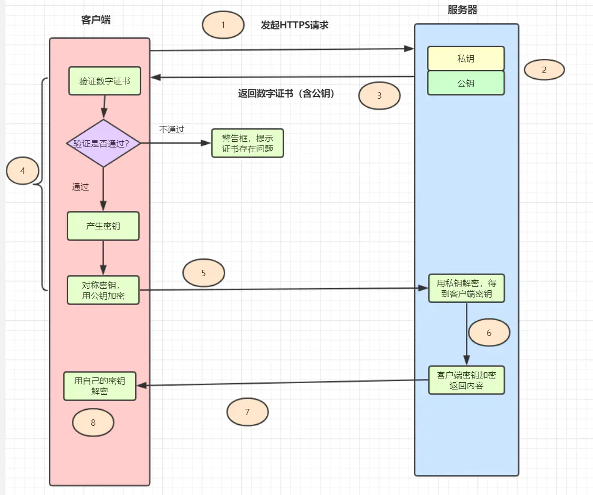
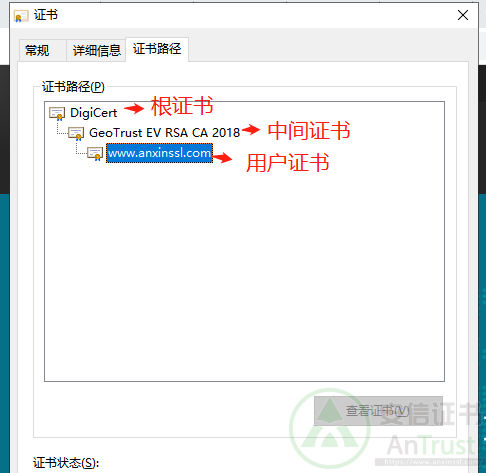
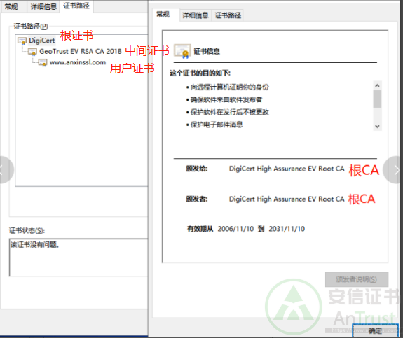
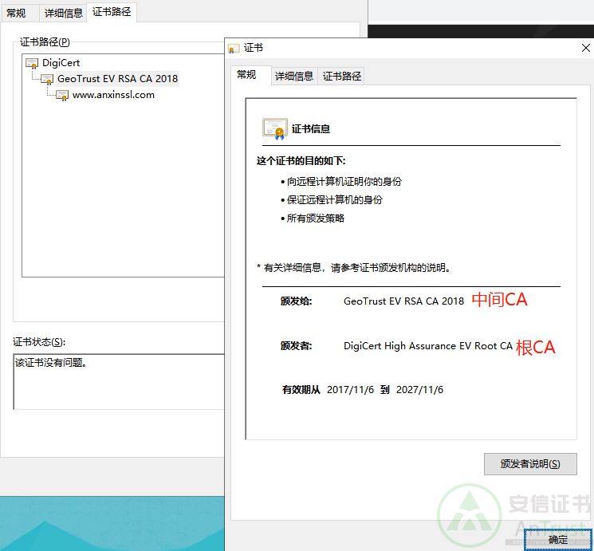
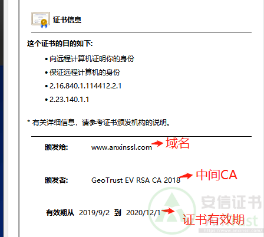
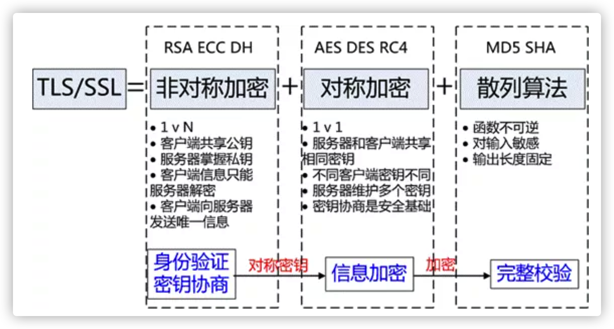
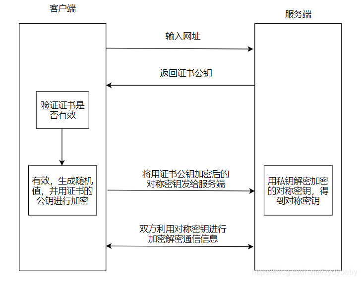

## https 流程

1. 用户在浏览器里输入一个 https 网址，然后连接到 server 的 443 端口。
2. **服务器必须要有一套数字证书**，可以自己制作，也可以向组织申请，区别就是自己颁发的证书需要客户端验证通过。这套证书其实就是一对公钥和私钥。
3. 服务器将自己的**数字证书（含有公钥）发送给客户端**。
4. 客户端收到服务器端的数字证书之后，会对其进行检查，如果不通过，则弹出警告框。如果证书没问题，**则生成一个密钥（对称加密），用证书的公钥对它加密。**
5. 客户端会发起 HTTPS 中的第二个 HTTP 请求，将加密之后的客户端密钥发送给服务器。
6. 服务器接收到客户端发来的密文之后，会用自己的私钥对其进行非对称解密，解密之后得到客户端密钥，然后用客户端密钥对返回数据进行对称加密，这样数据就变成了密文。
7. 服务器将加密后的密文返回给客户端。
8. 客户端收到服务器发返回的密文，用自己的密钥（客户端密钥）对其进行对称解密，得到服务器返回的数据。

## 二十八 什么是证书链，根证书，中间证书

**什么是证书信任链？什么是证书链？**

如图所示就是一个由根证书，中间证书，用户证书等组成一条完整证书信任链。**只有当整个证书信任链上的各个证书都有效时，浏览器才会认定当前颁发给用户的证书是有效和受信任的**。而证书链文件是指除了用户证书以外中间证书和根证书组成的证书文件称之为证书链文件。证书链文件是证书部署和验证证书是否可信环节中最重要的组成部分。

用户在获取SSL证书之前，首先要生成证书签名请求（CSR）和私钥。在最简单的迭代中，用户将生成的CSR发生到证书颁发机构，然后使用CA机构的根证书的私钥签署用户的SSL证书，并将SSL证书发回给用户。

当浏览器检测到SSL证书时，就会查看证书是由其中一个受信任的根证书签名（使用root的私钥签名）。由于浏览器信任root，所以浏览器也信任根证书签名的任何证书。

而证书链是由两个环节组成—信任锚（CA 证书）环节和已签名证书环节。信任锚证书CA 环节可以对中间证书签名；中间证书的所有者可以用自己的私钥对另一个证书签名。这两者结合就构成了证书链。

当你访问一个网站时，浏览器会查看它的SSL证书，并快速的验证证书的真实性。浏览器会检查证书的有效期、确保证书没有被撤销、验证证书的数字签名。

**浏览器循着证书链对证书进行身份验证的操作**。要获得颁发的SSL证书，首先要生成证书签名请求(CSR)和私钥。最简单的迭代，你将CSR发送给证书颁发机构，然后它使用来自其根的私钥签署SSL证书并将其发送回来。

现在，当浏览器看到SSL证书时，它会看到证书是由其根存储中的一个受信任根颁发的(或者更准确地说，使用根的私钥签名)。因为它信任根，所以它信任根签名的任何证书。为了使你更容易理解，上述内容我们作了简化，将服务器证书直接链到根。现在加入中间证书。

**根证书** –是受信任CA证书颁发机构给自己颁发的证书,是信任链的起始点。浏览器判断根证书是否受信任主要是通过检索浏览器的根证书库可信任列表里是否存在。如果存在浏览器就会信任该根证书。目前有的浏览器会自建根证书库，例如火狐浏览器，有的浏览器会使用其他浏览器的根证书库或者调用操作系统的根证书库，例如谷歌浏览器。根证书信息查看可以通过点击根证书后查看证书信息后显示根证书的颁发者以及有效期等信息如下图所示：

**中间证书** –中间证书是根证书颁发机构CA对中间证书颁发机构的公钥进行数字签名得到的证书。中间证书的作用主要是为了保护根证书。因为如果直接采用根证书签发证书，一旦发生根证书泄露，将造成极大的安全问题。中间证书可以不止一个，目前我们经常看到有两级中间证书的，原则上中间证书层数越多，根证书越安全。但是一般情况下最多也不超过2级。中间证书信息查看如下：

**用户证书** –用户证书是由中间证书CA签发给用户的证书。用户证书由中间证书证明可信。用户证书是浏览器上实际体现和使用的证书。用户证书可以通过点击小锁后查看到该证书颁发给哪个域名或者ip，证书有效期，颁发机构等信息。如下图所示：

## 二十四 数字签名

数字证书是指在互联网通讯中标志通讯各方身份信息的一个数字认证，人们可以在网上用它来识别对方的身份。**它的出现，是为了避免身份被篡改冒充**的。比如Https的数字证书，就是为了避免公钥被中间人冒充篡改：

**数字证书构成**

- 公钥和个人等信息，经过Hash摘要算法加密，形成消息摘要；将消息摘要拿到拥有公信力的认证中心（CA），用它的私钥对消息摘要加密，形成**数字签名**。
- 公钥和个人信息、数字签名共同构成**数字证书**。

- 在自己的服务器上生成一对公钥和私钥。然后将域名、申请者、公钥(注意不是私钥，私钥是无论如何也不能泄露的)等其他信息整合在一起，生成.csr 文件。
- 将这个 .csr 文件发给 CA 机构，CA 机构收到申请后，会通过各种手段验证申请者的组织信息和个人信息，如无异常(组织存在，企业合法，确实是域名的拥有者)，CA 就会使用散列算法对.csr里的明文信息先做一个HASH，得到一个**信息摘要**，再用 **CA 自己的私钥对这个信息摘要进行加密**，生成一串密文，密文即是所说的 **签名**。签名 + .csr 明文信息，即是 证书。CA 把这个证书返回给申请人。

在信息安全性问题中，我们常常要做到三点才能保证信息的安全：

- 信息的保密性
- 信息的完整性
- 身份识别

将这三者结合起来，就是 TLS/SSL 做的事情

- 客户端(浏览器)向服务端发出请求，服务端返回证书给客户端。
- 客户端拿到证书后，把证书里的签名与及明文信息分别取出来，然后会用自身携带的CA机构的公钥去解密签名，然后信息摘要1，然后再对明文信息进行HASH，得到一个信息摘要2，对比信息摘要1 和信息摘要2，如果一样，说明证书是合法的，也就是证书里的公钥是正确的。

HTTPS的加密过程：

1. 客户端向服务端发起第一次握手请求，告诉服务端客户端所支持的SSL的指定版本、加密算法及密钥长度等信息。
2. 服务端将自己的公钥发给数字证书认证机构，数字证书认证机构利用自己的私钥对服务器的公钥进行数字签名，并给服务器颁发公钥证书。
3. 服务端将证书发给客户端。
4. 客户端利用数字认证机构的公钥，向数字证书认证机构验证公钥证书上的**数字签名**，确认服务器公开密钥的真实性。
5. 客服端使用服务端的公开密钥加密自己生成的对称密钥，发给服务端。
6. 服务端收到后利用私钥解密信息，获得客户端发来的对称密钥。
7. 通信双方可用对称密钥来加密解密信息。

上述流程存在的一个问题是客户端哪里来的数字认证机构的公钥，其实，在很多浏览器开发时，会内置常用数字证书认证机构的公钥。

流程图如下：

## https 一定安全可靠吗？

这个问题的场景是这样的：客户端通过浏览器向服务端发起 HTTPS 请求时，被「假基站」转发到了一个「中间人服务器」，于是客户端是和「中间人服务器」完成了 TLS 握手，然后这个「中间人服务器」再与真正的服务端完成 TLS 握手。

具体过程如下：

- 客户端向服务端发起 HTTPS 建立连接请求时，然后被「假基站」转发到了一个「中间人服务器」，接着中间人向服务端发起 HTTPS 建立连接请求，此时客户端与中间人进行 TLS 握手，中间人与服务端进行 TLS 握手；
- 在客户端与中间人进行 TLS 握手过程中，中间人会发送自己的公钥证书给客户端，**客户端验证证书的真伪**，然后从证书拿到公钥，并生成一个随机数，用公钥加密随机数发送给中间人，中间人使用私钥解密，得到随机数，此时双方都有随机数，然后通过算法生成对称加密密钥（A），后续客户端与中间人通信就用这个对称加密密钥来加密数据了。
- 在中间人与服务端进行 TLS 握手过程中，服务端会发送从 CA 机构签发的公钥证书给中间人，从证书拿到公钥，并生成一个随机数，用公钥加密随机数发送给服务端，服务端使用私钥解密，得到随机数，此时双方都有随机数，然后通过算法生成对称加密密钥（B），后续中间人与服务端通信就用这个对称加密密钥来加密数据了。
- 后续的通信过程中，中间人用对称加密密钥（A）解密客户端的 HTTPS 请求的数据，然后用对称加密密钥（B）加密 HTTPS 请求后，转发给服务端，接着服务端发送 HTTPS 响应数据给中间人，中间人用对称加密密钥（B）解密 HTTPS 响应数据，然后再用对称加密密钥（A）加密后，转发给客户端。

从客户端的角度看，其实并不知道网络中存在中间人服务器这个角色。

那么中间人就可以解开浏览器发起的 HTTPS 请求里的数据，也可以解开服务端响应给浏览器的 HTTPS 响应数据。相当于，中间人能够 “偷看” 浏览器与服务端之间的 HTTPS 请求和响应的数据。

但是要发生这种场景是有前提的，**前提是用户点击接受了中间人服务器的证书。**

中间人服务器与客户端在 TLS 握手过程中，实际上发送了自己伪造的证书给浏览器，而这个伪造的证书是能被浏览器（客户端）识别出是非法的，于是就会提醒用户该证书存在问题。

如果用户执意点击「继续浏览此网站」，相当于用户接受了中间人伪造的证书，那么后续整个 HTTPS 通信都能被中间人监听了。

所以，这其实并不能说 HTTPS 不够安全，毕竟浏览器都已经提示证书有问题了，如果用户坚决要访问，那**不能怪 HTTPS ，得怪自己手贱**。

## **客户端是如何验证证书的？**

接下来，详细说一下实际中数字证书签发和验证流程。

如下图图所示，为数字证书签发和验证流程：

当服务端向 CA 机构申请证书的时候，CA 签发证书的过程，如上图左边部分：

- 首先 CA 会把持有者的公钥、用途、颁发者、有效时间等信息打成一个包，然后对这些信息进行 Hash 计算，得到一个 Hash 值；
- 然后 CA 会使用自己的私钥将该 Hash 值加密，生成 Certificate Signature，也就是 CA 对证书做了签名；
- 最后将 Certificate Signature 添加在文件证书上，形成数字证书；

客户端校验服务端的数字证书的过程，如上图右边部分：

- 首先客户端会使用同样的 Hash 算法获取该证书的 Hash 值 H1；
- 通常浏览器和操作系统中集成了 CA 的公钥信息，浏览器收到证书后可以使用 CA 的公钥解密 Certificate Signature 内容，得到一个 Hash 值 H2 ；
- 最后比较 H1 和 H2，如果值相同，则为可信赖的证书，否则则认为证书不可信。

但事实上，证书的验证过程中**还存在一个证书信任链的问题**，因为我们向 CA 申请的证书一般不是根证书签发的，而是由中间证书签发的，比如百度的证书，从下图你可以看到，证书的层级有三级：

对于这种三级层级关系的证书的验证过程如下：

- 客户端收到 baidu.com 的证书后，发现这个证书的签发者不是根证书，就无法根据本地已有的根证书中的公钥去验证 baidu.com 证书是否可信。于是，客户端根据 baidu.com 证书中的签发者，找到该证书的颁发机构是 “GlobalSign Organization Validation CA - SHA256 - G2”，然后向 CA 请求该中间证书。
- 请求到证书后发现 “GlobalSign Organization Validation CA - SHA256 - G2” 证书是由 “GlobalSign Root CA” 签发的，由于 “GlobalSign Root CA” 没有再上级签发机构，说明它是根证书，也就是自签证书。应用软件会检查此证书有否已预载于根证书清单上，如果有，则可以利用根证书中的公钥去验证 “GlobalSign Organization Validation CA - SHA256 - G2” 证书，如果发现验证通过，就认为该中间证书是可信的。
- “GlobalSign Organization Validation CA - SHA256 - G2” 证书被信任后，可以使用 “GlobalSign Organization Validation CA - SHA256 - G2” 证书中的公钥去验证 baidu.com 证书的可信性，如果验证通过，就可以信任 baidu.com 证书。

在这四个步骤中，最开始客户端只信任根证书 GlobalSign Root CA 证书的，然后 “GlobalSign Root CA” 证书信任 “GlobalSign Organization Validation CA - SHA256 - G2” 证书，而 “GlobalSign Organization Validation CA - SHA256 - G2” 证书又信任 baidu.com 证书，于是客户端也信任 baidu.com 证书。总括来说，由于用户信任 GlobalSign，所以由 GlobalSign 所担保的 baidu.com 可以被信任，另外由于用户信任操作系统或浏览器的软件商，所以由软件商预载了根证书的 GlobalSign 都可被信任。

操作系统里一般都会内置一些根证书，比如我的 MAC 电脑里内置的根证书有这么多：

这样的一层层地验证就构成了一条信任链路，整个证书信任链验证流程如下图所示：

如果你的电脑中毒了，被恶意导入了中间人的根证书，那么在验证中间人的证书的时候，由于你操作系统信任了中间人的根证书，那么等同于中间人的证书是合法的。

这种情况下，浏览器是不会弹出证书存在问题的风险提醒的。

这其实也不关 HTTPS 的事情，是你电脑中毒了才导致 HTTPS 数据被中间人劫持的。

所以，**HTTPS 协议本身到目前为止还是没有任何漏洞的，即使你成功进行中间人攻击，本质上是利用了客户端的漏洞（用户点击继续访问或者被恶意导入伪造的根证书），并不是 HTTPS 不够安全。**

## **为什么抓包工具能截取 HTTPS 数据？**

抓包工具 Fiddler 之所以可以明文看到 HTTPS 数据，工作原理与中间人一致的。

对于 HTTPS 连接来说，中间人要满足以下两点，才能实现真正的明文代理:

1. 中间人，作为客户端与真实服务端建立连接这一步不会有问题，因为服务端不会校验客户端的身份；
2. 中间人，作为服务端与真实客户端建立连接，这里会有客户端信任服务端的问题，也就是服务端必须有对应域名的私钥；

中间人要拿到私钥只能通过如下方式：

1. 去网站服务端拿到私钥；
2. 去CA处拿域名签发私钥；
3. 自己签发证书，且被浏览器信任；

不用解释，抓包工具只能使用第三种方式取得中间人的身份。

使用抓包工具进行 HTTPS 抓包的时候，需要在客户端安装 Fiddler 的根证书，这里实际上起认证中心（CA）的作用。

Fiddler 能够抓包的关键是客户端会往系统受信任的根证书列表中导入 Fiddler 生成的证书，而这个证书会被浏览器信任，也就是 Fiddler 给自己创建了一个认证中心 CA。

客户端拿着中间人签发的证书去中间人自己的 CA 去认证，当然认为这个证书是有效的。

## **如何避免被中间人抓取数据？**

我们要保证自己电脑的安全，不要被病毒乘虚而入，而且也不要点击任何证书非法的网站，这样 HTTPS 数据就不会被中间人截取到了。

当然，我们还可以通过 HTTPS 双向认证来避免这种问题。

一般我们的 HTTPS 是单向认证，客户端只会验证了服务端的身份，但是服务端并不会验证客户端的身份。

如果用了双向认证方式，不仅客户端会验证服务端的身份，而且服务端也会验证客户端的身份。

服务端一旦验证到请求自己的客户端为不可信任的，服务端就拒绝继续通信，客户端如果发现服务端为不可信任的，那么也中止通信。

