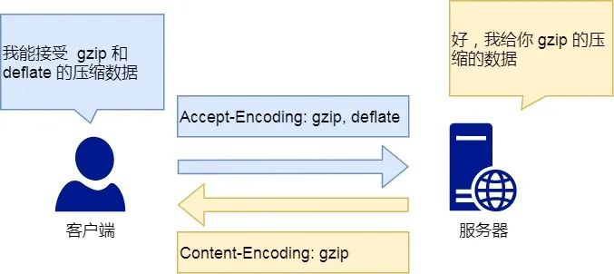
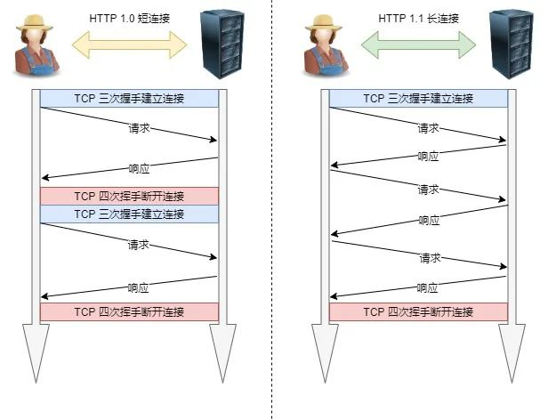
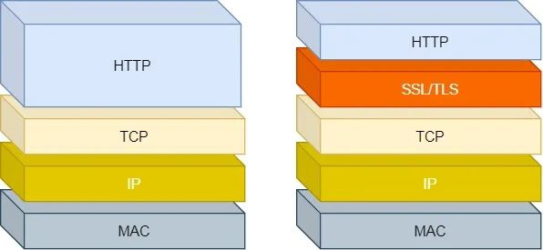
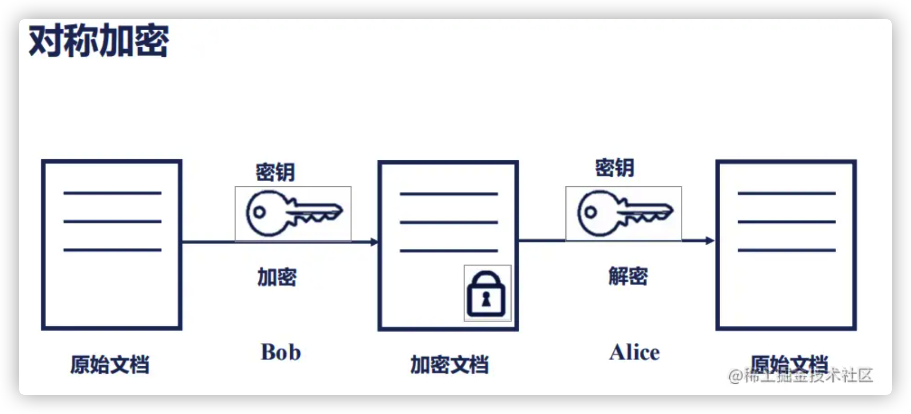
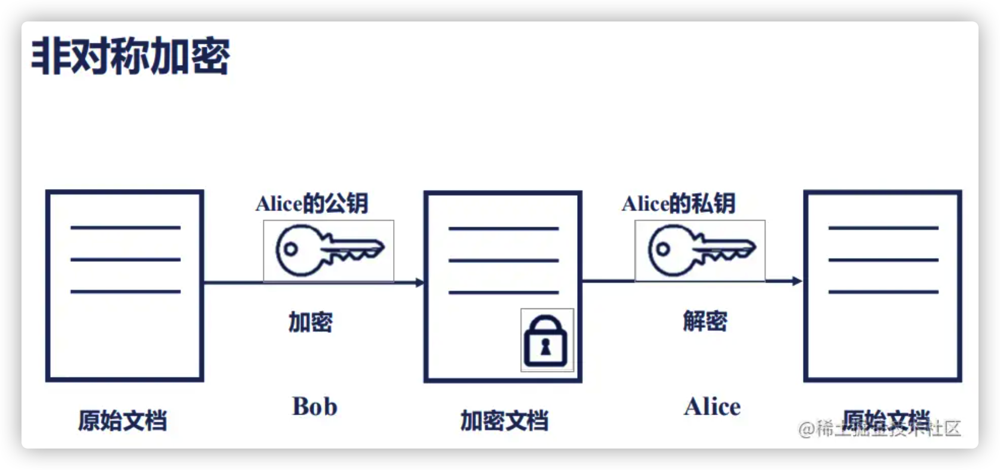
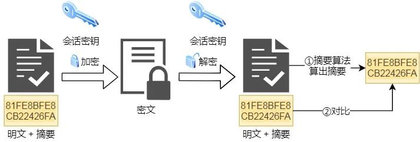
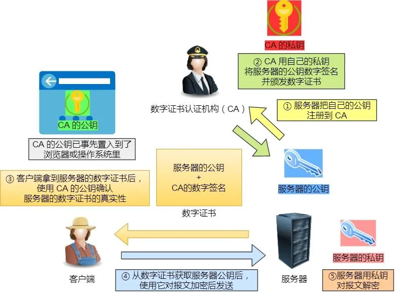
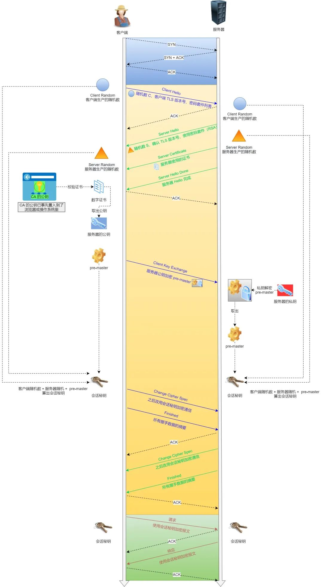

## HTTP 常见的状态码，有哪些？

五大类 HTTP 状态码

*1xx*

`1xx` 类状态码属于**提示信息**，是协议处理中的一种中间状态，实际用到的比较少。

*2xx*

`2xx` 类状态码表示服务器**成功**处理了客户端的请求，也是我们最愿意看到的状态。

「**200 OK**」是最常见的成功状态码，表示一切正常。如果是非 `HEAD` 请求，服务器返回的响应头都会有 body 数据。

「**204 No Content**」也是常见的成功状态码，与 200 OK 基本相同，但响应头没有 body 数据。

「**206 Partial Content**」是应用于 HTTP 分块下载或断电续传，表示响应返回的 body 数据并不是资源的全部，而是其中的一部分，也是服务器处理成功的状态。

*3xx*

`3xx` 类状态码表示客户端请求的资源发送了变动，需要客户端用新的 URL 重新发送请求获取资源，也就是**重定向**。

「**301 Moved Permanently**」表示永久重定向，说明请求的资源已经不存在了，需改用新的 URL 再次访问。

「**302 Moved Permanently**」表示临时重定向，说明请求的资源还在，但暂时需要用另一个 URL 来访问。

301 和 302 都会在响应头里使用字段 `Location`，指明后续要跳转的 URL，浏览器会自动重定向新的 URL。

「**304 Not Modified**」不具有跳转的含义，表示资源未修改，重定向已存在的缓冲文件，也称缓存重定向，用于缓存控制。

*4xx*

`4xx` 类状态码表示客户端发送的**报文有误**，服务器无法处理，也就是错误码的含义。

「**400 Bad Request**」表示客户端请求的报文有错误，但只是个笼统的错误。

「**403 Forbidden**」表示服务器禁止访问资源，并不是客户端的请求出错。

「**404 Not Found**」表示请求的资源在服务器上不存在或未找到，所以无法提供给客户端。

*5xx*

`5xx` 类状态码表示客户端请求报文正确，但是**服务器处理时内部发生了错误**，属于服务器端的错误码。

「**500 Internal Server Error**」与 400 类型，是个笼统通用的错误码，服务器发生了什么错误，我们并不知道。

「**501 Not Implemented**」表示客户端请求的功能还不支持，类似“即将开业，敬请期待”的意思。

「**502 Bad Gateway**」通常是服务器作为网关或代理时返回的错误码，表示服务器自身工作正常，访问后端服务器发生了错误。

「**503 Service Unavailable**」表示服务器当前很忙，暂时无法响应服务器，类似“网络服务正忙，请稍后重试”的意思。


## http 常见字段有哪些？

*Host*

客户端发送请求时，用来指定服务器的域名。


```
Host: www.A.com
```

有了 `Host` 字段，就可以将请求发往「同一台」服务器上的不同网站。

*Content-Length 字段*

服务器在返回数据时，会有 `Content-Length` 字段，表明本次回应的数据长度。


```
Content-Length: 1000
```

如上面则是告诉浏览器，本次服务器回应的数据长度是 1000 个字节，后面的字节就属于下一个回应了。

*Connection 字段*

`Connection` 字段最常用于客户端要求服务器使用 TCP 持久连接，以便其他请求复用。


HTTP/1.1 版本的默认连接都是持久连接，但为了兼容老版本的 HTTP，需要指定 `Connection` 首部字段的值为 `Keep-Alive`。

```
Connection: keep-alive
```

一个可以复用的 TCP 连接就建立了，直到客户端或服务器主动关闭连接。但是，这不是标准字段。

*Content-Type 字段*

`Content-Type` 字段用于服务器回应时，告诉客户端，本次数据是什么格式。


```
Content-Type: text/html; charset=utf-8
```

上面的类型表明，发送的是网页，而且编码是UTF-8。

客户端请求的时候，可以使用 `Accept` 字段声明自己可以接受哪些数据格式。

```
Accept: */*
```

上面代码中，客户端声明自己可以接受任何格式的数据。

*Content-Encoding 字段*

`Content-Encoding` 字段说明数据的压缩方法。表示服务器返回的数据使用了什么压缩格式




```
Content-Encoding: gzip
```

上面表示服务器返回的数据采用了 gzip 方式压缩，告知客户端需要用此方式解压。

客户端在请求时，用 `Accept-Encoding` 字段说明自己可以接受哪些压缩方法。

```
Accept-Encoding: gzip, deflate
```


## http 无状态

无状态的**好处**，因为服务器不会去记忆 HTTP 的状态，所以不需要额外的资源来记录状态信息，这能减轻服务器的负担，能够把更多的 CPU 和内存用来对外提供服务。

无状态的**坏处**，既然服务器没有记忆能力，它在完成有关联性的操作时会非常麻烦。

例如登录->添加购物车->下单->结算->支付，这系列操作都要知道用户的身份才行。但服务器不知道这些请求是有关联的，每次都要问一遍身份信息。

这样每操作一次，都要验证信息，这样的购物体验还能愉快吗？别问，问就是**酸爽**！

对于无状态的问题，解法方案有很多种，其中比较简单的方式用 **Cookie**技术。

`Cookie` 通过在请求和响应报文中写入 Cookie 信息来控制客户端的状态。

相当于，**在客户端第一次请求后，服务器会下发一个装有客户信息的「小贴纸」，后续客户端请求服务器的时候，带上「小贴纸」，服务器就能认得了了**，


## http 不安全

HTTP 比较严重的缺点就是不安全：

- 通信使用明文（不加密），内容可能会被窃听。比如，**账号信息容易泄漏，那你号没了。**
- 不验证通信方的身份，因此有可能遭遇伪装。比如，**访问假的淘宝、拼多多，那你钱没了。**
- 无法证明报文的完整性，所以有可能已遭篡改。比如，**网页上植入垃圾广告，视觉污染，眼没了。**

HTTP 的安全问题，可以用 HTTPS 的方式解决，也就是通过引入 SSL/TLS 层，使得在安全上达到了极致。


## http 长连接

早期 HTTP/1.0 性能上的一个很大的问题，那就是每发起一个请求，都要新建一次 TCP 连接（三次握手），而且是串行请求，做了无畏的 TCP 连接建立和断开，增加了通信开销。

为了解决上述 TCP 连接问题，HTTP/1.1 提出了**长连接**的通信方式，也叫持久连接。这种方式的好处在于减少了 TCP 连接的重复建立和断开所造成的额外开销，减轻了服务器端的负载。

持久连接的特点是，只要任意一端没有明确提出断开连接，则保持 TCP 连接状态。



## *管道网络传输*

HTTP/1.1 采用了长连接的方式，这使得管道（pipeline）网络传输成为了可能。

即可在同一个 TCP 连接里面，客户端可以发起多个请求，只要第一个请求发出去了，不必等其回来，就可以发第二个请求出去，可以**减少整体的响应时间。**

举例来说，客户端需要请求两个资源。以前的做法是，在同一个TCP连接里面，先发送 A 请求，然后等待服务器做出回应，收到后再发出 B 请求。管道机制则是允许浏览器同时发出 A 请求和 B 请求。


但是服务器还是按照**顺序**，先回应 A 请求，完成后再回应 B 请求。要是 前面的回应特别慢，后面就会有许多请求排队等着。这称为「队头堵塞」。


## *队头阻塞*

「请求 - 应答」的模式加剧了 HTTP 的性能问题。

因为当顺序发送的请求序列中的一个请求因为某种原因被阻塞时，在后面排队的所有请求也一同被阻塞了，会招致客户端一直请求不到数据，这也就是「**队头阻塞**」。**好比上班的路上塞车**。


总之 HTTP/1.1 的性能一般般，后续的 HTTP/2 和 HTTP/3 就是在优化 HTTP 的性能。


## http 和 https

> HTTP 与 HTTPS 有哪些区别？

1. HTTP 是超文本传输协议，信息是明文传输，存在安全风险的问题。HTTPS 则解决 HTTP 不安全的缺陷，在 TCP 和 HTTP 网络层之间加入了 SSL/TLS 安全协议，使得报文能够加密传输。
2. HTTP 连接建立相对简单， TCP 三次握手之后便可进行 HTTP 的报文传输。而 HTTPS 在 TCP 三次握手之后，还需进行 SSL/TLS 的握手过程，才可进入加密报文传输。
3. HTTP 的端口号是 80，HTTPS 的端口号是 443。
4. HTTPS 协议需要向 CA（证书权威机构）申请数字证书，来保证服务器的身份是可信的。


HTTP**S** 在 HTTP 与 TCP 层之间加入了 `SSL/TLS` 协议。



HTTP 与 HTTPS

可以很好的解决了上述的风险：

- **信息加密**：交互信息无法被窃取，但你的号会因为「自身忘记」账号而没。
- **校验机制**：无法篡改通信内容，篡改了就不能正常显示，但百度「竞价排名」依然可以搜索垃圾广告。
- **身份证书**：证明淘宝是真的淘宝网，但你的钱还是会因为「剁手」而没。


> HTTPS 是如何解决上面的三个风险的？

- **混合加密**的方式实现信息的**机密性**，解决了窃听的风险。
- **摘要算法**的方式来实现**完整性**，它能够为数据生成独一无二的「指纹」，指纹用于校验数据的完整性，解决了篡改的风险。
- 将服务器公钥放入到**数字证书**中，解决了冒充的风险。


# https


## 混合加密

HTTPS 采用的是**对称加密**和**非对称加密**结合的「混合加密」方式：

- 在通信建立前采用**非对称加密**的方式交换「会话秘钥」，后续就不再使用非对称加密。
- 在通信过程中全部使用**对称加密**的「会话秘钥」的方式加密明文数据。

采用「混合加密」的方式的原因：

- **对称加密**只使用一个密钥，运算速度快，密钥必须保密，无法做到安全的密钥交换。
- **非对称加密**使用两个密钥：公钥和私钥，公钥可以任意分发而私钥保密，解决了密钥交换问题但速度慢。


### 对称加密

对称加密又叫做私钥加密，即信息的发送方和接收方使用同一个密钥去加密和解密数据。对称加密的特点是算法公开、加密和解密速度快，适合于对大数据量进行加密。

> **加密过程如下**：明文 + 加密算法 + 私钥 => 密文
>
> **解密过程如下**：密文 + 解密算法 + 私钥 => 明文



对称加密中用到的密钥叫做私钥，私钥表示个人私有的密钥，即该密钥不能被泄露。 其加密过程中的私钥与解密过程中用到的私钥是同一个密钥，这也是称加密之所以称之为“对称”的原因。由于对称加密的算法是公开的，所以一旦私钥被泄露，那么密文就很容易被破解，所以对称加密的缺点是密钥安全管理困难。

**如果你不是很理解，就看这个通俗易懂的例子**：

> 甲对乙说，我这有一把锁，以后我们互相传消息，就把消息放盒子里，然后用这个锁锁上再传，这个锁有两把一模一样的钥匙，咱俩一人一把，说完甲把钥匙递给了乙。


### 非对称加密

非对称加密也叫做公钥加密。非对称加密与对称加密相比，其安全性更好。对称加密的通信双方使用相同的密钥，如果一方的密钥遭泄露，那么整个通信就会被破解。而非对称加密使用一对密钥，即公钥和私钥，且二者成对出现。私钥被自己保存，不能对外泄露。公钥指的是公共的密钥，任何人都可以获得该密钥。用公钥或私钥中的任何一个进行加密，用另一个进行解密。

> **被公钥加密过的密文只能被私钥解密，过程如下**：
>
> 明文 + 加密算法 + 公钥 => 密文， 密文 + 解密算法 + 私钥 => 明文



由于加密和解密使用了两个不同的密钥，这就是非对称加密“非对称”的原因。非对称加密的`缺点`是加密和解密花费时间长、速度慢，只适合对少量数据进行加密。


*2. 摘要算法*

**摘要算法**用来实现**完整性**，能够为数据生成独一无二的「指纹」，用于校验数据的完整性，解决了篡改的风险。



客户端在发送明文之前会通过摘要算法算出明文的「指纹」，发送的时候把「指纹 + 明文」一同
加密成密文后，发送给服务器，服务器解密后，用相同的摘要算法算出发送过来的明文，通过比较客户端携带的「指纹」和当前算出的「指纹」做比较，若「指纹」相同，说明数据是完整的。

*3. 数字证书*

客户端先向服务器端索要公钥，然后用公钥加密信息，服务器收到密文后，用自己的私钥解密。

这就存在些问题，如何保证公钥不被篡改和信任度？

所以这里就需要借助第三方权威机构 `CA` （数字证书认证机构），将**服务器公钥放在数字证书**（由数字证书认证机构颁发）中，只要证书是可信的，公钥就是可信的。



通过数字证书的方式保证服务器公钥的身份，解决冒充的风险。

> HTTPS  是如何建立连接的？其间交互了什么？

SSL/TLS 协议基本流程：

- 客户端向服务器索要并验证服务器的公钥。
- 双方协商生产「会话秘钥」。
- 双方采用「会话秘钥」进行加密通信。

前两步也就是 SSL/TLS 的建立过程，也就是握手阶段。

SSL/TLS 的「握手阶段」涉及**四次**通信，可见下图：

HTTPS 连接建立过程

SSL/TLS 协议建立的详细流程：

*1. ClientHello*

首先，由客户端向服务器发起加密通信请求，也就是 `ClientHello`请求。

在这一步，客户端主要向服务器发送以下信息：

（1）客户端支持的 SSL/TLS 协议版本，如 TLS 1.2 版本。

（2）客户端生产的随机数（`Client Random`），后面用于生产「会话秘钥」。

（3）客户端支持的密码套件列表，如 RSA 加密算法。

*2. SeverHello*

服务器收到客户端请求后，向客户端发出响应，也就是 `SeverHello`。服务器回应的内容有如下内容：

（1）确认 SSL/ TLS 协议版本，如果浏览器不支持，则关闭加密通信。

（2）服务器生产的随机数（`Server Random`），后面用于生产「会话秘钥」。

（3）确认的密码套件列表，如 RSA 加密算法。

（4）服务器的数字证书。

*3.客户端回应*

客户端收到服务器的回应之后，首先通过浏览器或者操作系统中的 CA 公钥，确认服务器的数字证书的真实性。

如果证书没有问题，客户端会从数字证书中取出服务器的公钥，然后使用它加密报文，向服务器发送如下信息：

（1）一个随机数（`pre-master key`）。该随机数会被服务器公钥加密。

（2）加密通信算法改变通知，表示随后的信息都将用「会话秘钥」加密通信。

（3）客户端握手结束通知，表示客户端的握手阶段已经结束。这一项同时把之前所有内容的发生的数据做个摘要，用来供服务端校验。

上面第一项的随机数是整个握手阶段的第三个随机数，这样服务器和客户端就同时有三个随机数，接着就用双方协商的加密算法，**各自生成**本次通信的「会话秘钥」。

*4. 服务器的最后回应*

服务器收到客户端的第三个随机数（`pre-master key`）之后，通过协商的加密算法，计算出本次通信的「会话秘钥」。然后，向客户端发生最后的信息：

（1）加密通信算法改变通知，表示随后的信息都将用「会话秘钥」加密通信。

（2）服务器握手结束通知，表示服务器的握手阶段已经结束。这一项同时把之前所有内容的发生的数据做个摘要，用来供客户端校验。

至此，整个 SSL/TLS 的握手阶段全部结束。接下来，客户端与服务器进入加密通信，就完全是使用普通的 HTTP 协议，只不过用「会话秘钥」加密内容。


### 05 HTTP/1.1、HTTP/2、HTTP/3 演变

> 说说 HTTP/1.1 相比 HTTP/1.0 提高了什么性能？

HTTP/1.1 相比 HTTP/1.0 性能上的改进：

- 使用 TCP 长连接的方式改善了 HTTP/1.0 短连接造成的性能开销。
- 支持 管道（pipeline）网络传输，只要第一个请求发出去了，不必等其回来，就可以发第二个请求出去，可以减少整体的响应时间。

但 HTTP/1.1 还是有性能瓶颈：

- 请求 / 响应头部（Header）未经压缩就发送，首部信息越多延迟越大。只能压缩 `Body` 的部分；
- 发送冗长的首部。每次互相发送相同的首部造成的浪费较多；
- 服务器是按请求的顺序响应的，如果服务器响应慢，会招致客户端一直请求不到数据，也就是队头阻塞；
- 没有请求优先级控制；
- 请求只能从客户端开始，服务器只能被动响应。


> 那上面的 HTTP/1.1 的性能瓶颈，HTTP/2 做了什么优化？

HTTP/2 协议是基于 HTTPS 的，所以 HTTP/2 的安全性也是有保障的。

那 HTTP/2 相比 HTTP/1.1 性能上的改进：

*1. 头部压缩*

HTTP/2 会**压缩头**（Header）如果你同时发出多个请求，他们的头是一样的或是相似的，那么，协议会帮你**消除重复的分**。

这就是所谓的 `HPACK` 算法：在客户端和服务器同时维护一张头信息表，所有字段都会存入这个表，生成一个索引号，以后就不发送同样字段了，只发送索引号，这样就**提高速度**了。

*2. 二进制格式*

HTTP/2 不再像 HTTP/1.1 里的纯文本形式的报文，而是全面采用了**二进制格式。**

头信息和数据体都是二进制，并且统称为帧（frame）：**头信息帧和数据帧**。

报文区别

这样虽然对人不友好，但是对计算机非常友好，因为计算机只懂二进制，那么收到报文后，无需再将明文的报文转成二进制，而是直接解析二进制报文，这**增加了数据传输的效率**。

*3. 数据流*

HTTP/2 的数据包不是按顺序发送的，同一个连接里面连续的数据包，可能属于不同的回应。因此，必须要对数据包做标记，指出它属于哪个回应。

每个请求或回应的所有数据包，称为一个数据流（`Stream`）。

每个数据流都标记着一个独一无二的编号，其中规定客户端发出的数据流编号为奇数， 服务器发出的数据流编号为偶数

客户端还可以**指定数据流的优先级**。优先级高的请求，服务器就先响应该请求。

HTT/1 ~ HTTP/2

*4. 多路复用*

HTTP/2 是可以在**一个连接中并发多个请求或回应，而不用按照顺序一一对应**。

移除了 HTTP/1.1 中的串行请求，不需要排队等待，也就不会再出现「队头阻塞」问题，**降低了延迟，大幅度提高了连接的利用率**。

举例来说，在一个 TCP 连接里，服务器收到了客户端 A 和 B 的两个请求，如果发现 A 处理过程非常耗时，于是就回应 A 请求已经处理好的部分，接着回应 B 请求，完成后，再回应 A 请求剩下的部分。

多路复用

*5. 服务器推送*

HTTP/2 还在一定程度上改善了传统的「请求 - 应答」工作模式，服务不再是被动地响应，也可以**主动**向客户端发送消息。

举例来说，在浏览器刚请求 HTML 的时候，就提前把可能会用到的 JS、CSS 文件等静态资源主动发给客户端，**减少延时的等待**，也就是服务器推送（Server Push，也叫 Cache Push）。

> HTTP/2 有哪些缺陷？HTTP/3 做了哪些优化？

HTTP/2 主要的问题在于：多个 HTTP 请求在复用一个 TCP 连接，下层的 TCP 协议是不知道有多少个 HTTP 请求的。

所以一旦发生了丢包现象，就会触发 TCP 的重传机制，这样在一个 TCP 连接中的**所有的 HTTP 请求都必须等待这个丢了的包被重传回来**。

- HTTP/1.1 中的管道（ pipeline）传输中如果有一个请求阻塞了，那么队列后请求也统统被阻塞住了
- HTTP/2 多请求复用一个TCP连接，一旦发生丢包，就会阻塞住所有的 HTTP 请求。

这都是基于 TCP 传输层的问题，所以 **HTTP/3 把 HTTP 下层的 TCP 协议改成了 UDP！**

HTTP/1 ~ HTTP/3

UDP 发生是不管顺序，也不管丢包的，所以不会出现 HTTP/1.1 的队头阻塞 和 HTTP/2 的一个丢包全部重传问题。

大家都知道 UDP 是不可靠传输的，但基于 UDP 的 **QUIC 协议** 可以实现类似 TCP 的可靠性传输。

- QUIC 有自己的一套机制可以保证传输的可靠性的。当某个流发生丢包时，只会阻塞这个流，**其他流不会受到影响**。
- TL3 升级成了最新的 `1.3` 版本，头部压缩算法也升级成了 `QPack`。
- HTTPS 要建立一个连接，要花费 6 次交互，先是建立三次握手，然后是 `TLS/1.3` 的三次握手。QUIC 直接把以往的 TCP 和 `TLS/1.3` 的 6 次交互**合并成了 3 次，减少了交互次数**。


TCP HTTPS（TLS/1.3） 和 QUIC HTTPS

所以， QUIC 是一个在 UDP 之上的**伪** TCP + TLS + HTTP/2 的多路复用的协议。

QUIC 是新协议，对于很多网络设备，根本不知道什么是 QUIC，只会当做 UDP，这样会出现新的问题。所以 HTTP/3 现在普及的进度非常的缓慢，不知道未来 UDP 是否能够逆袭 TCP。