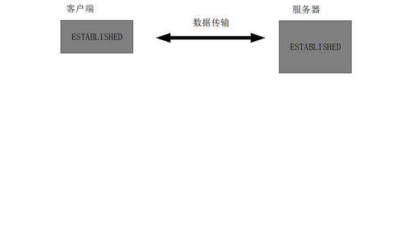
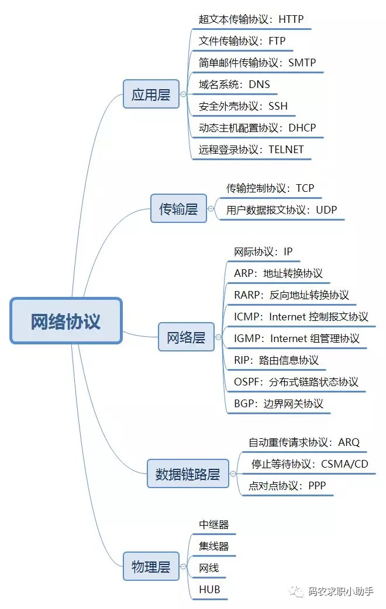
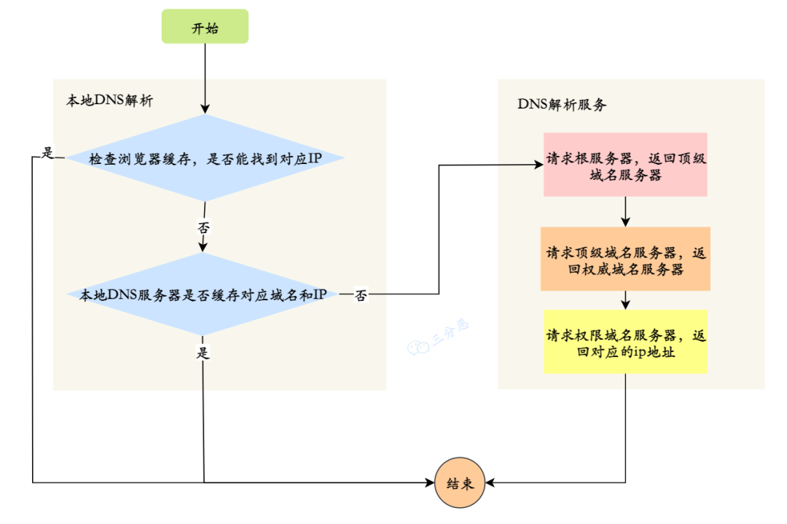
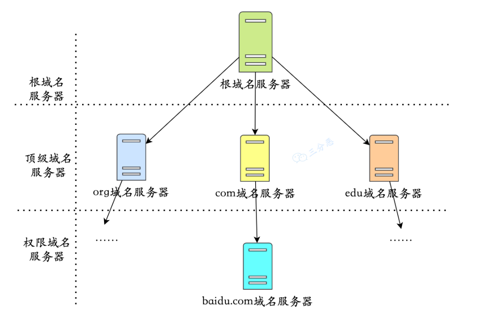
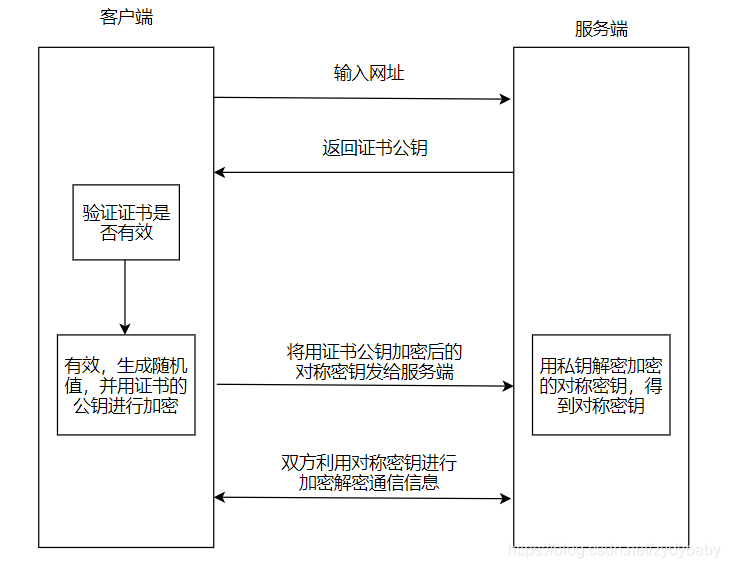
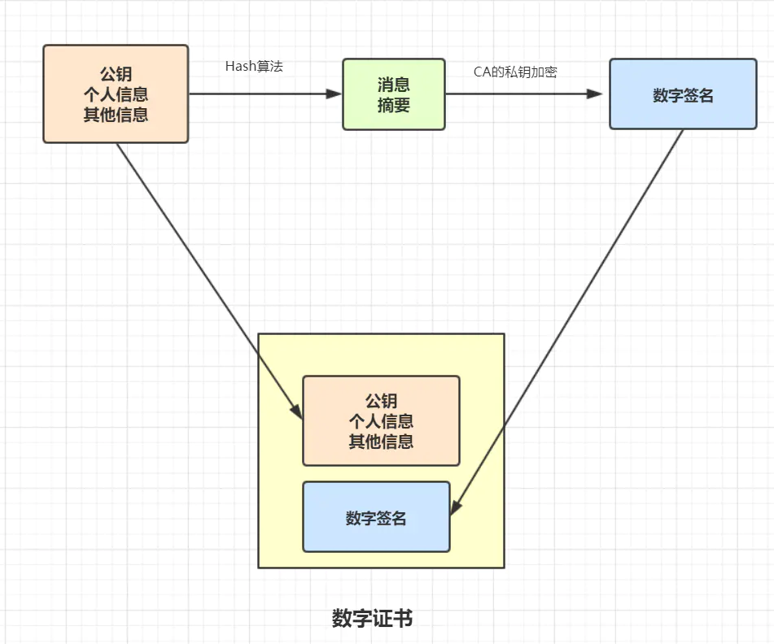
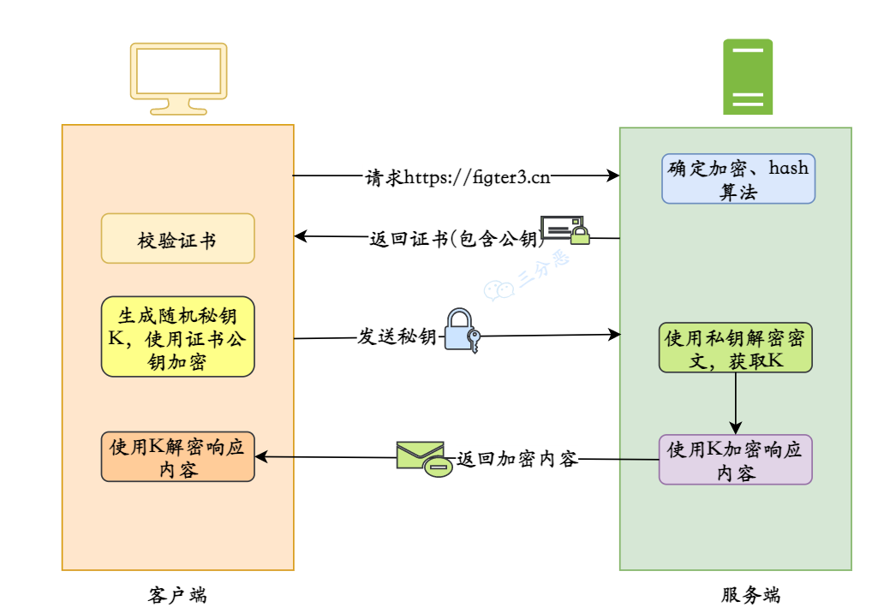
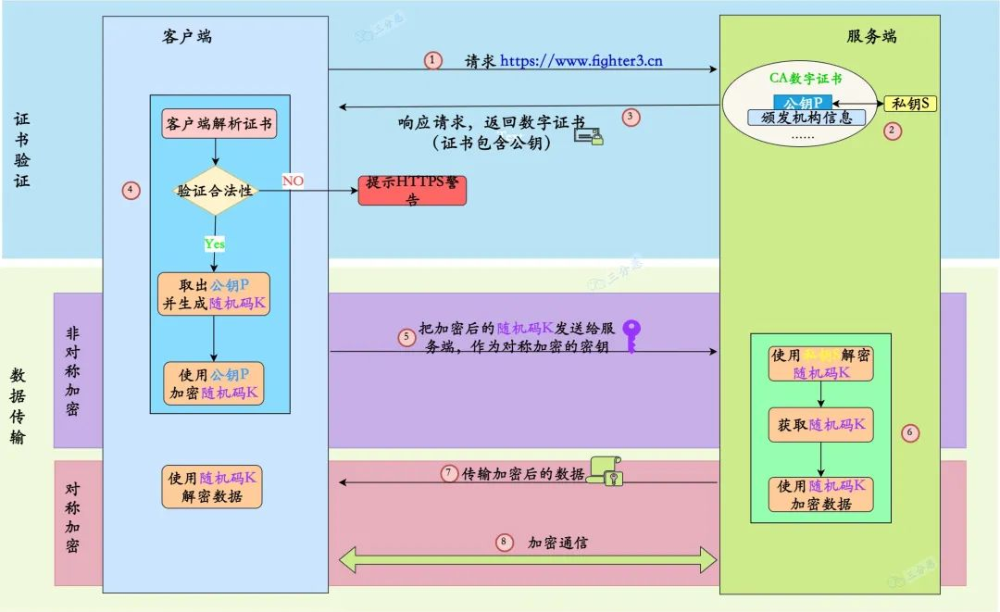
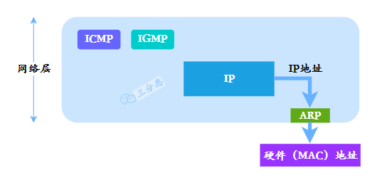

# 面试题

## 1. 说一下每一层对应的网络协议有哪些？


## 1. 为什么需要三次握手？两次不行？

### 三次握手


当面试官问你为什么需要有三次握手、三次握手的作用、讲讲三次三次握手的时候，我想很多人会这样回答：

首先很多人会先讲下握手的过程：

1、第一次握手：客户端给服务器发送一个 SYN 报文。

2、第二次握手：服务器收到 SYN 报文之后，会应答一个 SYN+ACK 报文。

3、第三次握手：客户端收到 SYN+ACK 报文之后，会回应一个 ACK 报文。

4、服务器收到 ACK 报文之后，三次握手建立完成。

作用是为了确认双方的接收与发送能力是否正常。

>**这里我顺便解释一下为啥只有三次握手才能确认双方的接受与发送能力是否正常，而两次却不可**以****
>
>
>
>第一次握手：客户端发送网络包，服务端收到了。这样服务端就能得出结论：客户端的发送能力、服务端的接收能力是正常的。
>
>第二次握手：服务端发包，客户端收到了。这样客户端就能得出结论：服务端的接收、发送能力，客户端的接收、发送能力是正常的。不过此时服务器并不能确认客户端的接收能力是否正常。
>
>第三次握手：客户端发包，服务端收到了。这样服务端就能得出结论：客户端的接收、发送能力正常，服务器自己的发送、接收能力也正常。


这样回答其实也是可以的，但我觉得，这个过程的我们应该要描述的更详细一点，因为三次握手的过程中，双方是由很多状态的改变的，而这些状态，也是面试官可能会问的点。所以我觉得在回答三次握手的时候，我们应该要描述的详细一点，而且描述的详细一点意味着可以扯久一点。加分的描述我觉得应该是这样：


**刚开始客户端处于 closed 的状态，服务端处于 listen 状态**。然后

1、第一次握手：客户端给服务端发一个 SYN 报文，并指明客户端的初始化序列号 **ISN(c)**。此时客户端处于 **SYN_Send** 状态。

2、第二次握手：服务器收到客户端的 SYN 报文之后，会以自己的 SYN 报文作为应答，并且也是指定了自己的初始化序列号 ISN(s)，同时会把客户端的 ISN + 1 作为 ACK 的值，表示自己已经收到了客户端的 SYN，此时服务器处于 **SYN_RCVD** 的状态。

3、第三次握手：客户端收到 SYN 报文之后，会发送一个 ACK 报文，当然，也是一样把服务器的 ISN + 1 作为 ACK 的值，表示已经收到了服务端的 SYN 报文，此时客户端处于 **established** 状态。

4、服务器收到 ACK 报文之后，也处于 **established 状态**，此时，双方以建立起了链接


### 三次握手的作用

三次握手的作用也是有好多的，多记住几个，保证不亏。例如：

1、确认双方的接受能力、发送能力是否正常。

2、指定自己的初始化序列号，为后面的可靠传送做准备。

**1、（ISN）是固定的吗**

三次握手的一个重要功能是客户端和服务端交换ISN(Initial Sequence Number), 以便让对方知道接下来接收数据的时候如何按序列号组装数据。

如果ISN是固定的，攻击者很容易猜出后续的确认号，因此 ISN 是动态生成的。

**2、什么是半连接队列**

服务器第一次收到客户端的 SYN 之后，就会处于 SYN_RCVD 状态，此时双方还没有完全建立其连接，服务器会把此种状态下请求连接放在一个队列里，我们把这种队列称之为**半连接队列**。当然还有一个**全连接队列**，就是已经完成三次握手，建立起连接的就会放在全连接队列中。如果队列满了就有可能会出现丢包现象。

>这里在补充一点关于**SYN-ACK 重传次数**的问题：　服务器发送完SYN－ACK包，如果未收到客户确认包，服务器进行首次重传，等待一段时间仍未收到客户确认包，进行第二次重传，如果重传次数超 过系统规定的最大重传次数，系统将该连接信息从半连接队列中删除。注意，每次重传等待的时间不一定相同，一般会是指数增长，例如间隔时间为 1s, 2s, 4s, 8s,

**3、三次握手过程中可以携带数据吗**

很多人可能会认为三次握手都不能携带数据，其实第三次握手的时候，是可以携带数据的。也就是说，第一次、第二次握手不可以携带数据，而第三次握手是可以携带数据的。

为什么这样呢？大家可以想一个问题，假如第一次握手可以携带数据的话，如果有人要恶意攻击服务器，那他每次都在第一次握手中的 SYN 报文中放入大量的数据，因为攻击者根本就不理服务器的接收、发送能力是否正常，然后疯狂着重复发 SYN 报文的话，这会让服务器花费很多时间、内存空间来接收这些报文。也就是说，第一次握手可以放数据的话，其中一个简单的原因就是会让服务器更加容易受到攻击了。

而对于第三次的话，此时客户端已经处于 established 状态，也就是说，对于客户端来说，他已经建立起连接了，并且也已经知道服务器的接收、发送能力是正常的了，所以能携带数据页没啥毛病。

**4. 为什么TCP客户端最后还要发送一次确认呢？**

一句话，主要防止已经失效的连接请求报文突然又传送到了服务器，从而产生错误。

如果使用的是两次握手建立连接，假设有这样一种场景，客户端发送了第一个请求连接并且没有丢失，只是因为在网络结点中滞留的时间太长了，由于TCP的客户端迟迟没有收到确认报文，以为服务器没有收到，此时重新向服务器发送这条报文，此后客户端和服务器经过两次握手完成连接，传输数据，然后关闭连接。此时此前滞留的那一次请求连接，网络通畅了到达了服务器，这个报文本该是失效的，但是，两次握手的机制将会让客户端和服务器再次建立连接，这将导致不必要的错误和资源的浪费。

如果采用的是三次握手，就算是那一次失效的报文传送过来了，服务端接受到了那条失效报文并且回复了确认报文，但是客户端不会再次发出确认。由于服务器收不到确认，就知道客户端并没有请求连接。

## 2. 为什么需要四次挥手？三次不行？



>数据传输完毕后，双方都可释放连接。最开始的时候，客户端和服务器都是处于ESTABLISHED状态，然后客户端主动关闭，服务器被动关闭。

1. 客户端进程发出连接释放报文，并且停止发送数据。释放数据报文首部，FIN=1，其序列号为seq=u（等于前面已经传送过来的数据的最后一个字节的序号加1），此时，客户端进入FIN-WAIT-1（终止等待1）状态。 TCP规定，FIN报文段即使不携带数据，也要消耗一个序号。
2. 服务器收到连接释放报文，发出确认报文，ACK=1，ack=u+1，并且带上自己的序列号seq=v，此时，服务端就进入了CLOSE-WAIT（关闭等待）状态。TCP服务器通知高层的应用进程，客户端向服务器的方向就释放了，这时候处于半关闭状态，即客户端已经没有数据要发送了，但是服务器若发送数据，客户端依然要接受。这个状态还要持续一段时间，也就是整个CLOSE-WAIT状态持续的时间。
3. 客户端收到服务器的确认请求后，此时，客户端就进入FIN-WAIT-2（终止等待2）状态，等待服务器发送连接释放报文（在这之前还需要接受服务器发送的最后的数据）。
4. 服务器将最后的数据发送完毕后，就向客户端发送连接释放报文，FIN=1，ack=u+1，由于在半关闭状态，服务器很可能又发送了一些数据，假定此时的序列号为seq=w，此时，服务器就进入了LAST-ACK（最后确认）状态，等待客户端的确认。
5. 客户端收到服务器的连接释放报文后，必须发出确认，ACK=1，ack=w+1，而自己的序列号是seq=u+1，此时，客户端就进入了TIME-WAIT（时间等待）状态。注意此时TCP连接还没有释放，必须经过2∗ *∗MSL（最长报文段寿命）的时间后，当客户端撤销相应的TCB后，才进入CLOSED状态。
6. 服务器只要收到了客户端发出的确认，立即进入CLOSED状态。同样，撤销TCB后，就结束了这次的TCP连接。可以看到，服务器结束TCP连接的时间要比客户端早一些。


四次挥手也一样，千万不要对方一个 FIN 报文，我方一个 ACK 报文，再我方一个 FIN 报文，我方一个 ACK 报文。然后结束，最好是说的详细一点，例如想下面这样就差不多了，要把每个阶段的**状态**记好，我上次面试就被问了几个了，呵呵。我答错了，还以为自己答对了，当时还解释的头头是道，呵呵。

刚开始双方都处于 establised 状态，假如是客户端先发起关闭请求，则：

1、第一次挥手：客户端发送一个 FIN 报文，报文中会指定一个序列号。此时客户端处于**FIN_WAIT1**状态。

2、第二次挥手：服务端收到 FIN 之后，会发送 ACK 报文，且把客户端的序列号值 + 1 作为 ACK 报文的序列号值，表明已经收到客户端的报文了，此时服务端处于 **CLOSE_WAIT**状态。

3、第三次挥手：如果服务端也想断开连接了，和客户端的第一次挥手一样，发给 FIN 报文，且指定一个序列号。此时服务端处于 **LAST_ACK** 的状态。

4、第四次挥手：客户端收到 FIN 之后，一样发送一个 ACK 报文作为应答，且把服务端的序列号值 + 1 作为自己 ACK 报文的序列号值，此时客户端处于 **TIME_WAIT** 状态。需要过一阵子以确保服务端收到自己的 ACK 报文之后才会进入 CLOSED 状态

5、服务端收到 ACK 报文之后，就处于关闭连接了，处于 CLOSED 状态。

这里特别需要主要的就是**TIME_WAIT**这个状态了，这个是面试的高频考点，就是要理解，为什么客户端发送 ACK 之后不直接关闭，而是要等一阵子才关闭。这其中的原因就是，要确保服务器是否已经收到了我们的 ACK 报文，如果没有收到的话，服务器会重新发 FIN 报文给客户端，客户端再次收到 FIN 报文之后，就知道之前的 ACK 报文丢失了，然后再次发送 ACK 报文。

至于 TIME_WAIT 持续的时间至少是一个报文的来回时间。一般会设置一个计时，如果过了这个计时没有再次收到 FIN 报文，则代表对方成功就是 ACK 报文，此时处于 CLOSED 状态。


1. **为什么客户端最后还要等待2MSL？** （或者说：为什么要 time-wait）

>MSL（Maximum Segment Lifetime），TCP允许不同的实现可以设置不同的MSL值。
>
>第一，保证客户端发送的最后一个ACK报文能够到达服务器，因为这个ACK报文可能丢失，站在服务器的角度看来，我已经发送了FIN+ACK报文请求断开了，客户端还没有给我回应，应该是我发送的请求断开报文它没有收到，于是服务器又会重新发送一次，而客户端就能在这个2MSL时间段内收到这个重传的报文，接着给出回应报文，并且会重启2MSL计时器。
>
>第二，防止类似与“三次握手”中提到了的“已经失效的连接请求报文段”出现在本连接中。客户端发送完最后一个确认报文后，在这个2MSL时间中，就可以使本连接持续的时间内所产生的所有报文段都从网络中消失。这样新的连接中不会出现旧连接的请求报文。

2. **为什么建立连接是三次握手，关闭连接确是四次挥手呢？**

>建立连接的时候， 服务器在LISTEN状态下，收到建立连接请求的SYN报文后，把ACK和SYN放在一个报文里发送给客户端。
>而关闭连接时，服务器收到对方的FIN报文时，仅仅表示对方不再发送数据了但是还能接收数据，而自己也未必全部数据都发送给对方了，所以己方可以立即关闭，也可以发送一些数据给对方后，再发送FIN报文给对方来表示同意现在关闭连接，因此，己方ACK和FIN一般都会分开发送，从而导致多了一次。

3. **如果已经建立了连接，但是客户端突然出现故障了怎么办？**

>TCP还设有一个保活计时器，显然，客户端如果出现故障，服务器不能一直等下去，白白浪费资源。服务器每收到一次客户端的请求后都会重新复位这个计时器，时间通常是设置为2小时，若两小时还没有收到客户端的任何数据，服务器就会发送一个探测报文段，以后每隔75秒发送一次。若一连发送10个探测报文仍然没反应，服务器就认为客户端出了故障，接着就关闭连接。
>

这里我给出每个状态所包含的含义，有兴趣的可以看看。

LISTEN – 侦听来自远方TCP端口的连接请求；

SYN-SENT -在发送连接请求后等待匹配的连接请求；

SYN-RECEIVED – 在收到和发送一个连接请求后等待对连接请求的确认；

ESTABLISHED- 代表一个打开的连接，数据可以传送给用户；

FIN-WAIT-1 – 等待远程TCP的连接中断请求，或先前的连接中断请求的确认；

FIN-WAIT-2 – 从远程TCP等待连接中断请求；

CLOSE-WAIT – 等待从本地用户发来的连接中断请求；

CLOSING -等待远程TCP对连接中断的确认；

LAST-ACK – 等待原来发向远程TCP的连接中断请求的确认；

TIME-WAIT -等待足够的时间以确保远程TCP接收到连接中断请求的确认；

CLOSED – 没有任何连接状态；


## 3. Tcp 和 Udp

### TCP协议的主要特点

（1）TCP是面向连接的运输层协议；所谓面向连接就是双方传输数据之前，必须先建立一条通道，例如三次握手就是建议通道的一个过程，而四次挥手则是结束销毁通道的一个其中过程。

（2）每一条TCP连接只能有两个端点（即两个套接字），只能是点对点的；

（3）TCP提供可靠的传输服务。传送的数据无差错、不丢失、不重复、按序到达；

（4）TCP提供全双工通信。允许通信双方的应用进程在任何时候都可以发送数据，因为两端都设有发送缓存和接受缓存；

（5）面向字节流。虽然应用程序与TCP交互是一次一个大小不等的数据块，但TCP把这些数据看成一连串无结构的字节流，它不保证接收方收到的数据块和发送方发送的数据块具有对应大小关系，例如，发送方应用程序交给发送方的TCP10个数据块，但就受访的TCP可能只用了4个数据块久保收到的字节流交付给上层的应用程序，但字节流完全一样。

### TCP的可靠性原理

可靠传输有如下两个特点:

a.传输信道无差错,保证传输数据正确;

b.不管发送方以多快的速度发送数据,接收方总是来得及处理收到的数据;

（1）首先，采用三次握手来建立TCP连接，四次挥手来释放TCP连接，从而保证建立的传输信道是可靠的。

（2）其次，TCP采用了连续ARQ协议（回退N，Go-back-N；超时自动重传）来保证数据传输的正确性，使用滑动窗口协议来保证接方能够及时处理所接收到的数据，进行流量控制。

（3）最后，TCP使用慢开始、拥塞避免、快重传和快恢复来进行拥塞控制，避免网络拥塞。


### UDP协议特点

（１）UDP是无连接的传输层协议；

（２）UDP使用尽最大努力交付，不保证可靠交付；

（３）UDP是面向报文的，对应用层交下来的报文，不合并，不拆分，保留原报文的边界；

（４）UDP没有拥塞控制，因此即使网络出现拥塞也不会降低发送速率；

（５）UDP支持一对一　一对多　多对多的交互通信；

（６）UDP的首部开销小，只有８字节．


### TCP和UDP的区别

(1)TCP是可靠传输,UDP是不可靠传输;

(2)TCP面向连接,UDP无连接;

(3)TCP传输数据有序,UDP不保证数据的有序性;

(4)TCP不保存数据边界,UDP保留数据边界;

(5)TCP传输速度相对UDP较慢;

(6)TCP有流量控制和拥塞控制,UDP没有;

(７)TCP是重量级协议,UDP是轻量级协议;

(８)TCP首部较长２０字节,UDP首部较短８字节;

### 基于TCP和UDP的常用协议

HTTP、HTTPS、FTP、TELNET、SMTP(简单邮件传输协议)协议基于可靠的TCP协议。DNS、DHCP、TFTP、SNMP(简单网络管理协议)、RIP基于不可靠的UDP协议

### TCP 和 UDP 应用场景

TCP应用场景：

效率要求相对低，但对准确性要求相对高的场景。因为传输中需要对数据确认、重发、排序等操作，相比之下效率没有UDP高。举几个例子：文件传输（准确高要求高、但是速度可以相对慢）、接受邮件、远程登录。

FTP：定义了文件传输协议，使用 21 端口。常说某某计算机开了 FTP 服务便是启动了文件传输服务。下载文件，上传主页，都要用到 FTP 服务。

Telnet：它是一种用于远程登陆的协议，用户可以以自己的身份远程连接到计算机上，通过这种端口可以提供一种基于 DOS 模式下的通信服务。如以前的 BBS 是-纯字符界面的，支持 BBS 的服务器将 23 端口打开，对外提供服务。

HTTP：从 Web 服务器传输超文本到本地浏览器的传送协议。


UDP应用场景：

效率要求相对高，对准确性要求相对低的场景。举几个例子：QQ聊天、在线视频、网络语音电话（即时通讯，速度要求高，但是出现偶尔断续不是太大问题，并且此处完全不可以使用重发机制）、广播通信（广播、多播）

DNS：用于域名解析服务，将域名地址转换为 IP 地址。DNS 用的是 53 号端口。

## 4. HTTP1.0，1.1，2.0 的版本区别

**HTTP/1.0**

1996年5月，HTTP/1.0 版本发布，为了提高系统的效率，**HTTP/1.0规定浏览器与服务器只保持短暂的连接，浏览器的每次请求都需要与服务器建立一个TCP连接，服务器完成请求处理后立即断开TCP连接**，服务器不跟踪每个客户也不记录过去的请求。

这种方式就好像我们打电话的时候，只能说一件事儿一样，说完之后就要挂断，想要说另外一件事儿的时候就要重新拨打电话。

HTTP/1.0中浏览器与服务器只保持短暂的连接，连接无法复用。也就是说每个TCP连接只能发送一个请求。发送数据完毕，连接就关闭，如果还要请求其他资源，就必须再新建一个连接。

我们知道TCP连接的建立需要三次握手，是很耗费时间的一个过程。所以，HTTP/1.0版本的性能比较差。

**HTTP/1.1**

为了解决HTTP/1.0存在的缺陷，HTTP/1.1于1999年诞生。相比较于HTTP/1.0来说，最主要的改进就是引入了持久连接。所谓的持久连接即**TCP连接默认不关闭，可以被多个请求复用**。

由于之前打一次电话只能说一件事儿，效率很低。后来人们提出一种想法，就是电话打完之后，先不直接挂断，而是持续一小段时间，这一小段时间内，如果还有事情沟通可以再次进行沟通。

客户端和服务器发现对方一段时间没有活动，就可以主动关闭连接。或者客户端在最后一个请求时，主动告诉服务端要关闭连接。

**HTTP/2**

HTTP/2 为了解决HTTP/1.1中仍然存在的效率问题，HTTP/2 采用了**多路复用**。即在一个连接里，客户端和浏览器都可以同时发送多个请求或回应，而且不用按照顺序一一对应。能这样做有一个前提，就是HTTP/2进行了**二进制分帧**，即 HTTP/2 会将所有传输的信息分割为更小的消息和帧（frame）,并对它们采用二进制格式的编码。

也就是说，老板可以同时下达多个命令，员工也可以收到了A请求和B请求，于是先回应A请求，结果发现处理过程非常耗时，于是就发送A请求已经处理好的部分， 接着回应B请求，完成后，再发送A请求剩下的部分。A请求的两部分响应在组合到一起发给老板。

## 5. POST和GET有哪些区别？各自应用场景？

`GET`和`POST`，两者是`HTTP`协议中发送请求的方法

#### GET

`GET`方法请求一个指定资源的表示形式，使用GET的请求应该只被用于获取数据

#### POST

`POST`方法用于将实体提交到指定的资源，通常导致在服务器上的状态变化或**副作用**

本质上都是`TCP`链接，并无差别

但是由于`HTTP`的规定和浏览器/服务器的限制，导致他们在应用过程中会体现出一些区别

#### 区别

- GET在浏览器回退时是无害的，而POST会再次提交请求。
- GET产生的URL地址可以被Bookmark，而POST不可以。
- GET请求会被浏览器主动cache，而POST不会，除非手动设置。
- GET请求只能进行url编码，而POST支持多种编码方式。
- GET请求参数会被完整保留在浏览器历史记录里，而POST中的参数不会被保留。
- GET请求在URL中传送的参数是有长度限制的，而POST没有。
- 对参数的数据类型，GET只接受ASCII字符，而POST没有限制。
- GET比POST更不安全，因为参数直接暴露在URL上，所以不能用来传递敏感信息。
- GET参数通过URL传递，POST放在Request body中

##### 参数位置

貌似从上面看到`GET`与`POST`请求区别非常大，但两者实质并没有区别

无论 `GET `还是 `POST`，用的都是同一个传输层协议，所以在传输上没有区别

当不携带参数的时候，两者最大的区别为第一行方法名不同

> POST /uri HTTP/1.1 \r\n
>
> GET /uri HTTP/1.1 \r\n

当携带参数的时候，我们都知道`GET`请求是放在`url`中，`POST`则放在`body`中

`GET` 方法简约版报文是这样的

```
GET /index.html?name=qiming.c&age=22 HTTP/1.1
Host: localhost
```

`POST `方法简约版报文是这样的

```
POST /index.html HTTP/1.1
Host: localhost
Content-Type: application/x-www-form-urlencoded

name=qiming.c&age=22
```

注意：这里只是约定，并不属于`HTTP`规范，相反的，我们可以在`POST`请求中`url`中写入参数，或者`GET`请求中的`body`携带参数

##### 参数长度

`HTTP `协议没有`Body`和 `URL` 的长度限制，对 `URL `限制的大多是浏览器和服务器的原因

`IE`对`URL`长度的限制是2083字节(2K+35)。对于其他浏览器，如Netscape、FireFox等，理论上没有长度限制，其限制取决于操作系统的支持

这里限制的是整个`URL`长度，而不仅仅是参数值的长度

服务器处理长` URL` 要消耗比较多的资源，为了性能和安全考虑，会给 `URL` 长度加限制

##### 安全

`POST `比` GET` 安全，因为数据在地址栏上不可见

然而，从传输的角度来说，他们都是不安全的，因为` HTTP` 在网络上是明文传输的，只要在网络节点上捉包，就能完整地获取数据报文

只有使用`HTTPS`才能加密安全

##### 数据包

对于`GET`方式的请求，浏览器会把`http header`和`data`一并发送出去，服务器响应200（返回数据）

对于`POST`，浏览器先发送`header`，服务器响应100 `continue`，浏览器再发送`data`，服务器响应200 ok

并不是所有浏览器都会在`POST`中发送两次包，`Firefox`就只发送一次

##### 数据类型

`GET `只允许 ASCII 字符。

`POST` 没有限制。也允许二进制数据。


#### 使用场景

POST用于创建资源，资源的内容会被编入HTTP请示的内容中。例如，处理订货表单、在数据库中加入新数据行等。

当请求无副作用时（如进行**搜索**），便可使用GET方法；当请求有副作用时（如添加数据行），则用POST方法。一个比较实际的问题是：GET方法可能会产生很长的**URL**，或许会超过某些浏览器与服务器对URL长度的限制。


若符合下列任一情况，则用POST方法：

- 请求的结果有持续性的副作用，例如，数据库内添加新的数据行。
- 若使用GET方法，则表单上收集的数据可能让URL过长。
- 若使用GET方法，则表单上收集的数据可能让URL过长。

若符合下列任一情况，则用GET方法：

- 请求是为了**查找资源**，HTML表单数据仅用来帮助搜索。
- 请求结果无持续性的副作用。
- 收集的数据及HTML表单内的输入字段名称的总长不超过1024个字符。


## 6. HTTP 哪些常用的状态码及使用场景？

### 状态码分类

1xx：表示目前是协议的中间状态，还需要后续请求

2xx：表示请求成功

3xx：表示重定向状态，需要重新请求

4xx：表示请求报文错误

5xx：服务器端错误

### 常用状态码

101 切换请求协议，从 HTTP 切换到 WebSocket

200 请求成功，有响应体

301 永久重定向：会缓存

302 临时重定向：不会缓存

304 协商缓存命中

403 服务器禁止访问

404 资源未找到

400 请求错误

500 服务器端错误

503 服务器繁忙

## 7. 在交互过程中如果数据传送完了，还不想断开连接怎么办，怎么维持？

在 HTTP 中响应体的 Connection 字段指定为 keep-alive

```java
connetion:keep-alive;
```

## 8. TCP 如何保证有效传输及拥塞控制原理

- tcp 是面向连接的、可靠的、传输层通信协议

可靠体现在：有状态、可控制

- 有状态是指 TCP 会确认发送了哪些报文，接收方受到了哪些报文，哪些没有收到，保证数据包按序到达，不允许有差错
- 可控制的是指，如果出现丢包或者网络状况不佳，则会跳转自己的行为，减少发送的速度或者重发

#### 拥塞控制原理

原因是有可能整个网络环境特别差，容易丢包，那么发送端就应该注意了。

主要用三种方法：

- 慢启动阈值 + 拥塞避免
- 快速重传
- 快速恢复

#### 慢启动阈值 + 拥塞避免

对于拥塞控制来说，TCP 主要维护两个核心状态：

- 拥塞窗口（cwnd）
- 慢启动阈值（ssthresh）

在发送端使用拥塞窗口来控制发送窗口的大小。

#### 快速重传

在 TCP 传输过程中，如果发生了丢包，接收端就会发送之前重复 ACK，比如 第 5 个包丢了，6、7 达到，然后接收端会为 5，6，7 都发送第四个包的 ACK，这个时候发送端受到了 3 个重复的 ACK，意识到丢包了，就会马上进行重传，而不用等到 RTO （超时重传的时间）

#### 快速恢复

如果发送端收到了 3 个重复的 ACK，发现了丢包，觉得现在的网络状况已经进入拥塞状态了，那么就会进入快速恢复阶段：

- 会将拥塞阈值降低为 拥塞窗口的一半
- 然后拥塞窗口大小变为拥塞阈值
- 接着 拥塞窗口再进行线性增加，以适应网络状况


## 9. HTTPS 和 HTTP 的区别

Http协议运行在TCP之上，明文传输，客户端与服务器端都无法验证对方的身份；Https是身披SSL(Secure Socket Layer)外壳的Http，运行于SSL上，SSL运行于TCP之上，是添加了加密和认证机制的HTTP。二者之间存在如下不同：

1、端口不同：Http与Https使用不同的连接方式，用的端口也不一样，前者是80，后者是443；

2、资源消耗：和HTTP通信相比，Https通信会由于加减密处理消耗更多的CPU和内存资源；

3、开销：Https通信需要证书，而证书一般需要向认证机构购买；


## 10. 对称加密与非对称加密的区别

对称密钥加密是指加密和解密使用同一个密钥的方式，这种方式存在的最大问题就是密钥发送问题，即如何安全地将密钥发给对方。

而非对称加密是指使用一对非对称密钥，即公钥和私钥，公钥可以随意发布，但私钥只有自己知道。发送密文的一方使用对方的公钥进行加密处理，对方接收到加密信息后，使用自己的私钥进行解密。

由于非对称加密的方式不需要发送用来解密的私钥，所以可以保证安全性；但是和对称加密比起来，它非常的慢，所以我们还是要用对称加密来传送消息，但对称加密所使用的密钥我们可以通过非对称加密的方式发送出去。


- 对称加密

  对称加密指加密和解密使用同一密钥，**优点是运算速度快**，缺点是如何安全将密钥传输给另一方。常见的对称加密算法有DES、AES等等。

- 非对称加密

  **非对称加密指的是加密和解密使用不同的密钥，一把公开的公钥，一把私有的私钥**。公钥加密的信息只有私钥才能解密，私钥加密的信息只有公钥才能解密。优点解决了对称加密中存在的问题。**缺点是运算速度较慢**。常见的非对称加密算法有RSA、DSA、ECC等等。

  非对称加密的工作流程：**A生成一对非堆成密钥，将公钥向所有人公开**，B拿到A的公钥后使用A的公钥对信息加密后发送给A，经过加密的信息只有A手中的私钥能解密。这样B可以通过这种方式将自己的公钥加密后发送给A，两方建立起通信，可以通过对方的公钥加密要发送的信息，接收方用自己的私钥解密信息。

上面已经介绍了对称加密和非对称加密的优缺点，**HTTPS是将两者结合起来，使用的对称加密和非对称加密的混合加密算法**。具体做法就是**使用非对称加密来传输对称密钥来保证安全性，使用对称加密来保证通信的效率**。

简化的工作流程：服务端生成一对非对称密钥，将公钥发给客户端。客户端生成对称密钥，用服务端发来的公钥进行加密，加密后发给服务端。服务端收到后用私钥进行解密，得到客户端发送的对称密钥。通信双方就可以通过对称密钥进行高效地通信了。

但是仔细想想这其中存在一个很大地问题，就是客户端最开始如何判断收到的这个公钥就是来自服务端而不是其他人冒充的？

这就需要证书上场了，服务端会向一个权威机构申请一个证书来证明自己的身份，**到时候将证书（证书中包含了公钥）发给客户端就可以了**，客户端收到证书后既证明了服务端的身份又拿到了公钥就可以进行下一步操作了。

HTTPS的加密过程：

1. 客户端向服务端发起第一次握手请求，告诉服务端客户端所支持的SSL的指定版本、加密算法及密钥长度等信息。
2. 服务端将自己的公钥发给数字证书认证机构，数字证书认证机构利用自己的私钥对服务器的公钥进行数字签名，并给服务器颁发公钥证书。
3. 服务端将证书发给客户端。
4. 客户端利用数字认证机构的公钥，向数字证书认证机构验证公钥证书上的**数字签名**，确认服务器公开密钥的真实性。
5. 客服端使用服务端的公开密钥加密自己生成的对称密钥，发给服务端。
6. 服务端收到后利用私钥解密信息，获得客户端发来的对称密钥。
7. 通信双方可用对称密钥来加密解密信息。

上述流程存在的一个问题是客户端哪里来的数字认证机构的公钥，其实，在很多浏览器开发时，会内置常用数字证书认证机构的公钥。

流程图如下：


## 11. 每一层对应的网络协议有哪些？




## 12. ARP 协议的工作原理


## 13.TCP 协议是如何保证可靠传输的？

1. 数据包校验：目的是检测数据在传输过程中的任何变化，若校验出包有错，则丢弃报文段并且不给出响应，这时 TCP 发送数据端超时后会重发数据；
2. 对失序数据包重排序：既然 TCP 报文段作为 IP 数据报来传输，而 IP 数据报的到达可能会失序，因此 TCP 报文段的到达也可能会失序。TCP 将对失序数据进行重新排序，然后才交给应用层；
3. 丢弃重复数据：对于重复数据，能够丢弃重复数据；
4. 应答机制：当 TCP 收到发自 TCP 连接另一端的数据，它将发送一个确认。这个确认不是立即发送，通常将推迟几分之一秒；
5. 超时重发：当 TCP 发出一个段后，它启动一个定时器，等待目的端确认收到这个报文段。如果不能及时收到一个确认，将重发这个报文段；
6. 流量控制：TCP 连接的每一方都有固定大小的缓冲空间。TCP 的接收端只允许另一端发送接收端缓冲区所能接纳的数据，这可以防止较快主机致使较慢主机的缓冲区溢出，这就是流量控制。TCP 使用的流量控制协议是可变大小的滑动窗口协议。


## 14 滑动窗口

TCP 提供了一种机制，可以让发送端根据接收端的实际接收能力控制发送的数据量，这就是**流量控制**。

TCP 通过**滑动窗口**来控制流量，我们看下简要流程：

- 首先双方三次握手，初始化各自的窗口大小，均为 400 个字节。

TCP 流量控制

- 假如当前发送方给接收方发送了 200 个字节，那么，发送方的`SND.NXT`会右移 200 个字节，也就是说当前的可用窗口减少了 200 个字节。
- 接受方收到后，放到缓冲队列里面，REV.WND =400-200=200 字节，所以 win=200 字节返回给发送方。接收方会在 ACK 的报文首部带上缩小后的滑动窗口 200 字节
- 发送方又发送 200 字节过来，200 字节到达，继续放到缓冲队列。不过这时候，由于大量负载的原因，接受方处理不了这么多字节，只能处理 100 字节，剩余的 100 字节继续放到缓冲队列。这时候，REV.WND = 400-200-100=100 字节，即 win=100 返回发送方。
- 发送方继续发送 100 字节过来，这时候，接收窗口 win 变为 0。
- 发送方停止发送，开启一个定时任务，每隔一段时间，就去询问接受方，直到 win 大于 0，才继续开始发送。


## 15 流量控制

TCP 发送一个数据，如果需要收到确认应答，才会发送下一个数据。这样的话就会有个缺点：效率会比较低。

“用一个比喻，我们在微信上聊天，你打完一句话，我回复一句之后，你才能打下一句。假如我没有及时回复呢？你是把话憋着不说吗？然后傻傻等到我回复之后再接着发下一句？”

为了解决这个问题，TCP 引入了**窗口**，它是操作系统开辟的一个缓存空间。窗口大小值表示无需等待确认应答，而可以继续发送数据的最大值。

TCP 头部有个字段叫 win，也即那个 **16 位的窗口大小**，它告诉对方本端的 TCP 接收缓冲区还能容纳多少字节的数据，这样对方就可以控制发送数据的速度，从而达到**流量控制**的目的。

“通俗点讲，就是接受方每次收到数据包，在发送确认报文的时候，同时告诉发送方，自己的缓存区还有多少空余空间，缓冲区的空余空间，我们就称之为接受窗口大小。这就是 win。”

TCP 滑动窗口分为两种: 发送窗口和接收窗口。**发送端的滑动窗口**包含四大部分，如下：

- 已发送且已收到 ACK 确认
- 已发送但未收到 ACK 确认
- 未发送但可以发送
- 未发送也不可以发送

发送端滑动窗口

- 深蓝色框里就是发送窗口。
- SND.WND: 表示发送窗口的大小, 上图虚线框的格子数是 10 个，即发送窗口大小是 10。
- SND.NXT：下一个发送的位置，它指向未发送但可以发送的第一个字节的序列号。
- SND.UNA: 一个绝对指针，它指向的是已发送但未确认的第一个字节的序列号。

接收方的滑动窗口包含三大部分，如下：

- 已成功接收并确认
- 未收到数据但可以接收
- 未收到数据并不可以接收的数据

接收方滑动窗口

- 蓝色框内，就是接收窗口。
- REV.WND: 表示接收窗口的大小, 上图虚线框的格子就是 9 个。
- REV.NXT: 下一个接收的位置，它指向未收到但可以接收的第一个字节的序列号。


## 16 ICMP 有哪些应用？

ICMP 主要有两个应用，一个是 Ping，一个是 Traceroute。

**1. Ping**

Ping 是 ICMP 的一个重要应用，主要用来测试两台主机之间的连通性。

Ping 的原理是通过向目的主机发送 ICMP Echo 请求报文，目的主机收到之后会发送 Echo 回答报文。Ping 会根据时间和成功响应的次数估算出数据包往返时间以及丢包率。

**2. Traceroute**

Traceroute 是 ICMP 的另一个应用，用来跟踪一个分组从源点到终点的路径。

Traceroute 发送的 IP 数据报封装的是无法交付的 UDP 用户数据报，并由目的主机发送终点不可达差错报告报文。


## 17 Cookie 和 Session 有什么区别？

1. 由于HTTP协议是无状态的协议，所以服务端需要记录用户的状态时，就需要用某种机制来识具体的用户，这个机制就是Session.典型的场景比如购物车。当你点击下单按钮时，由于HTTP协议无状态，所以并不知道是哪个用户操作的，所以服务端要为特定的用户创建了特定的Session，用用于标识这个用户，并且跟踪用户，这样才知道购物车里面有几本书。这个Session是保存在服务端的，有一个唯一标识。在服务端保存Session的方法很多，内存、数据库、文件都有。集群的时候也要考虑Session的转移，在大型的网站，一般会有专门的Session服务器集群，用来保存用户会话，这个时候 Session 信息都是放在内存的，使用一些缓存服务比如Memcached之类的来放 Session。
2. 思考一下服务端如何识别特定的客户？这个时候Cookie就登场了。每次HTTP请求的时候，客户端都会发送相应的Cookie信息到服务端。实际上大多数的应用都是用 Cookie 来实现Session跟踪的，第一次创建Session的时候，服务端会在HTTP协议中告诉客户端，需要在 Cookie 里面记录一个Session ID，以后每次请求把这个会话ID发送到服务器，我就知道你是谁了。
3. 有人问，如果客户端的浏览器禁用了 Cookie 怎么办？一般这种情况下，会使用一种叫做URL重写的技术来进行会话跟踪，即每次HTTP交互，URL后面都会被附加上一个诸如 sid=xxxxx 这样的参数，服务端据此来识别用户。
4. Cookie其实还可以用在一些方便用户的场景下，设想你某次登陆过一个网站，下次登录的时候不想再次输入账号了，怎么办？这个信息可以写到Cookie里面，访问网站的时候，网站页面的脚本可以读取这个信息，就自动帮你把用户名给填了，能够方便一下用户。这也是Cookie名称的由来，给用户的一点甜头。


所以，总结一下：

Session是在服务端保存的一个数据结构，用来跟踪用户的状态，这个数据可以保存在集群、数据库、文件中。

Cookie是客户端保存用户信息的一种机制，用来记录用户的一些信息，也是实现Session的一种方式。


## 18 udp 如何实现可靠传输

UDP不属于连接协议，具有资源消耗少，处理速度快的优点，所以通常音频，视频和普通数据在传送时，使用UDP较多，因为即使丢失少量的包，也不会对接受结果产生较大的影响。

传输层无法保证数据的可靠传输，只能通过应用层来实现了。实现的方式可以参照tcp可靠性传输的方式，只是实现不在传输层，实现转移到了应用层。

最简单的方式是在应用层模仿传输层TCP的可靠性传输。下面不考虑拥塞处理，可靠UDP的简单设计。

- 1、添加seq/ack机制，确保数据发送到对端
- 2、添加发送和接收缓冲区，主要是用户超时重传。
- 3、添加超时重传机制。

详细说明：送端发送数据时，生成一个随机seq=x，然后每一片按照数据大小分配seq。数据到达接收端后接收端放入缓存，并发送一个ack=x的包，表示对方已经收到了数据。发送端收到了ack包后，删除缓冲区对应的数据。时间到后，定时任务检查是否需要重传数据。


## 19 在浏览器中输入 URL 地址到显示主页的过程？

1. DNS 解析：浏览器查询 DNS，获取域名对应的 IP 地址：具体过程包括浏览器搜索自身的 DNS 缓存、搜索操作系统的 DNS 缓存、读取本地的 Host 文件和向本地 DNS 服务器进行查询等。对于向本地 DNS 服务器进行查询，如果要查询的域名包含在本地配置区域资源中，则返回解析结果给客户机，完成域名解析(此解析具有权威性)；如果要查询的域名不由本地 DNS 服务器区域解析，但该服务器已缓存了此网址映射关系，则调用这个 IP 地址映射，完成域名解析（此解析不具有权威性）。如果本地域名服务器并未缓存该网址映射关系，那么将根据其设置发起递归查询或者迭代查询；
2. TCP 连接：浏览器获得域名对应的 IP 地址以后，浏览器向服务器请求建立链接，发起三次握手；
3. 发送 HTTP 请求：TCP 连接建立起来后，浏览器向服务器发送 HTTP 请求；
4. 服务器处理请求并返回 HTTP 报文：服务器接收到这个请求，并根据路径参数映射到特定的请求处理器进行处理，并将处理结果及相应的视图返回给浏览器；
5. 浏览器解析渲染页面：浏览器解析并渲染视图，若遇到对 js 文件、css 文件及图片等静态资源的引用，则重复上述步骤并向服务器请求这些资源；浏览器根据其请求到的资源、数据渲染页面，最终向用户呈现一个完整的页面。
6. 连接结束。


## 20 https 工作过程


## 21 浏览器寻址url过程？ （网易面试题）

### [ #](https://tobebetterjavaer.com/sidebar/sanfene/network.html#_4-从浏览器地址栏输入-url-到显示主页的过程)4.从浏览器地址栏输入 url 到显示主页的过程？

这道题，大概的过程比较简单，但是有很多点可以细挖：DNS 解析、TCP 三次握手、HTTP 报文格式、TCP 四次挥手等等。

1. DNS 解析：将域名解析成对应的 IP 地址。
2. TCP 连接：与服务器通过三次握手，建立 TCP 连接
3. 向服务器发送 HTTP 请求
4. 服务器处理请求，返回 HTTp 响应
5. 浏览器解析并渲染页面
6. 断开连接：TCP 四次挥手，连接结束

我们以输入 [www.baidu.comopen in new window](http://www.baidu.com/) 为例：

www.baidu.comliu 到显示主页

> 各个过程都使用了哪些协议？

www.baidu.comliu 到显示主页过程使用的协议


## 22 arp表的作用？arp的分组格式？对于主机不存在的apr请求会发生什么？ （网易面试题）


## 23 DNS的作用？DNS的解析流程？

DNS，英文全称是 **domain name system**，域名解析系统，它的作用也很明确，就是域名和 IP 相互映射。

DNS 的解析过程如下图：

DNS 解析流程

假设你要查询 **[www.baidu.comopen in new window](http://www.baidu.com/)** 的 IP 地址:

- 首先会查找浏览器的缓存,看看是否能找到**[www.baidu.comopen in new window](http://www.baidu.com/)**对应的 IP 地址，找到就直接返回；否则进行下一步。
- 将请求发往给本地 DNS 服务器，如果查找到也直接返回，否则继续进行下一步；

域名服务器层级

- 本地 DNS 服务器向**根域名服务器**发送请求，根域名服务器返回负责`com`的顶级域名服务器的 IP 地址的列表。
- 本地 DNS 服务器再向其中一个负责`com`的顶级域名服务器发送一个请求，返回负责`baidu.com`的权限域名服务器的 IP 地址列表。
- 本地 DNS 服务器再向其中一个权限域名服务器发送一个请求，返回**[www.baidu.comopen in new window](http://www.baidu.com/)**所对应的 IP 地址。


## 24 下一跳路由转发数据包的过程？（网易面试题）


## 25 fdb表 ARP表 路由表 区别

参考资料:https://blog.csdn.net/weixin_42106049/article/details/120190004

1. `二层转发`通过查询`FDB`表实现，不对报文做任何修改。
2. `三层转发`通过查询`路由表`和`arp`表实现，路由表确定出接口，然后以出接口的MAC作为报文的源MAC；以报文的目的IP查询arp表获取下一跳MAC，以该MAC作为报文的目的MAC; 因此三层转发会修改报文的二层地址。


### fdb表

- FDB表即二层MAC地址表。

- 记录MAC、端口、VLAN的对应关系。

- 用于二层转发。

- FDB表存有交换机发送端口与报文目的MAC地址的映射，有动态和静态两部分，当某个端口收到一个数据帧时，会将该数据帧的源MAC地址与端口的映射关系存储在FDB表中, 如果FDB表中已经存在该表项，更新该表项的老化时间。

### arp


## 26 tls 流程


- 对称加密

  对称加密指加密和解密使用同一密钥，**优点是运算速度快**，缺点是如何安全将密钥传输给另一方。常见的对称加密算法有DES、AES等等。

- 非对称加密

  **非对称加密指的是加密和解密使用不同的密钥，一把公开的公钥，一把私有的私钥**。公钥加密的信息只有私钥才能解密，私钥加密的信息只有公钥才能解密。优点解决了对称加密中存在的问题。**缺点是运算速度较慢**。常见的非对称加密算法有RSA、DSA、ECC等等。

  非对称加密的工作流程：**A生成一对非堆成密钥，将公钥向所有人公开**，B拿到A的公钥后使用A的公钥对信息加密后发送给A，经过加密的信息只有A手中的私钥能解密。这样B可以通过这种方式将自己的公钥加密后发送给A，两方建立起通信，可以通过对方的公钥加密要发送的信息，接收方用自己的私钥解密信息。

上面已经介绍了对称加密和非对称加密的优缺点，**HTTPS是将两者结合起来，使用的对称加密和非对称加密的混合加密算法**。具体做法就是**使用非对称加密来传输对称密钥来保证安全性，使用对称加密来保证通信的效率**。

简化的工作流程：服务端生成一对非对称密钥，将公钥发给客户端。客户端生成对称密钥，用服务端发来的公钥进行加密，加密后发给服务端。服务端收到后用私钥进行解密，得到客户端发送的对称密钥。通信双方就可以通过对称密钥进行高效地通信了。

但是仔细想想这其中存在一个很大地问题，就是客户端最开始如何判断收到的这个公钥就是来自服务端而不是其他人冒充的？

这就需要证书上场了，服务端会向一个权威机构申请一个证书来证明自己的身份，**到时候将证书（证书中包含了公钥）发给客户端就可以了**，客户端收到证书后既证明了服务端的身份又拿到了公钥就可以进行下一步操作了。

HTTPS的加密过程：

1. 客户端向服务端发起第一次握手请求，告诉服务端客户端所支持的SSL的指定版本、加密算法及密钥长度等信息。
2. 服务端将自己的公钥发给数字证书认证机构，数字证书认证机构利用自己的私钥对服务器的公钥进行数字签名，并给服务器颁发公钥证书。
3. 服务端将证书发给客户端。
4. 客户端利用数字认证机构的公钥，向数字证书认证机构验证公钥证书上的**数字签名**，确认服务器公开密钥的真实性。
5. 客服端使用服务端的公开密钥加密自己生成的对称密钥，发给服务端。
6. 服务端收到后利用私钥解密信息，获得客户端发来的对称密钥。
7. 通信双方可用对称密钥来加密解密信息。

上述流程存在的一个问题是客户端哪里来的数字认证机构的公钥，其实，在很多浏览器开发时，会内置常用数字证书认证机构的公钥。

流程图如下：




## 27 http 状态码

1XX

- 100 Continue：表示正常，客户端可以继续发送请求
- 101 Switching Protocols：切换协议，服务器根据客户端的请求切换协议。

2XX

- **200 OK：请求成功**
- 201 Created：已创建，表示成功请求并创建了新的资源
- 202 Accepted：已接受，已接受请求，但未处理完成。
- 204 No Content：无内容，服务器成功处理，但未返回内容。
- 205 Reset Content：重置内容，服务器处理成功，客户端应重置文档视图。
- 206 Partial Content：表示客户端进行了范围请求，响应报文应包含Content-Range指定范围的实体内容

3XX

- **301 Moved Permanently：永久性重定向**
- **302 Found：临时重定向**
- 303 See Other：和301功能类似，但要求客户端采用get方法获取资源
- 304 Not Modified：所请求的资源未修改，服务器返回此状态码时，不会返回任何资源。
- 305 Use Proxy：所请求的资源必须通过代理访问
- 307 Temporary Redirect： 临时重定向，与302类似，要求使用get请求重定向。

4XX

- **400 Bad Request：客户端请求的语法错误，服务器无法理解。**
- 401 Unauthorized：表示发送的请求需要有认证信息。
- **403 Forbidden：服务器理解用户的请求，但是拒绝执行该请求**
- **404 Not Found：服务器无法根据客户端的请求找到资源。**
- 405 Method Not Allowed：客户端请求中的方法被禁止
- 406 Not Acceptable：服务器无法根据客户端请求的内容特性完成请求
- 408 Request Time-out：服务器等待客户端发送的请求时间过长，超时

5XX

- **500 Internal Server Error：服务器内部错误，无法完成请求**
- 501 Not Implemented：服务器不支持请求的功能，无法完成请求


## 28 get 和 post 区别

GET 方法与 POST 方法的区别（面试常问）

1、 get 重点在从服务器上获取资源， post 重点在向服务器发送数据；

2、 get 传输数据**是通过 URL 请求**，以 field（字段） = value 的形式，置于URL 后，并用"?"连接，多个请求数据间用"&"连接，如http://127.0.0.1/Test/login.action?name=admin&password=admin，这个过程用户是可见的； post 传输数据通过 Http 的 post 机制，将字段与对应值封存在请求实体中发送给服务器，这个过程对用户是不可见的；

3、 **Get 传输的数据量小，因为受 URL 长度限制，但效率较高**； Post 可以传输大量数据，所以上传文件时只能用 Post 方式

4、 **get 是不安全的**，因为 URL 是可见的，可能会泄露私密信息，如密码等；**post 较 get 安全性较高**

5、 **get 方式只能支持 ASCII 字符**，向服务器传的中文字符可能会乱码； post支持标准字符集，可以正确传递中文字符 


## 29 数字签名

数字证书是指在互联网通讯中标志通讯各方身份信息的一个数字认证，人们可以在网上用它来识别对方的身份。**它的出现，是为了避免身份被篡改冒充**的。比如Https的数字证书，就是为了避免公钥被中间人冒充篡改：

**数字证书构成**

- 公钥和个人等信息，经过Hash摘要算法加密，形成消息摘要；将消息摘要拿到拥有公信力的认证中心（CA），用它的私钥对消息摘要加密，形成**数字签名**。
- 公钥和个人信息、数字签名共同构成**数字证书**。


- 在自己的服务器上生成一对公钥和私钥。然后将域名、申请者、公钥(注意不是私钥，私钥是无论如何也不能泄露的)等其他信息整合在一起，生成.csr 文件。
- 将这个 .csr 文件发给 CA 机构，CA 机构收到申请后，会通过各种手段验证申请者的组织信息和个人信息，如无异常(组织存在，企业合法，确实是域名的拥有者)，CA 就会使用散列算法对.csr里的明文信息先做一个HASH，得到一个**信息摘要**，再用 **CA 自己的私钥对这个信息摘要进行加密**，生成一串密文，密文即是所说的 **签名**。签名 + .csr 明文信息，即是 证书。CA 把这个证书返回给申请人。


## 30 滑动窗口

双方在通信的时候，发送方的速率与接收方的速率是不一定相等，如果发送方的发送速率太快，会导致接收方处理不过来，这时候接收方只能把处理不过来的数据存在缓存区里（失序的数据包也会被存放在缓存区里）。如果缓存区满了发送方还在疯狂着发送数据，接收方只能把收到的数据包丢掉，大量的丢包会极大着浪费网络资源，因此，我们需要控制发送方的发送速率，让接收方与发送方处于一种动态平衡才好。

对发送方发送速率的控制，我们称之为流量控制。

**接收方每次收到数据包，可以在发送确定报文的时候，同时告诉发送方自己的缓存区还剩余多少是空闲的，我们也把缓存区的剩余大小称之为接收窗口大小，用变量 win 来表示接收窗口的大小**。发送方收到之后，便会调整自己的发送速率，也就是调整自己发送窗口的大小，当发送方收到接收窗口的大小为 0 时，发送方就会停止发送数据，防止出现大量丢包情况的发生  


## 32 说说 WebSocket 与 Socket 的区别？

- Socket 其实就是等于 **IP 地址 + 端口 + 协议**。

> 具体来说，Socket 是一套标准，它完成了对 TCP/IP 的高度封装，屏蔽网络细节，以方便开发者更好地进行网络编程。

- WebSocket 是一个持久化的协议，它是伴随 H5 而出的协议，用来解决 **http 不支持持久化连接**的问题。
- Socket 一个是**网编编程的标准接口**，而 WebSocket 则是应用层通信协议。


## 33 http 报文结构

HTTP 报文有两种，HTTP 请求报文和 HTTP 响应报文：

HTTP 报文

**HTTP 请求报文**

HTTP 请求报文的格式如下：

```text
GET / HTTP/1.1
User-Agent: Mozilla/5.0 (Macintosh; Intel Mac OS X 10_10_5)
Accept: */*
```

HTTP 请求报文的第一行叫做请求行，后面的行叫做首部行，首部行后还可以跟一个实体主体。请求首部之后有一个空行，这个空行不能省略，它用来划分首部与实体。

请求行包含三个字段：

- 方法字段：包括 POST、GET 等请方法。
- URL 字段
- HTTP 版本字段。

**HTTP 响应报文**

HTTP 响应报文的格式如下：

```text
HTTP/1.0 200 OK
Content-Type: text/plain
Content-Length: 137582
Expires: Thu, 05 Dec 1997 16:00:00 GMT
Last-Modified: Wed, 5 August 1996 15:55:28 GMT
Server: Apache 0.84
<html>
  <body>Hello World</body>
</html>
```

HTTP 响应报文的第一行叫做**状态行**，后面的行是**首部行**，最后是**实体主体**。

- **状态行**包含了三个字段：协议版本字段、状态码和相应的状态信息。
- **实体部分**是报文的主要部分，它包含了所请求的对象。
- **首部行**首部可以分为四种首部，请求首部、响应首部、通用首部和实体首部。通用首部和实体首部在请求报文和响应报文中都可以设置，区别在于请求首部和响应首部。
- 常见的请求首部有 Accept 可接收媒体资源的类型、Accept-Charset 可接收的字符集、Host 请求的主机名。
- 常见的响应首部有 ETag 资源的匹配信息，Location 客户端重定向的 URI。
- 常见的通用首部有 Cache-Control 控制缓存策略、Connection 管理持久连接。
- 常见的实体首部有 Content-Length 实体主体的大小、Expires 实体主体的过期时间、Last-Modified 资源的最后修改时间。


## 34 说下 HTTP/1.0，1.1，2.0 的区别？

关键需要记住 **HTTP/1.0** 默认是短连接，可以强制开启，HTTP/1.1 默认长连接，HTTP/2.0 采用**多路复用**。

**HTTP/1.0**

- 默认使用**短连接**，每次请求都需要建立一个 TCP 连接。它可以设置`Connection: keep-alive` 这个字段，强制开启长连接。

**HTTP/1.1**

- 引入了持久连接，即 TCP 连接默认不关闭，可以被多个请求复用。
- 分块传输编码，即服务端每产生一块数据，就发送一块，用” 流模式” 取代” 缓存模式”。
- 管道机制，即在同一个 TCP 连接里面，客户端可以同时发送多个请求。

**HTTP/2.0**

- 二进制协议，1.1 版本的头信息是文本（ASCII 编码），数据体可以是文本或者二进制；2.0 中，头信息和数据体都是二进制。
- 完全多路复用，在一个连接里，客户端和浏览器都可以同时发送多个请求或回应，而且不用按照顺序一一对应。
- 报头压缩，HTTP 协议不带有状态，每次请求都必须附上所有信息。Http/2.0 引入了头信息压缩机制，使用 gzip 或 compress 压缩后再发送。
- 服务端推送，允许服务器未经请求，主动向客户端发送资源。


## 35 HTTP 如何实现长连接？在什么时候会超时？

> **什么是 HTTP 的长连接？**

1. HTTP 分为长连接和短连接，**本质上说的是 TCP 的长短连接**。TCP 连接是一个双向的通道，它是可以保持一段时间不关闭的，因此 TCP 连接才具有真正的长连接和短连接这一说法。
2. TCP 长连接可以复用一个 TCP 连接，来发起多次的 HTTP 请求，这样就可以减少资源消耗，比如一次请求 HTML，如果是短连接的话，可能还需要请求后续的 JS/CSS。

> **如何设置长连接？**

通过在头部（请求和响应头）设置 **Connection** 字段指定为`keep-alive`，HTTP/1.0 协议支持，但是是默认关闭的，从 HTTP/1.1 以后，连接默认都是长连接。

> **在什么时候会超时呢？**

- HTTP 一般会有 httpd 守护进程，里面可以设置 **keep-alive timeout**，当 tcp 连接闲置超过这个时间就会关闭，也可以在 HTTP 的 header 里面设置超时时间
- TCP 的 **keep-alive** 包含三个参数，支持在系统内核的 net.ipv4 里面设置；当 TCP 连接之后，闲置了 **tcp_keepalive_time**，则会发生侦测包，如果没有收到对方的 ACK，那么会每隔 tcp_keepalive_intvl 再发一次，直到发送了 **tcp_keepalive_probes**，就会丢弃该连接。


```text
1. tcp_keepalive_intvl = 15
2. tcp_keepalive_probes = 5
3. tcp_keepalive_time = 1800
```

### 

## 36 HTTPS 工作流程是怎样的？

这道题有几个要点：**公私钥、数字证书、加密、对称加密、非对称加密**。

HTTPS 主要工作流程：

1. 客户端发起 HTTPS 请求，连接到服务端的 443 端口。
2. 服务端有一套数字证书（证书内容有公钥、证书颁发机构、失效日期等）。
3. 服务端将自己的数字证书发送给客户端（公钥在证书里面，私钥由服务器持有）。
4. 客户端收到数字证书之后，会验证证书的合法性。如果证书验证通过，就会生成一个随机的对称密钥，用证书的公钥加密。
5. 客户端将公钥加密后的密钥发送到服务器。
6. 服务器接收到客户端发来的密文密钥之后，用自己之前保留的私钥对其进行非对称解密，解密之后就得到客户端的密钥，然后用客户端密钥对返回数据进行对称加密，酱紫传输的数据都是密文啦。
7. 服务器将加密后的密文返回到客户端。
8. 客户端收到后，用自己的密钥对其进行对称解密，得到服务器返回的数据。

https 主要流程

这里还画了一张更详尽的图：

https 工作流程详图


## 37 客户端怎么去校验证书的合法性？


首先，服务端的证书从哪来的呢？

为了让服务端的公钥被⼤家信任，服务端的证书都是由 CA （*Certificate Authority*，证书认证机构）签名的，CA 就是⽹络世界⾥的公安局、公证中⼼，具有极⾼的可信度，所以由它来给各个公钥签名，信任的⼀⽅签发的证书，那必然证书也是被信任的。

证书签名和客户端校验-来源参考

CA 签发证书的过程，如上图左边部分：

- ⾸先 CA 会把持有者的公钥、⽤途、颁发者、有效时间等信息打成⼀个包，然后对这些信息进⾏ Hash 计算，得到⼀个 Hash 值；
- 然后 CA 会使⽤⾃⼰的私钥将该 Hash 值加密，⽣成 Certificate Signature，也就是 CA 对证书做了签名；
- 最后将 Certificate Signature 添加在⽂件证书上，形成数字证书；

客户端校验服务端的数字证书的过程，如上图右边部分：

- ⾸先客户端会使⽤同样的 Hash 算法获取该证书的 Hash 值 H1；
- 通常浏览器和操作系统中集成了 CA 的公钥信息，浏览器收到证书后可以使⽤ CA 的公钥解密 Certificate
- Signature 内容，得到⼀个 Hash 值 H2 ；
- 最后⽐较 H1 和 H2，如果值相同，则为可信赖的证书，否则则认为证书不可信。

假如在 HTTPS 的通信过程中，中间人篡改了证书原文，由于他没有 CA 机构的私钥，所以 CA 公钥解密的内容就不一致。


# IP

## 说下 ping 的原理？


ping，**Packet Internet Groper**，是一种因特网包探索器，用于测试网络连接量的程序。Ping 是工作在 TCP/IP 网络体系结构中应用层的一个服务命令， 主要是向特定的目的主机发送 ICMP（Internet Control Message Protocol 因特网报文控制协议） 请求报文，测试目的站是否可达及了解其有关状态。

ping 百度

一般来说，ping 可以用来检测网络通不通。它是基于`ICMP`协议工作的。假设**机器 A** ping **机器 B**，工作过程如下：

1. ping 通知系统，新建一个固定格式的 ICMP 请求数据包
2. ICMP 协议，将该数据包和目标机器 B 的 IP 地址打包，一起转交给 IP 协议层
3. IP 层协议将本机 IP 地址为源地址，机器 B 的 IP 地址为目标地址，加上一些其他的控制信息，构建一个 IP 数据包
4. 先获取目标机器 B 的 MAC 地址。
5. 数据链路层构建一个数据帧，目的地址是 IP 层传过来的 **MAC 地址**，源地址是本机的 **MAC 地址**
6. 机器 B 收到后，对比目标地址，和自己本机的 MAC 地址是否一致，符合就处理返回，不符合就丢弃。
7. 根据目的主机返回的 ICMP 回送回答报文中的时间戳，从而计算出往返时间
8. 最终显示结果有这几项：发送到目的主机的 IP 地址、发送 & 收到 & 丢失的分组数、往返时间的最小、最大 & 平均值


## ICMP 协议的功能？


ICMP（Internet Control Message Protocol） ，网际控制报文协议。

- ICMP 协议是一种面向无连接的协议，用于传输出错报告控制信息。
- 它是一个非常重要的协议，它对于网络安全具有极其重要的意义。它属于网络层协议，主要用于在主机与路由器之间传递控制信息，包括**报告错误、交换受限控制和状态信息**等。
- 当遇到 IP 数据无法访问目标、IP 路由器无法按当前的传输速率转发数据包等情况时，会自动发送 ICMP 消息。

比如我们日常使用得比较多的 **ping**，就是基于 ICMP 的。


## arp 过程

ARP 协议，**Address Resolution Protocol**，地址解析协议，它是用于实现 IP 地址到 MAC 地址的映射。



ARP 协议作用

1. 首先，每台主机都会在自己的 ARP 缓冲区中建立一个 ARP 列表，以表示 IP 地址和 MAC 地址的对应关系。
2. 当源主机需要将一个数据包要发送到目的主机时，会首先检查自己的 ARP 列表，是否存在该 IP 地址对应的 MAC 地址；如果有﹐就直接将数据包发送到这个 MAC 地址；如果没有，就向本地网段发起一个 ARP 请求的广播包，查询此目的主机对应的 MAC 地址。此 ARP 请求的数据包里，包括源主机的 IP 地址、硬件地址、以及目的主机的 IP 地址。
3. 网络中所有的主机收到这个 ARP 请求后，会检查数据包中的目的 IP 是否和自己的 IP 地址一致。如果不相同，就会忽略此数据包；如果相同，该主机首先将发送端的 MAC 地址和 IP 地址添加到自己的 ARP 列表中，如果 ARP 表中已经存在该 IP 的信息，则将其覆盖，然后给源主机发送一个 ARP 响应数据包，告诉对方自己是它需要查找的 MAC 地址。
4. 源主机收到这个 ARP 响应数据包后，将得到的目的主机的 IP 地址和 MAC 地址添加到自己的 ARP 列表中，并利用此信息开始数据的传输。如果源主机一直没有收到 ARP 响应数据包，表示 ARP 查询失败。


# 参考

https://tobebetterjavaer.com/sidebar/sanfene/network.html#_55-%E8%AF%B4%E4%B8%8B-ping-%E7%9A%84%E5%8E%9F%E7%90%86